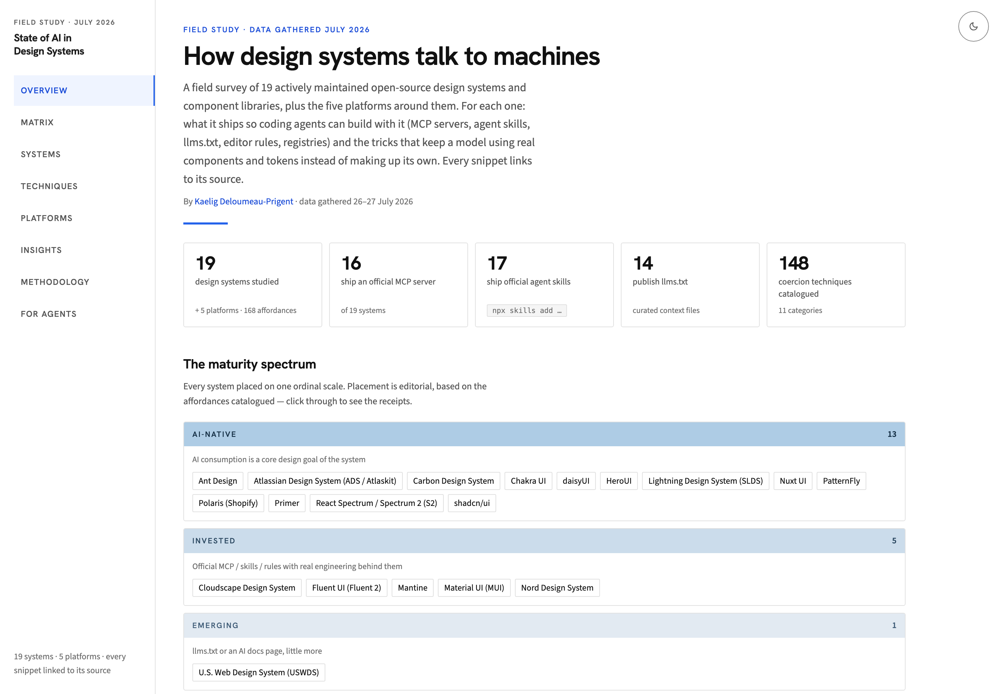

# State of AI in Design Systems — July 2026

A field survey of how 20 actively maintained open-source design systems make
themselves legible to machines, plus the five platforms around them.

For each system: what it ships so coding agents can build with it (MCP servers,
agent skills, `llms.txt`, editor rules, component registries) and the techniques
that keep a model using real components and tokens instead of inventing its own.
Both directions are covered: AI for **consumption** (agents building UIs with the
system) and AI for **building** (the team using AI to maintain the system itself).

**Read it: <https://state-of-ai-in-design-systems.netlify.app>**

20 design systems · 5 platforms · 179 affordances · 157 coercion techniques ·
every snippet linked to its source. Data gathered 26–28 July 2026.



## Using it

**As a reader**, start at the [overview](https://state-of-ai-in-design-systems.netlify.app)
for the findings, or the [matrix](https://state-of-ai-in-design-systems.netlify.app/matrix)
if you want to see all 20 systems against each other at once. Every claim links
to the page it came from. Open the link before you cite it. The data is a
snapshot and the underlying systems keep moving.

**With an AI tool**, don’t scrape the HTML. Every route has a markdown twin and
every record has a JSON twin, and
[`/llms.txt`](https://state-of-ai-in-design-systems.netlify.app/llms.txt)
indexes all of them with measured file sizes so an agent can budget context
before fetching. Paste this at an assistant:

```
Read https://state-of-ai-in-design-systems.netlify.app/llms.txt, then answer from
what you read there and cite the source_url on each record. My question: …
```

Or connect the MCP server: public, read-only, no auth, a July 2026 snapshot:

```sh
claude mcp add --transport http --scope user ds-state-of-ai https://state-of-ai-in-design-systems.netlify.app/mcp
```

```json
{
  "mcpServers": {
    "ds-state-of-ai": {
      "type": "http",
      "url": "https://state-of-ai-in-design-systems.netlify.app/mcp"
    }
  }
}
```

`type` is required in Claude Code and VS Code; a `url` without it is read as a
local command and skipped. VS Code puts servers under `servers`, not
`mcpServers`. Cursor needs only the `url`. Full instructions with copy-paste
blocks: [`/ai`](https://state-of-ai-in-design-systems.netlify.app/ai).

**As a contributor**, the report is wrong in places and corrections are welcome.
[CONTRIBUTING.md](CONTRIBUTING.md) covers how; [AGENTS.md](AGENTS.md) is the same
ground written for agents. Filing an issue with a link in it is a complete
contribution. You don’t need to clone anything.

## How it’s built

`data/*.json` is the only place facts are written. Everything published is
derived from it by one command:

```
data/*.json  ──▶ validate_data.mjs ──▶ every record against schema/*.json,
                        │               or the build stops here
                        ▼
                 build_dashboard.py ──▶ dashboard/{index,artifact}.html, data.js
                        │                build/{payload,routes}.json
                        ▼
                   build_md.py ──▶ 62 × .md, 33 × .json, llms.txt + slices,
                        │          public SQLite, sitemap, edge route table,
                        │          build/{md-map,ai-page-content}.json
                        ▼
          build_dashboard.py --final ──▶ same HTML, now carrying the /ai copy
                        ▼
                  prerender.mjs ──▶ dashboard/<route>/index.html × 29
```

Validation runs first and on the deploy, not only in CI, so a record with a bad
enum or a missing `source_url` fails the build instead of reaching the site, the
mirrors, the SQLite export and `/mcp`.

Nothing generated in `dashboard/` is written by hand, or committed — Netlify
rebuilds all of it on every deploy. To change a page, edit
`dashboard/template.html` (markup, CSS, view functions) or a build script, then
rebuild. `build_dashboard.py` runs twice because the `/ai` page quotes counts
that only exist once the markdown layer has been compiled and measured.

Adding a view means a line in `VIEW_TITLES`, a line in `NAV`, and a view function
in `template.html`; the route table, the sitemap and prerender follow from there.
The markdown layer does not. A twin needs its own builder function plus an entry
in `VIEW_META`, `HTML_TWIN`, the `html_routes` table that feeds the edge
function, the `llms.txt` listing, the fixed-section table in `mcp.mjs`, and the
report-path list the MCP suite checks against. The build catches a missing nav
entry and an empty route; it does not catch a view that never reached the
markdown layer, so work through that list rather than trusting the first two.

## What gets published

| Path                                                                          | What it is                                                                                                                 |
| ----------------------------------------------------------------------------- | -------------------------------------------------------------------------------------------------------------------------- |
| `dashboard/index.html` + `dashboard/<route>/index.html`                       | The site, prerendered: 29 routes plus a static 404, real HTML for crawlers that don’t run JS                               |
| `dashboard/data.js`                                                           | The payload every page loads (`window.DATA`)                                                                               |
| `dashboard/artifact.html`                                                     | The same site as one file: hash routing, no `<head>` of its own, `noindex`                                                 |
| `dashboard/**/*.md`                                                           | Markdown twin of every route, plus 15 `questions/*.md` and `about/schema.md`                                               |
| `dashboard/**/*.json`                                                         | Typed twin of every system and platform record                                                                             |
| `dashboard/llms.txt` (and `/.well-known/`)                                    | The router: staleness note, retrieval contract, vocabulary, every file with its measured size                              |
| `dashboard/llms-full.txt`, `llms-{systems,techniques,platforms,insights}.txt` | Concatenated documentation sets, sliced by concern for context budgets                                                     |
| `dashboard/data/`                                                             | `design-systems.json`, `platforms.json`, `insights.json`, `reading.json`, a JSON Schema for each, and `state-of-ai.sqlite` |
| `netlify/functions/mcp.mjs`                                                   | The MCP server at `/mcp`: 9 read-only tools, 2 resources, 5 prompts                                                        |
| `netlify/edge-functions/markdown.ts`                                          | Serves the markdown twin when a client sends `Accept: text/markdown`                                                       |
| `dashboard/template.html` → `registerReportTools()`                           | WebMCP: 4 page tools behind one feature check                                                                              |
| `/ai`                                                                         | The page documenting all of the above, mirrored at `/ai.md`                                                                |

## Developing

Node 24 and Python 3.12, pinned in `.nvmrc` and `runtime.txt`. Building needs no
Python packages.

```sh
npm install
npm run check                       # everything CI runs, in one command
./scripts/build.sh                  # everything; fails loudly on an empty route
npm test                            # MCP server suite, no ports
netlify serve                       # site + functions + edge functions locally
npx @modelcontextprotocol/inspector --cli http://localhost:8888/mcp \
  --transport http --method tools/list
```

## Deploying

A push to `main` deploys production. Netlify runs `./scripts/build.sh`, publishes
what it writes to `dashboard/`, bundles the function with esbuild and picks up the
edge function. There is no SPA fallback: every route is a real file, and anything
else gets an honest 404.

Because the deploy builds from source, nothing generated is committed and no
local build is needed before pushing. The build validates every record against
its schema first, so a bad record fails the deploy rather than reaching the site.

To deploy by hand — a preview, or from a branch:

```sh
./scripts/build.sh && netlify deploy --prod
```

Build first when you do. `netlify/functions/mcp.mjs` imports two files from
`build/`, which is generated and not committed.

## Querying the data

```sql
-- Who ships official MCP servers?
SELECT s.name, a.name FROM affordances a JOIN systems s ON s.id = a.system_id
WHERE a.type = 'mcp-server' AND a.official = 1;

-- All tool-gating tricks, with receipts
SELECT s.name, t.name, t.snippet_source_url FROM techniques t
JOIN systems s ON s.id = t.system_id WHERE t.category = 'tool-gating';
```

Both run unchanged against
[`/data/state-of-ai.sqlite`](https://state-of-ai-in-design-systems.netlify.app/data/state-of-ai.sqlite).

## How it was made

Every record was catalogued against a fixed schema, quoting files verbatim, with
each claim linked to the page it was taken from. Open the link and you can check
the claim yourself. The
[methodology page](https://state-of-ai-in-design-systems.netlify.app/methodology)
covers how the set was picked, what counted as an affordance or a technique, the
maturity rubric, and the caveats.

Two engineering notes live in this repository:
[`docs/architecture.md`](docs/architecture.md) for why the site is built the way
it is, and [`docs/design-audit.md`](docs/design-audit.md) for the open design
work against the rendered pages.

## Licensing

Two licenses, because this repository is two things.

| What                                                                                                  | License   |                              |
| ----------------------------------------------------------------------------------------------------- | --------- | ---------------------------- |
| Code — build scripts, site template, MCP server, edge function, tests                                 | MIT       | [LICENSE](LICENSE)           |
| Data and report text — `data/`, `schema/`, the `.md` and `.json` output, the SQLite export, the prose | CC BY 4.0 | [LICENSE-DATA](LICENSE-DATA) |

The records describe third-party design systems and quote them under fair use
with attribution; that source material stays under its own license. CC BY 4.0
covers the survey, not the things surveyed.

## Citation

```
Deloumeau-Prigent, K. (2026). State of AI in Design Systems.
https://state-of-ai-in-design-systems.netlify.app
```

```bibtex
@misc{deloumeauprigent2026stateofai,
  author       = {Deloumeau-Prigent, Kaelig},
  title        = {State of AI in Design Systems},
  year         = {2026},
  month        = {7},
  howpublished = {\url{https://state-of-ai-in-design-systems.netlify.app}},
  note         = {Data gathered 26--28 July 2026}
}
```

By [Kaelig Deloumeau-Prigent](https://www.kaelig.fr).
