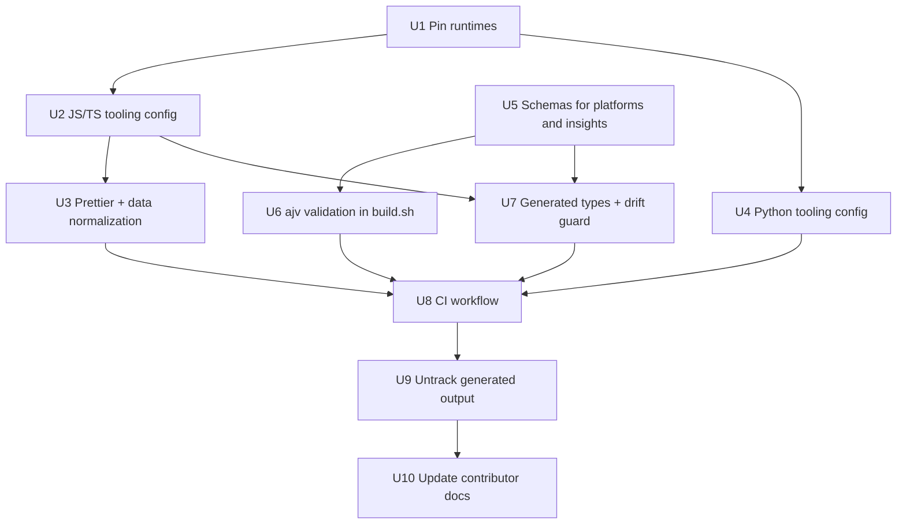
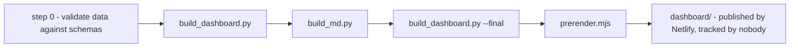

# Contributor Toolchain - Plan

**Product Contract preservation:** unchanged. R1-R7 keep their original meaning and
IDs. Planning added the Key Technical Decisions, Implementation Units, Verification
Contract and Definition of Done below.

## Goal capsule

**Objective.** Make this repository safe and pleasant to contribute to, for three
kinds of contributor at once: a person opening their first pull request, a coding
agent editing the data, and the maintainer iterating locally. Get there with
mainstream, current tooling across both runtimes, and remove the requirement to
build locally before deploying.

**Product authority.** The maintainer. Decisions recorded below were settled in
the 27 July 2026 brainstorm and planning session.

**Open blockers.** None.

**Not in scope.** Extracting the inline script from `dashboard/template.html`
into typed modules. It would extend type checking to the view functions, but it
touches the file that is the entire site, and the rest of this work does not
depend on it. See Known gaps.

**Branch.** Work on `main`, per the maintainer's instruction. Land each unit as
its own commit so the two large mechanical diffs stay separable from everything
else.

---

## Why now

The repository has no linter, no formatter, no type checking, no version pins and
no CI. `.github/` carries four issue templates and a pull request template, so the
contribution path is designed but unverified: nothing checks what arrives through
it. `AGENTS.md` asks contributors to run three commands before proposing a change,
enforced by nobody.

Two specific gaps do the most damage.

`schema/design-system.schema.json` is published and documented but never enforced.
`scripts/build_md.py` reads it only to copy it out and to generate
`/about/schema.md`. A record with a bad `ai_maturity` value or a missing
`source_url` would flow through the build into the HTML, the markdown mirrors, the
SQLite export and the MCP server. The other two data files, `platforms.json` and
`insights.json`, have no schema at all.

And 130 generated files are committed under `dashboard/`, 11MB of derivation that
Netlify regenerates on every deploy anyway. A one-line data correction arrives as
a 131-file diff, which is a poor thing to ask a first-time contributor to open and
an expensive thing to ask a reviewer to read.

---

## Key decisions

**Netlify builds every deploy; nothing generated is committed.**
`netlify.toml` already sets `command = "./scripts/build.sh"` and publishes the
freshly generated output, so the committed copy is redundant for deployment.
Untracking it makes a data correction a one-file diff. Governs R2.

**CI replaces the committed output as the safety net.** Dropping the committed
build removes the fallback that would have deployed if `build.sh` broke. A
workflow that runs the real build on every pull request restores it, and does so
earlier: a broken build turns the pull request red instead of turning up at deploy
time. Governs R2, R6.

**TypeScript 7.0.2 now; typescript-eslint revisited when it supports TS 7.**
`session-settled: user-directed — chosen over TypeScript 6.0.3 + full
typescript-eslint: the prize on the losing side is lint rules over ~130 lines of
Deno edge-function code that deno lint covers better anyway.` Governs R3.

**Data files get formatted.** `session-settled: user-approved — chosen over
leaving them alone: one noisy commit buys readable diffs on every correction
afterward.` Governs R3.

**Prettier formats Markdown too, with `proseWrap: preserve`.**
`session-settled: user-directed — chosen over excluding the hand-wrapped
contributor docs: consistency across all Markdown was preferred, and preserve
mode leaves existing line breaks intact.` Governs R3.

**`engine-strict=true` stays.** `session-settled: user-directed — chosen over
warn-only: a contributor on the wrong Node gets an error that names the required
version instead of a confusing failure later in the build.` Governs R1.

**Ruff and mypy for Python, and Python stays a build-time dependency of nobody.**
Python is the majority of the source by bytes. Its tooling installs in CI only, so
`build.sh` stays standard-library-only and the Netlify deploy takes on no Python
packages. Governs R4.

**Data validation runs in Node, inside the build.** Keeping the guard on the
deploy path matters more than which runtime holds it, and Node is already there.
This is what makes an agent's edit to a 630KB JSON file safe. Governs R5.

---

## Requirements

### R1 - Version pins the deploy actually reads

Netlify resolves Node from `.nvmrc` or `.node-version` first, then `NODE_VERSION`,
then the UI, then the image default; Python from `runtime.txt`, then `Pipfile`,
then `PYTHON_VERSION`.

- `.nvmrc` pins Node to `24`, matching the local 24.18.0 and Netlify's default.
- `runtime.txt` pins Python to `3.12`. Nothing pins it today: 91KB of
  `build_md.py` currently runs on the deploy against whatever the build image
  supplies, while local development is on 3.14.6. CI must run the pinned version
  so the skew is tested rather than assumed.
- `.npmrc` sets `engine-strict=true` and `save-exact=true`.
- `package.json` raises `engines.node` from `>=20` to `>=24`.

If `build.sh` turns out to need syntax newer than 3.12, CI says so on the first
run and the pin moves up. That is the point of pinning.

### R2 - Generated output leaves the repository

- `.gitignore` ignores `dashboard/*` and re-includes `dashboard/template.html`,
  the only source file in that directory.
- `git rm -r --cached` untracks the other 130 files.
- `AGENTS.md:210` and `CONTRIBUTING.md:123` currently instruct contributors to
  commit the regenerated output. Both must say the opposite, and say why: the
  deploy builds from source, so a local build is a check, not a deliverable.
- Nothing in the repository reads a committed `dashboard/` file as input.
  `scripts/check_md_layer.py` inspects generated files, but runs after the build
  produces them.

### R3 - JavaScript and TypeScript checking

- TypeScript 7.0.2. `tsconfig.json` with `allowJs`, `checkJs`, `noEmit` and
  `strict`, covering `scripts/prerender.mjs`, `netlify/functions/mcp.mjs` and
  `tests/mcp.test.mjs`. Types arrive through JSDoc; no file is renamed.
- ESLint 10.8.0, flat config, `@eslint/js` plus `globals`, over `.mjs` and `.js`.
- Prettier 3.9.6, with `eslint-config-prettier` to drop conflicting rules.
- `netlify/edge-functions/**` is excluded from `tsconfig.json` and checked by
  `deno check` and `deno lint` instead. Those files import `netlify:edge` and run
  on Deno; `tsc` cannot resolve the specifier and typescript-eslint cannot parse
  them under TS 7. Deno is already installed locally and available in CI.
- `.prettierignore` excludes `dashboard/template.html`, whose 1,531 lines of
  markup and CSS are hand-tuned, and includes `data/*.json` and `**/*.md` per the
  decisions above.

### R4 - Python checking

- Ruff 0.16.0 for both `ruff check` and `ruff format`, in place of the
  black/isort/flake8 trio.
- mypy 2.3.0 over `scripts/`, starting non-strict and tightening over time rather
  than annotating 127KB in one pass.
- Both configured in `pyproject.toml`. Installed in CI only.

### R5 - Schema-first type safety, end to end

- Add `schema/platform.schema.json` and `schema/insights.schema.json`. Today only
  system records have a schema, leaving 96KB of data unschematized.
- `json-schema-to-typescript` generates a committed `types/data.d.ts`. CI fails if
  it has drifted from the schemas.
- `ajv` 8.20.0 validates all four data files as step 0 of `scripts/build.sh`, so a
  bad enum value or a missing `source_url` fails the build instead of reaching the
  site, the SQLite export and the MCP server.

Validation belongs on the deploy path rather than in CI alone, because the deploy
is now the only build that has to succeed.

### R6 - One command, run two places

`npm run check` runs the full sequence locally, and `.github/workflows/ci.yml`
runs the same sequence on every pull request and on `main`:

lint, format check, typecheck, `deno check`, `ruff check`, `ruff format --check`,
`mypy`, `npm test`, `./scripts/build.sh`, `python3 scripts/check_md_layer.py`.

`build.sh` does not currently run `check_md_layer.py`; the workflow runs it as a
separate step, as `AGENTS.md` already describes for humans.

### R7 - Contributor documentation matches reality

`AGENTS.md`, `CONTRIBUTING.md` and `.github/PULL_REQUEST_TEMPLATE.md` describe a
three-command manual routine and a requirement to commit build output. After this
work, the routine is `npm run check` and the build output is not committed. All
three need updating, and the pull request template should stop asking for
confirmation that checks were run by hand, because CI answers that.

---

## Key technical decisions

**KTD1 - `ajv/dist/2020`, not the default export.** `schema/design-system.schema.json`
declares `$schema: https://json-schema.org/draft/2020-12/schema`. Ajv's default
export implements draft-07, and the two dialects cannot share an instance. The
validator must import the 2020-12 class (`ajv/dist/2020`). Writing `new Ajv()`
produces validation that looks like it works and does not enforce the schema.
Covers R5.

**KTD2 - CI lands before the untracking, not after.** The committed `dashboard/`
is today's fallback. Removing it first opens a window where a broken `build.sh`
means a failed deploy with nothing to catch it earlier. U8 must be green on `main`
before U9 runs. Covers R2, R6.

**KTD3 - `ajv` is a runtime dependency; every other tool is a dev dependency.**
Validation runs inside `build.sh`, which Netlify executes, so `ajv` belongs in
`dependencies`. TypeScript, ESLint, Prettier and the type generator never run on
the deploy and belong in `devDependencies`. Covers R5.

**KTD4 - `.gitignore` uses `dashboard/*`, never `dashboard/**`.** Git cannot
re-include a file whose parent directory is excluded. `dashboard/*` plus
`!dashboard/template.html` works; `dashboard/**` plus the same negation silently
drops the template from the repository. Covers R2.

**KTD5 - `git rm -r --cached` must be scoped away from `template.html`.** Running
it against the whole directory untracks the one source file too. Either exclude it
from the command or re-add it in the same commit, and verify with `git ls-files
dashboard` before committing. Covers R2.

**KTD6 - Python 3.12 is a floor to be tested, not an assumption.** Local
development is on 3.14.6 and no version is pinned today, so 3.12 compatibility is
unverified. U1 pins it and U8 runs CI on exactly that version; the first red build
is the answer, and the pin moves up if needed. Covers R1.

**KTD7 - `sanitize_data.py` is excluded from Ruff and mypy.** It is gitignored, so
it exists locally but never in CI. Including it would make local and CI results
disagree for every contributor who still has it. Covers R4.

**KTD8 - `scripts/check_contrast.js` joins the check sequence.** It is a real WCAG
AA check referenced by `AGENTS.md:113` that nothing currently runs. It costs one
line in CI. Covers R6.

---

## High-level technical design

### Unit dependency order

The safety-net inversion is the load-bearing part: CI (U8) is a prerequisite of
the untracking (U9), not a follow-up to it.

### What changes in the build pipeline

`build.sh` gains one step at the front. Everything after it is untouched.

Directional only. The prose and the per-unit fields are authoritative.

---

## Implementation units

### Phase A - The deploy contract

#### U1. Pin the runtimes Netlify reads

**Goal.** Make the Node and Python versions explicit, so the deploy stops running
on whatever the build image happens to supply.

**Requirements.** R1. Covers KTD6.

**Dependencies.** None.

**Files.** `.nvmrc` (create), `runtime.txt` (create), `.npmrc` (create),
`package.json` (modify).

**Approach.**

1. `.nvmrc` containing `24`.
2. `runtime.txt` containing `3.12`.
3. `.npmrc` with `engine-strict=true` and `save-exact=true`.
4. `package.json`: `engines.node` from `>=20` to `>=24`.

All four files sit at the repository root. Netlify's base directory is the root,
so they are found without configuration.

**Patterns to follow.** None in-repo; these are Netlify-native conventions.

**Execution note.** Verify the Python pin by running `build.sh` under 3.12 before
trusting it. If `build_md.py` or `build_dashboard.py` uses newer syntax, raise the
pin now rather than discovering it in U8.

**Test scenarios.**

- `./scripts/build.sh` completes under Python 3.12 with the same output it
  produces under 3.14.
- `npm install` under Node 22 fails with an error naming the required version.
- `npm install` under Node 24 succeeds.

**Verification.** The build runs clean under the pinned Python, and a wrong Node
version produces a legible error rather than a downstream failure.

#### U2. JavaScript and TypeScript tooling configuration

**Goal.** Install and configure TypeScript, ESLint and Prettier without applying
them yet, so config review is separable from the reformat.

**Requirements.** R3. Covers KTD3.

**Dependencies.** U1.

**Files.** `package.json` (modify), `tsconfig.json` (create), `eslint.config.js`
(create), `.prettierrc` (create), `.prettierignore` (create).

**Approach.**

1. Add to `devDependencies`: `typescript@7.0.2`, `eslint@10.8.0`,
   `@eslint/js@10.0.1`, `globals@17.8.0`, `prettier@3.9.6`,
   `eslint-config-prettier`, `@types/node@26.1.2`.
2. `tsconfig.json`: `allowJs`, `checkJs`, `noEmit`, `strict`, `module: nodenext`.
   Include `scripts/**/*.mjs`, `scripts/**/*.js`, `netlify/functions/**`,
   `tests/**`. Exclude `netlify/edge-functions/**`, `dashboard/`, `build/`,
   `node_modules/`.
3. `eslint.config.js`: flat config, `@eslint/js` recommended plus Node globals,
   over `**/*.mjs` and `**/*.js`. Ignore `dashboard/`, `build/`, `node_modules/`.
   Append `eslint-config-prettier` last.
4. `.prettierrc`: `proseWrap: "preserve"` per the settled decision.
5. `.prettierignore`: `dashboard/`, `build/`, `node_modules/`, `.netlify/`,
   `package-lock.json`, `deno.lock`. Note the exclusion is the whole `dashboard/`
   directory, which covers `template.html`.
6. Add `npm` scripts: `lint`, `format`, `format:check`, `typecheck`.

Expect `tsc` to report errors on the first run against 78KB of untyped `.mjs`.
Do not fix them here. This unit lands configuration only; record the error count
as a baseline. If the count is small enough to clear quickly, fix it in U7 while
adding JSDoc annotations. If it is large, relax `strict` to get a passing
baseline and ratchet it up later, the same way U4 handles mypy.

**Patterns to follow.** `scripts/prerender.mjs` is dependency-free ESM using
`node:` prefixed imports; keep that style intact.

**Execution note.** This unit is configuration and packaging. Prefer running each
tool once to confirm it loads its config over writing unit tests for it.

**Test scenarios.** Test expectation: none -- configuration only, with no
behavioral change. The tools running successfully is the proof.

**Verification.** `npx tsc --noEmit`, `npx eslint .` and `npx prettier --check .`
each run to completion and read the intended config. Error counts are recorded,
not necessarily zero.

#### U3. Formatting pass and data normalization

**Goal.** Apply Prettier once across the repository, including the two large data
files, as its own commit.

**Requirements.** R3.

**Dependencies.** U2.

**Files.** `data/*.json`, `schema/*.json`, `netlify/**/*.ts`, `scripts/*.mjs`,
`scripts/check_contrast.js`, `tests/*.mjs`, all `*.md` including `README.md`,
`AGENTS.md`, `CONTRIBUTING.md` and `docs/*.md`, and `.github/**/*.yml`. Prettier
does not handle TOML, so `netlify.toml` is untouched.

**Approach.**

1. Run `npx prettier --write .`.
2. Inspect the Markdown diff before committing. `proseWrap: preserve` keeps
   existing line breaks, but Prettier still normalizes list markers, emphasis
   delimiters and table padding. `AGENTS.md` has a "write like a person" section
   with deliberate typography; confirm nothing it says was changed in meaning.
3. Confirm the data files are still valid JSON and that `build.sh` produces
   byte-identical output to before the reformat. The generated surfaces
   re-serialize the data, so formatting the source should not change them.
4. Commit as a single mechanical change with a message that says it is one.

**Patterns to follow.** None; this is a mechanical pass.

**Execution note.** Land this alone. Mixing a 700KB reformat with any behavioral
change makes both unreviewable.

**Test scenarios.**

- `./scripts/build.sh` before and after the reformat produces identical
  `dashboard/` output.
- `npm test` passes unchanged.
- Every `data/*.json` file parses.

**Verification.** A diff of the generated output across the reformat is empty.

#### U4. Python tooling configuration and formatting pass

**Goal.** Bring Ruff and mypy in over `scripts/`, and apply the format pass.

**Requirements.** R4. Covers KTD7.

**Dependencies.** U1.

**Files.** `pyproject.toml` (create), `scripts/*.py` (formatted).

**Approach.**

1. `pyproject.toml` with `[tool.ruff]` and `[tool.mypy]` sections. Target Python
   3.12 to match `runtime.txt`.
2. Exclude `scripts/sanitize_data.py` from both — it is gitignored and will not
   exist in CI.
3. Start mypy non-strict: `ignore_missing_imports = true`, no
   `disallow_untyped_defs`. Record the error count as the baseline to ratchet
   against.
4. Run `ruff format` over `scripts/`, then `ruff check --fix` for the safe
   autofixes only. Review anything it wants to change beyond formatting.
5. Commit the config and the format pass separately from any lint fix that
   changes behavior.

**Patterns to follow.** The existing scripts use module-level constants
(`ROOT`, `OUT`, `SCHEMA_SRC`) and `pathlib`. Ruff's defaults will not fight this.

**Execution note.** Do not chase a zero mypy count here. A non-strict baseline
that runs in CI is worth more than a strict configuration that never lands.

**Test scenarios.**

- `./scripts/build.sh` produces identical output after `ruff format`.
- `python3 scripts/check_md_layer.py` passes unchanged.
- `ruff check` and `mypy scripts/` both run to completion; counts recorded.

**Verification.** Both tools run under Python 3.12 and the build output is
unchanged by the reformat.

### Phase B - The data contract

#### U5. Schemas for platforms and insights

**Goal.** Give the two unschematized data files a schema, so all four can be
validated.

**Requirements.** R5.

**Dependencies.** None.

**Files.** `schema/platform.schema.json` (create),
`schema/insights.schema.json` (create).

**Approach.**

1. Derive each schema from the data it describes. `data/platforms.json` is 80KB
   of platform records; `data/insights.json` is 15KB of findings, essay,
   methodology and caveats.
2. Match the conventions in `schema/design-system.schema.json`: draft 2020-12,
   `$id`, `title`, `description`, `required` arrays, and `enum` for controlled
   vocabularies.
3. Carry over the shared vocabularies rather than redefining them. Platform
   records use the same affordance `type` enum as system records; reference or
   duplicate deliberately, and say which in a comment.
4. Encode the constraint `AGENTS.md` states as prose: every claim carries a
   `source_url`. Make it `required` where the data already satisfies it, and
   record any record that does not as a finding rather than weakening the schema.

**Patterns to follow.** `schema/design-system.schema.json` end to end.

**Execution note.** Write the schema against the data as it is, then tighten.
A schema that fails on existing valid records blocks the whole phase.

**Test scenarios.**

- Every record in `data/platforms.json` validates against the new platform schema.
- `data/insights.json` validates against the new insights schema.
- A platform record with an unknown affordance `type` fails validation.
- A platform record missing `source_url` on an affordance fails validation.

**Verification.** All existing data passes; deliberately broken copies fail.

#### U6. Validate the data inside the build

**Goal.** Make a schema violation fail the build rather than reach the published
surfaces.

**Requirements.** R5. Covers KTD1, KTD3.

**Dependencies.** U5.

**Files.** `scripts/validate_data.mjs` (create), `scripts/build.sh` (modify),
`package.json` (modify), `tests/validate_data.test.mjs` (create).

**Approach.**

1. Add `ajv@8.20.0` to `dependencies`, not `devDependencies` — it runs on the
   Netlify deploy path.
2. `scripts/validate_data.mjs` imports the draft 2020-12 Ajv class from
   `ajv/dist/2020`. The default export is draft-07 and will not enforce this
   schema. See KTD1.
3. Validate all four data files, each against its schema. Report every error with
   the file, the JSON pointer to the offending value, and the rule that failed —
   an agent reading the failure should be able to fix it without opening the
   schema.
4. Exit non-zero on any failure.
5. Insert it as step 0 of `scripts/build.sh`, before `build_dashboard.py`.

**Patterns to follow.** `scripts/prerender.mjs` for the Node script shape;
`scripts/check_md_layer.py` for the reporting style, which prints a numbered check
list and collects failures before exiting.

**Execution note.** Write the failing case first. A validator that passes
everything is indistinguishable from one that validates nothing, and the
draft-07 mistake in KTD1 produces exactly that.

**Test scenarios.**

- A valid record set passes and the script exits 0.
- A record with an `ai_maturity` value outside the enum fails, and the error names
  the record id and the field.
- An affordance missing `source_url` fails.
- A malformed JSON file fails with a parse error rather than a stack trace.
- `build.sh` halts before `build_dashboard.py` runs when validation fails.
- The validator loads the 2020-12 dialect: a schema construct valid in 2020-12 but
  not draft-07 is accepted rather than rejected.

**Verification.** `./scripts/build.sh` fails fast on a deliberately corrupted
record, and no file under `dashboard/` is written.

#### U7. Generated types and a drift guard

**Goal.** Give the JavaScript that reads the data real types, derived from the
schemas rather than written by hand.

**Requirements.** R5.

**Dependencies.** U5, U2.

**Files.** `types/data.d.ts` (create, committed), `package.json` (modify).

**Approach.**

1. Add `json-schema-to-typescript@15.0.4` to `devDependencies`.
2. Add an npm script that generates `types/data.d.ts` from all three schemas.
3. Commit the generated file. It is an input to `tsc`, which runs before any
   generation step in CI.
4. Add a drift check: regenerate, then fail if the working tree changed. This is
   the same shape as the build-output check, applied to a file that stays
   committed because the type checker needs it present.
5. Wire the generated types into the `.mjs` consumers through JSDoc
   `@typedef`/`@type` annotations where they carry weight — `mcp.mjs` reading
   records is the highest-value target.

**Patterns to follow.** None in-repo. Keep the generated file untouched by hand;
its header should say so.

**Execution note.** Annotate the highest-traffic data reads first rather than
every function. The point is catching a wrong field name, not full coverage.

**Test scenarios.**

- Regenerating types on a clean tree leaves no diff.
- Changing a schema enum and regenerating changes `types/data.d.ts`.
- A JSDoc-annotated read of a misspelled record field is reported by `tsc`.

**Verification.** `npx tsc --noEmit` passes with the generated types in place, and
the drift check is clean.

### Phase C - Enforcement

#### U8. The CI workflow

**Goal.** Run the whole check sequence on every pull request and on `main`, so the
safety net exists before the committed output is removed.

**Requirements.** R6. Covers KTD2, KTD6, KTD8.

**Dependencies.** U3, U4, U6, U7.

**Files.** `.github/workflows/ci.yml` (create), `package.json` (modify).

**Approach.**

1. One workflow, triggered on `pull_request` and on push to `main`.
2. Set up Node from `.nvmrc`, Python from `runtime.txt`, and Deno.
3. Install: `npm ci`, plus Ruff and mypy through `pip` or `uv`.
4. Run, in order: `lint`, `format:check`, `typecheck`, `deno check` and
   `deno lint` over `netlify/edge-functions/`, `ruff check`,
   `ruff format --check`, `mypy scripts/`, `npm test`, `node
scripts/check_contrast.js`, `./scripts/build.sh`,
   `python3 scripts/check_md_layer.py`, and the U7 type drift check.
5. Add `npm run check` running the same sequence locally, so the two never drift.
   The workflow should call the npm script where possible rather than restating
   the commands.

**Patterns to follow.** `scripts/build.sh` uses `set -e` and fails loudly; the
check script should do the same.

**Execution note.** Get one green run on `main` before U9. That green run is the
precondition the next unit depends on.

**Test scenarios.**

- A pull request with a schema-violating record fails at the validation step.
- A pull request with unformatted Python fails at `ruff format --check`.
- A pull request with a type error fails at `typecheck`.
- A pull request touching only `README.md` still runs and passes.
- `npm run check` locally reproduces a CI failure without pushing.
- The workflow runs on Python 3.12 as pinned, not the runner default.

**Verification.** A green run on `main`, and a deliberately broken branch that
fails at the expected step.

#### U9. Untrack the generated output

**Goal.** Remove 130 generated files and 11MB from the repository, so a data
correction is a one-file diff.

**Requirements.** R2. Covers KTD4, KTD5.

**Dependencies.** U8, green on `main`.

**Files.** `.gitignore` (modify), 130 files under `dashboard/` (untracked).

**Approach.**

1. `.gitignore` gains `dashboard/*` and `!dashboard/template.html`. Use
   `dashboard/*`, not `dashboard/**` — see KTD4.
2. Untrack everything under `dashboard/` except `template.html`. Verify with
   `git ls-files dashboard`, which must return exactly one path afterwards. See
   KTD5.
3. Confirm the working tree still contains the generated files. This is an index
   operation; nothing is deleted from disk.
4. Deploy and confirm the site is unchanged. Netlify rebuilds from source, so
   this should be invisible — confirming it is the point.

**Patterns to follow.** The existing `.gitignore` already documents each block
with a comment explaining why. Match that.

**Execution note.** Verify against a fresh clone: clone into a temporary
directory, run `./scripts/build.sh`, and confirm a complete `dashboard/` appears.
That is the exact path Netlify takes.

**Test scenarios.**

- `git ls-files dashboard` returns only `dashboard/template.html`.
- A fresh clone plus `./scripts/build.sh` produces a complete `dashboard/`.
- `git status` is clean after a build — the regenerated files are ignored, not
  shown as untracked noise.
- Editing `dashboard/template.html` still shows up in `git status`.
- A production deploy after this change serves the same site.

**Verification.** The live site is unchanged, and a data-only edit produces a
one-file diff.

#### U10. Update the contributor documentation

**Goal.** Make `AGENTS.md`, `CONTRIBUTING.md` and the pull request template
describe what the repository now does.

**Requirements.** R7.

**Dependencies.** U9.

**Files.** `AGENTS.md`, `CONTRIBUTING.md`, `.github/PULL_REQUEST_TEMPLATE.md`.

**Approach.**

1. `AGENTS.md`: replace the three-command block with `npm run check`. Rewrite the
   "Commit the regenerated `dashboard/` output" paragraph near line 210 to say the
   opposite and explain why. Update the "Never edit these" section, which is now
   enforced by `.gitignore` rather than by instruction. Add the new configuration
   files to the "Edit these" table.
2. `CONTRIBUTING.md`: same changes around line 123. Note that the current sentence
   "The site is deployed from those files" is factually wrong today, not merely
   outdated — `netlify.toml` has always built from source. Correct it rather than
   softening it.
3. `.github/PULL_REQUEST_TEMPLATE.md`: drop the request for confirmation that the
   three checks were run by hand. CI answers it.
4. Update the "Requirements: Python 3 (no packages needed), Node 20 or newer" line
   to match the pins, and keep the "no packages" claim accurate — it remains true
   for the build, which is the claim that matters.

**Patterns to follow.** `AGENTS.md`'s own house style: specific, contraction-friendly,
no marketing adjectives. It documents the rule and then says what goes wrong when
you break it. Keep that shape.

**Execution note.** Read the "Write like a person" section of `AGENTS.md` before
editing either document. The repository holds its own prose to a standard, and
these edits are subject to it.

**Test scenarios.** Test expectation: none -- documentation only. Correctness is
checked by following the documented steps from a fresh clone.

**Verification.** A fresh clone, following only `CONTRIBUTING.md`, reaches a
passing `npm run check` without further instruction.

---

## Verification contract

The whole sequence, in the order CI runs it:

| Gate           | Command                                                   | Fails when                            |
| -------------- | --------------------------------------------------------- | ------------------------------------- |
| Lint           | `npm run lint`                                            | ESLint finds an error in `.mjs`/`.js` |
| Format         | `npm run format:check`                                    | Any tracked file is unformatted       |
| Types          | `npm run typecheck`                                       | `tsc` reports an error                |
| Edge functions | `deno check` and `deno lint` on `netlify/edge-functions/` | Deno reports an error                 |
| Python lint    | `ruff check`                                              | A lint rule fires                     |
| Python format  | `ruff format --check`                                     | Any script is unformatted             |
| Python types   | `mypy scripts/`                                           | An error above the recorded baseline  |
| Unit tests     | `npm test`                                                | The MCP suite fails                   |
| Contrast       | `node scripts/check_contrast.js`                          | A token pair falls below AA           |
| Data           | step 0 of `build.sh`                                      | A record violates its schema          |
| Build          | `./scripts/build.sh`                                      | Any pipeline step fails               |
| Markdown layer | `python3 scripts/check_md_layer.py`                       | A mirror, link or budget check fails  |
| Type drift     | regenerate `types/data.d.ts`                              | The working tree changed              |

---

## Definition of done

1. `npm run check` passes locally on a fresh clone.
2. CI is green on `main` and runs the same sequence.
3. `git ls-files dashboard` returns exactly `dashboard/template.html`.
4. A production deploy after untracking serves the same site as before.
5. A record with a schema violation fails `./scripts/build.sh` before any file is
   written.
6. `AGENTS.md`, `CONTRIBUTING.md` and the pull request template describe the
   current workflow, and a fresh clone can be set up by following them alone.
7. The Netlify deploy installs no Python packages and depends on no new tool
   beyond `ajv`.

---

## Success criteria

1. A data correction is a one-file diff.
2. A fresh clone with no local build can deploy, because Netlify builds from
   source and the runtimes are pinned.
3. A record that violates its schema fails the build rather than reaching the
   published surfaces.
4. Every pull request runs the same checks the maintainer runs, without anyone
   remembering to.
5. The Netlify deploy takes on no new dependencies. Development tooling is
   development-only.

---

## Risks

**The Python pin is unverified.** Nothing runs on 3.12 today. If `build_md.py`
uses newer syntax, U1 fails and the pin moves up. Cheap to discover, and better
discovered in U1 than in a deploy.

**Untracking removes a fallback.** Between U9 and any future breakage, a failing
`build.sh` means a failing deploy with no committed output to fall back on. KTD2
sequences CI first to mitigate it; the residual risk is a build that passes CI and
fails on Netlify, which the version pins in U1 exist to prevent.

**`tsc` on 78KB of untyped `.mjs` may report a large error count.** U2 records the
count rather than fixing it. If it is large enough to block, the plan is to keep
`strict` off initially and ratchet, the same approach U4 takes with mypy.

**The Markdown formatting pass touches four hand-written documents.**
`proseWrap: preserve` keeps line breaks, but list markers, emphasis delimiters and
table padding still normalize. U3 requires reading that diff rather than trusting
it.

---

## Scope boundaries

### Deferred to follow-up work

- Extracting `dashboard/template.html`'s inline script into typed modules. It
  would bring the view functions under type checking and lint, and would be the
  point at which a bundler earns its place here.
- Tightening mypy past the U4 baseline.
- Adding `typescript-eslint` once its peer range admits TypeScript 7.

### Outside this work

- Rebuilding the site on a framework. `docs/architecture.md` settles this.
- Adopting Vite+. See Approach notes.

---

## Known gaps

**`dashboard/template.html` gets no automated checking.** Its inline script holds
the view functions, and neither ESLint nor Prettier reaches JavaScript inside an
HTML file without a plugin, so the file is excluded from both.

**mypy starts loose.** A non-strict first pass over 127KB of untyped Python finds
less than a strict one. The alternative is annotating everything before anything
is checked, which is how this kind of work stalls.

**One-time formatting noise.** U3 and U4 produce large diffs. Both land as their
own commits, separate from any behavior change, so `git log` stays readable.

---

## Sources and research

- Netlify resolves Node from `.nvmrc` / `.node-version`, then `NODE_VERSION`, then
  the UI, then the image default; Python from `runtime.txt`, then `Pipfile`, then
  `PYTHON_VERSION`. Current build image is Ubuntu 24.04 with Node 24 default and
  Deno available at build time.
- Ajv's default export implements draft-07. Draft 2020-12 requires a separate Ajv
  class, and the two dialects cannot share an instance.
- `typescript-eslint` 8.65.0 and its canary both declare
  `typescript: ">=4.8.4 <6.1.0"`. Latest stable TypeScript is 7.0.2; the last
  supported version is 6.0.3.
- Versions verified 27 July 2026: typescript 7.0.2, eslint 10.8.0, @eslint/js
  10.0.1, prettier 3.9.6, globals 17.8.0, ajv 8.20.0, json-schema-to-typescript
  15.0.4, @types/node 26.1.2, ruff 0.16.0, mypy 2.3.0.
- Repository facts: `netlify.toml:8` build command, `netlify.toml:13` esbuild
  function bundling, 131 tracked files under `dashboard/` totaling 11MB, zero
  JSDoc annotations across `prerender.mjs`, `mcp.mjs` and `mcp.test.mjs`,
  `scripts/check_contrast.js` referenced by `AGENTS.md:113` and run by nothing.

---

## Approach notes

Vite+ was considered and set aside. It never enters the deploy path: `build.sh` is
four steps of `python3` and one `node`, with no bundle, no dev server and no task
graph, and the only bundling Netlify does here is esbuild for the function and its
own Deno toolchain for the edge function. Its runtime pinning does not propagate
to Netlify, which reads `.nvmrc` and `runtime.txt` and nothing else, so it would
have added a second source of truth for the Node version rather than removing the
first. It also reached beta on 4 June 2026, and `docs/architecture.md` declines
Astro and Eleventy by name to avoid a dependency treadmill. Worth revisiting at
1.0, or if the template extraction above ever creates a real bundling step.
