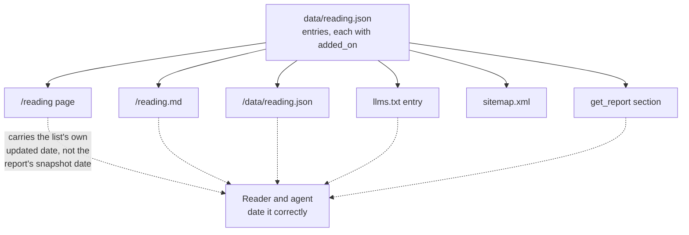
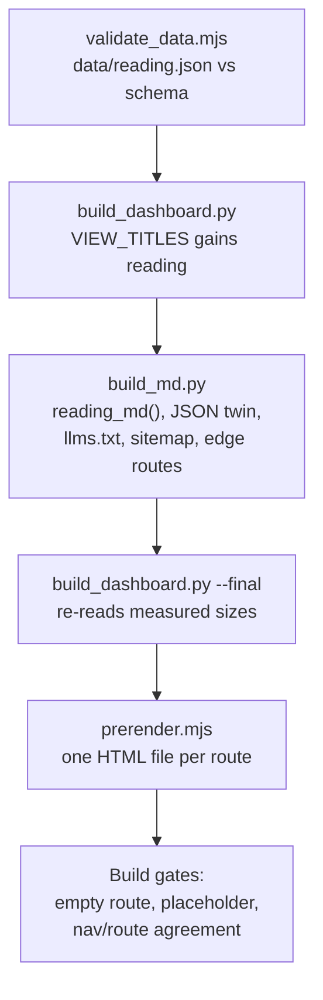

# Further Reading Route - Plan

## Goal Capsule

- **Objective:** Ship a `/reading` route listing work on AI and design systems, described on its own terms, and make it the one surface of the report that is not frozen at the July 2026 snapshot.
- **Authority:** The Product Contract below owns product behavior. The Planning Contract owns implementation mechanism within those constraints. `AGENTS.md` owns repository convention and overrides both on house style, data placement, and what fails review.
- **Product Contract preservation:** Unchanged. No requirement was split, moved, or rewritten during enrichment.
- **Execution profile:** Content and plumbing in one plan. U2 writes the twelve entries; the rest wires an eighth view into a build that was designed for exactly that.
- **Stop conditions:** Stop and ask if a source link no longer says what the entry claims, or if `data/reading.json` starts wanting a field that duplicates something `data/design-systems.json` already records.
- **Tail ownership:** This plan ends at a green `npm run check`. Deploy is Netlify's on merge.

---

## Product Contract

### Summary

A `/reading` route listing work on AI and design systems: studies, essays, talks and courses, each with a short description of what it says and the quote that carries it. It is the one page on the site that is not frozen at the July 2026 snapshot, and it says so on the page and in every machine-readable twin.

### Problem Frame

The report is strict about evidence and silent about company. Every affordance and technique carries a `source_url` a reader can open, but nothing on the site acknowledges that other people have been writing about this. `data/insights.json` holds nine findings, five convergences, five divergences, a four-part essay, a four-part methodology and five caveats, and none of them mention another study.

A reader who finishes `/insights` has nowhere to go. Some of what they want next is close by and easy to name: a practitioner survey with a sample the report does not have, an argument about evaluation that names exactly what a survey of shipped artifacts cannot measure, a dissent about accountability, a peer index counting some of the same signals. Right now they have to go find all of it themselves.

The cost is small per reader and it compounds. The report reads as though it thinks it arrived first.

### Key Decisions

- A reading list, not a positioning statement. (session-settled: user-directed — chosen over situating the study against peer work: serve the reader rather than defend the report's place.) Governs R4, R7.
- Its own route rather than a section on an existing page. (session-settled: user-directed — chosen over folding into `/methodology` or `/insights`: one entry in the route table brings the nav, sitemap, markdown twin and JSON twin with it.) Governs R1, R3.
- Entries describe each work on its own terms. (session-settled: user-directed — chosen over relating each work back to this report: a neutral description ages well and needs no claim about this report's own coverage.) Governs R7, R8.
- The one page that is not a snapshot. (session-settled: user-directed — chosen over freezing it with the rest of the report: a reading list is worth keeping current even when the survey behind it is not.) Governs R11, R12, R13, R14.

The last decision is the one with reach. Everything published today carries the 26–28 July 2026 snapshot, including the MCP layer, and a living page inside that has to announce itself at every surface or an agent will date it wrong.

### Actors

- A1. Reader — a person who has finished the analysis and wants more.
- A2. Agent — a model reading the report through the markdown twins or the MCP server.
- A3. Contributor — anyone suggesting a work for the list.
- A4. Maintainer — the report author, deciding what gets listed.

### Requirements

**The route and its surfaces**

- R1. The report gains a top-level `reading` view in the route table, so the nav, the sitemap, the prerendered HTML, the markdown twin and the JSON twin all derive from a single entry.
- R2. `/reading` appears in the site nav alongside the existing eight views.
- R3. Agents reach the reading list on the same terms as every other section of the report: a markdown twin, a JSON twin, an `llms.txt` entry, and retrieval through the existing report-section tool. The MCP server gains no tenth tool.

**What gets listed**

- R4. Entries are limited to work about the intersection of AI and design systems. General design-system galleries and directories do not qualify.
- R5. `/reading` states the inclusion bar on the page, so a reader knows why each work is there and a contributor knows what is worth sending. The bar reads: *Work about what happens when a design system meets an AI agent — how systems are built for models to read, whether that works, and whether it should. Not a directory of design systems.*
- R6. Every entry links to a page that was fetched and read before it was listed, the same bar the report applies to a `source_url`.

**How an entry reads**

- R7. An entry carries title, author, publication date, kind, link, and a description of what the work says in its own terms.
- R8. An entry carries a short verbatim quote from the work when the work has one that does the arguing.
- R9. An entry that costs money names the price and what it buys.
- R10. Entries are grouped by kind, with the groups ordered so work reporting data or reading artifacts appears before commentary.

**Staying current**

- R11. `/reading` states that it is the one surface of the report not frozen at the July 2026 snapshot.
- R12. `/reading` carries its own last-updated date, and that date reaches the markdown twin, the JSON twin, `llms.txt` and the MCP layer in place of the report's snapshot date.
- R13. Each entry records the date it was added, so a returning reader can tell what is new.
- R14. A dedicated issue template accepts a suggested work, and `/reading` links to it.

### Key Flows

- F1. A work is suggested and listed
  - **Trigger:** A3 finds work the list is missing.
  - **Actors:** A3, A4
  - **Steps:** A3 opens the suggestion template from `/reading` and supplies the link, what the work argues, and why it clears the bar. A4 reads the linked page, judges it against R4 and R5, and either adds an entry with today's date or closes the issue saying which part of the bar it missed. Adding an entry moves the list's last-updated date.
  - **Outcome:** The next build publishes the entry and the new date across every surface.
  - **Covered by:** R5, R6, R12, R13, R14

### Acceptance Examples

- AE1. Paid work is listed honestly
  - **Covers R9.**
  - **Given** an entry for a course that costs money to enrol in,
  - **When** a reader scans the entry,
  - **Then** the price and what it buys are visible before they follow the link.

- AE2. An agent dates the reading list correctly
  - **Covers R11, R12.**
  - **Given** an agent that has read `get_stats` and holds the 2026-07-28 snapshot date,
  - **When** it fetches the reading list through the markdown twin or the report-section tool,
  - **Then** the response carries the list's own last-updated date and says the list is not part of the snapshot, so the agent cites that date instead.

- AE3. A work that cannot be read is not listed
  - **Covers R6.**
  - **Given** a suggested link that returns an error, sits behind a login, or does not say what the suggestion claims,
  - **When** the maintainer works through F1,
  - **Then** no entry is created, and the reason is recorded on the issue.

- AE4. An off-topic suggestion is declined against a stated bar
  - **Covers R4, R5.**
  - **Given** a suggestion for a general design-system gallery,
  - **When** the maintainer works through F1,
  - **Then** it is declined by pointing at the inclusion bar the page already states, not by a case-by-case judgement.

### Scope Boundaries

- Reconciling this report's maturity ratings against the Agent-Ready Design Systems Index. The two count different things over different samples and reach different-looking conclusions, and explaining that is a positioning move this plan deliberately does not make.
- General design-system galleries, component directories and catalogues of agent-facing files, per R4. Useful to some readers, outside the bar.
- A tenth MCP tool, per R3.
- Any acknowledgments or influences framing on `/methodology` or `/insights`.
- Rating, scoring or ranking the listed works. The list describes; it does not grade.
- The SQLite export. It holds survey data — systems, affordances, techniques, capabilities, sources — and the reading list is a report section, not a record set.

#### Deferred to Follow-Up Work

- Unifying how the report's snapshot date is expressed. It is hand-typed in `dashboard/template.html` and in `netlify/functions/mcp.mjs` today. This plan adds a second, independent date for `/reading` and leaves those alone, per KTD4.

### Dependencies and Assumptions

- Facts live in `data/*.json` and every published surface is generated from them, so a new content type means new records and a schema to validate them. Recorded in `AGENTS.md`.
- The report-section tool is addressed by section name, so a new report section reaches MCP consumers without new tool code.
- The nav renders from a list and scrolls horizontally on narrow screens, so a ninth item costs no layout work.
- `scripts/prerender.mjs` fails any route whose view body is under 400 characters, so `/reading` has to ship with its entries in place rather than as an empty shell.
- The same script fails when the nav item count and the view route count disagree, so the nav entry and the route-table entry have to land together.
- Every count on the site is computed from records at build time. If the reading list is ever counted in prose, the count comes from the records like every other number.

### Outstanding Questions

**Deferred to planning**

None remain. All four questions carried from the brainstorm are resolved as KTD1, KTD2, KTD5 and KTD6.

### Sources and Research

Candidate entries, read 28 July 2026. Every link below was opened and read; the notes are a single reading, not a substitute for the authoring pass under R6.

**Studies and data**

| Work | Who | Date | Note |
|---|---|---|---|
| [Agent-Ready Design Systems Index](https://www.designsystems.one/ai-ready/systems) | Kiryl Zhukouski, DesignSystems.one | audited 2026-06-10 | 37 systems scored 0–5 on MCP, llms.txt, DTCG tokens, component registry and Code Connect. Re-audited quarterly. JSON and CSV under CC BY 4.0. Highest score is 3. |
| [Design Systems Report 2026](https://report.zeroheight.com/) | zeroheight | 2026 | Practitioner survey, n=147. 10% have AI in their process, 46% experimenting, 44% not. Code generation 71%, documentation generation 60%. |
| [Building design system components with agent teams](https://www.kaelig.fr/design-system-components-with-ai-agent-teams/) | Kaelig Deloumeau-Prigent | 2026-04-22 | A build report: eight agents across Understand, Build and Verify phases producing a production Menu component from Figma, each with a named artifact, exit criteria and a retry budget. Full autonomy hit a ceiling, and the fix was a human gate rather than a better prompt. "The pipeline could follow rules but it couldn't question." |

**Essays**

| Work | Who | Date | Note |
|---|---|---|---|
| [Design systems need evals](https://blog.murphytrueman.com/design-systems-need-evals/) | Murphy Trueman | 2026-07-17 | "You've taught agents your design system. You still don't know whether they're following it." |
| [In the open: what the modal reveals](https://blog.murphytrueman.com/in-the-open-what-the-modal-reveals/) | Murphy Trueman | 2026-03-13 | Comparative reading of the modal in Carbon, Material UI, Polaris and Radix. |
| [Your next design system user](https://blog.murphytrueman.com/your-next-design-system-user/) | Murphy Trueman | 2025-06-04 | "Your design system is already an API; the question is whether it's a good one." |
| [My beef with agentic design systems](https://southleft.substack.com/p/my-beef-with-agentic-design-systems) | TJ Pitre, Southleft | 2026-06-19 | "What rejects the agent's output, and who decided the rule?" |
| [Agentic AI, design systems and Figma](https://christinevallaure.substack.com/p/agentic-ai-design-systems-and-figma) | Christine Vallaure | 2026-03-31 | "The design system is no longer just documentation for developers. It is instructions for a machine." |
| [AI in design systems: what's changing in 2026](https://zeroheight.com/blog/ai-in-design-systems-whats-changing-in-2026/) | Elyse Holladay, zeroheight | 2026-03-25 | Three moves for the year: MCPs, skills and design guidelines; designing with code; shipping patterns as structured relationships rather than components. Argues design systems have to document when and why, not only how, because that is the part a model guesses at. "AI is finally starting to change what a design system ships." |

**Talks**

| Work | Who | Date | Note |
|---|---|---|---|
| [Agentic Design Systems in 2026 with Brad Frost](https://www.youtube.com/watch?v=Vg78K3t9KYc) | Brad Frost, on Chromatic's channel | 2025-12-11 | An 80-minute conversation, not a conference talk. "AI is rapidly reshaping who (or what) uses your design system." Oldest work on the list and the one most likely to have been overtaken. |

**Courses**

| Work | Who | Price | Note |
|---|---|---|---|
| [AI & Design Systems](https://aianddesign.systems/) | Brad Frost, Ian Frost, TJ Pitre | $995 | Six chapters, 20+ hours, released iteratively. Biweekly jam sessions and a Slack community. |
| [Design Systems Course](https://www.intodesignsystems.com/design-systems-course) | Sil Bormüller, Into Design Systems | $599 | Six modules, 15+ hours, 21 practitioners. Agentic design systems, MCP and LLM readiness, vibe coding for designers. |

Three notes on the set.

People recur across it. TJ Pitre writes the dissent and co-teaches the first course; Brad Frost gives the talk and co-teaches it; Elyse Holladay's piece cites Murphy Trueman and Nathan Curtis. The field is small enough that a reader will notice, which is an argument for listing works rather than people.

One entry is by the report's author. R7 puts the author's name on every entry, so the self-citation is visible rather than quiet, which is the right way round.

React Aria's [`/ai` page](https://react-aria.adobe.com/ai) came up during research and is not a candidate. It is an affordance belonging to `react-spectrum-s2`, already recorded in the study.

---

## Planning Contract

### Key Technical Decisions

- KTD1. Reading entries get their own data file and schema rather than a key on the insights record. `schema/insights.schema.json` sets `additionalProperties: false` and describes its contents as prose written about the records, carrying no source URLs; reading entries are a collection where every record carries one. Governs R6, R7.
- KTD2. The list's last-updated date is computed from the newest entry's `added_on`, never stored. (session-settled: user-approved — chosen over a hand-maintained field: a typed date goes stale silently, which is the same reason counts on this site are computed.) Governs R12, R13.
- KTD3. `/reading` reaches MCP by adding one row to the fixed-section table in `netlify/functions/mcp.mjs`. That table is filtered against the compiled markdown map, so the section appears once `/reading.md` exists and no tool code changes. Governs R3.
- KTD4. The report's existing snapshot date is left exactly as it is. (session-settled: user-approved — chosen over unifying date handling across the site: keeps the diff to the new route, at the cost of two date concepts coexisting.) Governs R11, R12.
- KTD5. The route is `/reading` and the nav label is `Reading`. The nav uses one-word labels for every view except `For agents`.
- KTD6. Each entry carries a kebab-case `id`. A correction needs to name a record the way `data-correction.yml` names `systems/primer-github`, and the JSON twin needs stable keys. Governs R14.

### High-Level Technical Design

`scripts/build.sh` runs `build_dashboard.py` twice — once to emit the payload and route table, then again after `build_md.py` has measured the markdown layer, so the `/ai` page can quote real file sizes. A new route has to be correct on the first pass, because the second pass reads what the first one wrote.

The date in KTD2 is derived once in `build_md.py` from the entry records and passed into both the payload and the markdown frontmatter, so the page, its twin and the MCP response cannot disagree.

### Sequencing

Data and schema first, then the entries, then the surfaces that render them. The route lands after the entries exist because the build fails a route that renders empty. The issue template lands before the route, because the route links to it.

---

## Implementation Units

### U1. The reading data file and its schema

- **Goal:** A validated record shape for a reading-list entry.
- **Requirements:** R6, R7, R8, R9, R10, R13. KTD1, KTD6.
- **Dependencies:** none
- **Files:** `data/reading.json`, `schema/reading.schema.json`, `scripts/validate_data.mjs`, `scripts/generate_types.mjs`, `types/data.d.ts` (regenerated)
- **Approach:**
  1. Model `data/reading.json` on `data/platforms.json` — a top-level key holding an array of records.
  2. Give each record `id`, `title`, `author`, `published`, `kind`, `url`, `description`, `added_on`, and optional `quote` and `price`.
  3. Constrain `kind` to a controlled vocabulary ordered per R10, matching how `ai_maturity` is constrained in the system schema.
  4. Set `additionalProperties: false` and require `url` to match the `^https?://` pattern the other schemas use.
  5. Add the fourth pair to `PAIRS` in `scripts/validate_data.mjs`, and the fourth entry to `SCHEMAS` in `scripts/generate_types.mjs` — that list is explicit, not a glob, and CI fails on a stale `types/data.d.ts`.
- **Patterns to follow:** `schema/platform.schema.json` for a collection schema; `scripts/validate_data.mjs` `PAIRS` for registration.
- **Test scenarios:**
  - A record missing `url` fails validation with the file and record named.
  - A record with a `kind` outside the vocabulary fails validation.
  - A record carrying an unknown property fails validation.
  - A record with `url` set to a non-HTTP string fails validation.
  - A minimal valid record with no `quote` and no `price` passes.
- **Verification:** `node scripts/validate_data.mjs` reports four files validating, and `npm run check` regenerates types without a diff.

### U2. The twelve entries

- **Goal:** The reading list has its content.
- **Requirements:** R4, R6, R7, R8, R9, R10, R13.
- **Dependencies:** U1
- **Files:** `data/reading.json`
- **Approach:**
  1. Author one record per work in Sources and Research, in the four `kind` groups.
  2. Open each URL and confirm it still says what the description claims before writing the record — the notes in Sources and Research are a single reading, not the authoring pass R6 requires.
  3. Set `price` on the two courses.
  4. Set `added_on` to the authoring date on every record, so the derived list date in U5 has something to compute from.
  5. Write descriptions in the house voice: say the specific thing, no em-dash chains, no bolding mid-sentence.
- **Execution note:** This is the content unit. Treat a link that no longer matches its note as a stop condition, not a thing to paper over.
- **Patterns to follow:** the description voice in `data/platforms.json`; `AGENTS.md` "Write like a person".
- **Test scenarios:**
  - Covers AE1. Each course record carries a price and what it buys.
  - Every record's `url` returns a page that states what its `description` says.
  - Every `quote` appears verbatim on the linked page.
  - The set contains no general design-system gallery.
- **Verification:** `node scripts/validate_data.mjs` passes with twelve reading records.

### U3. The suggestion issue template

- **Goal:** A contributor can send a link through the same channel as every other correction.
- **Requirements:** R5, R14. Covers F1.
- **Dependencies:** none
- **Files:** `.github/ISSUE_TEMPLATE/reading-suggestion.yml`
- **Approach:**
  1. Model the template on `data-correction.yml`.
  2. Ask for the link, what the work argues, and why it clears the inclusion bar, quoting the bar from R5 in the template body.
  3. Use text field ids that prefill from a URL, matching the pattern `AGENTS.md` documents.
- **Patterns to follow:** `.github/ISSUE_TEMPLATE/data-correction.yml`.
- **Test scenarios:**
  - Covers AE4. The template body states the inclusion bar, so a decline can point at it.
  - The template appears in the chooser alongside the existing four.
  - A prefilled URL populates the text fields.
- **Verification:** the template renders in GitHub's issue chooser and its fields prefill from a query string.

### U4. The route, the view, and the nav

- **Goal:** `/reading` renders.
- **Requirements:** R1, R2, R5, R7, R8, R9, R10, R11, R14. KTD5.
- **Dependencies:** U1, U2, U3
- **Files:** `scripts/build_dashboard.py`, `dashboard/template.html`
- **Approach:**
  1. Add one `VIEW_TITLES` entry for `reading`; the route table, sitemap and prerenderer all read from it.
  2. Add `['reading', 'Reading']` to `NAV`.
  3. Add a `reading()` view function to `VIEWS` rendering the inclusion bar, the groups in `kind` order, and each entry with its quote and price.
  4. State on the page that this list is not part of the snapshot, per R11.
  5. Link the suggestion template from the page.
  6. Pass every record string through `esc()`, and `fmt()` where the description uses inline markup.
- **Patterns to follow:** the `methodology` entry in `VIEW_TITLES`; an existing grouped view in `VIEWS` for the group-and-list shape.
- **Test scenarios:**
  - Covers AE1. A course entry renders its price.
  - A description containing `<` renders as text rather than breaking the page.
  - An entry with no quote renders without an empty quote block.
  - The nav marks `/reading` as current when the route is active.
  - The page states it is not part of the snapshot.
- **Verification:** `./scripts/build.sh` completes, the 400-character view-body floor and the nav/route count check both pass, and `netlify serve` shows `/reading` in both themes.

### U5. The markdown twin, the JSON twin, and the llms layer

- **Goal:** Agents get the reading list on the same terms as every other section, dated correctly.
- **Requirements:** R3, R11, R12, R13. KTD2.
- **Dependencies:** U1, U2, U4
- **Files:** `scripts/build_md.py`, `netlify/edge-functions/lib/md-routes.ts` (regenerated)
- **Approach:**
  1. Derive the list's updated date from the newest `added_on` across the records, per KTD2.
  2. Add `reading_md()`, following `methodology_md()`, carrying that date in the frontmatter and the not-a-snapshot statement in the body.
  3. Register `/reading.md` and `/data/reading.json` in `main()`.
  4. Add `/reading.md` to the view paths that feed the llms aggregates, so it appears in the index with a measured size.
- **Patterns to follow:** `methodology_md()` for page shape; the `add("/data/…json", …)` lines in `main()` for the JSON twin.
- **Test scenarios:**
  - Covers AE2. `/reading.md` frontmatter carries the derived date, not `2026-07-28`.
  - The derived date equals the newest `added_on` in the records.
  - `/reading.md` states the list is not part of the snapshot.
  - `/reading.md` appears in `llms.txt` with a measured size.
  - `/reading` appears in the sitemap and in the generated edge route table.
  - `/data/reading.json` is byte-identical to the source records.
- **Verification:** `python3 scripts/check_md_layer.py` passes its grep gate, and `Accept: text/markdown` on `/reading` returns the twin.

### U6. MCP section registration

- **Goal:** `get_report({section:"reading"})` returns the list, and the tool count stays at nine.
- **Requirements:** R3, R11, R12. KTD3.
- **Dependencies:** U5
- **Files:** `netlify/functions/mcp.mjs`, `tests/mcp.test.mjs`
- **Approach:**
  1. Add one row to the fixed-section table, with a title that says the section is kept current rather than frozen.
  2. Add no tool, and change no existing tool description.
- **Patterns to follow:** the existing fixed-section rows and their guard against the compiled markdown map.
- **Test scenarios:**
  - Covers AE2. `get_report({section:"reading"})` returns markdown carrying the list's own date.
  - `get_report()` with no argument lists `reading` among the sections.
  - `get_stats` still reports nine tools.
  - An unknown section id still fails with the valid-section list, now including `reading`.
- **Verification:** `node --test tests/mcp.test.mjs` passes.

### U7. Repository documentation

- **Goal:** The docs describe what the repository now contains.
- **Requirements:** R14.
- **Dependencies:** U1, U3, U5
- **Files:** `AGENTS.md`, `CONTRIBUTING.md`, `README.md`
- **Approach:**
  1. Add `data/reading.json` and `schema/reading.schema.json` to the "Edit these" table.
  2. Add the fifth issue template to the feedback table.
  3. Note in "Reading it as data" that `/reading` carries its own date and is not part of the snapshot.
- **Patterns to follow:** the existing tables in `AGENTS.md`.
- **Test expectation:** none — documentation carries no behavior.
- **Verification:** the tables list every data file, schema and template that exists.

---

## Verification Contract

| Gate | Command | Proves |
|---|---|---|
| Everything CI runs | `npm run check` | The whole sequence below, in order, and nothing drifts from CI |
| Schema validation | `node scripts/validate_data.mjs` | U1, U2 — four files validate, twelve reading records |
| Full build | `./scripts/build.sh` | U4, U5 — every view body clears 400 characters, no placeholder survives, nav and route counts match |
| Markdown layer | `python3 scripts/check_md_layer.py` | U5 — the grep gate finds no process narration in the generated reading files |
| Contrast | `node scripts/check_contrast.js` | U4 — any new colour pairing holds AA 4.5:1 |
| MCP suite | `node --test tests/mcp.test.mjs` | U6 — the section resolves and the tool count is unchanged |
| Manual | `netlify serve` | U4 — `/reading` reads correctly in light and dark |

The build is the main gate. It refuses a thin view body, a placeholder that survives into HTML, and a nav that disagrees with the route table, which covers most of the ways a ninth view goes wrong.

---

## Definition of Done

- `npm run check` passes.
- `/reading` renders in both themes, lists twelve entries in four groups, and states its inclusion bar.
- The date on `/reading`, `/reading.md`, `/data/reading.json` and the MCP section is the newest entry's `added_on`, and never `2026-07-28`.
- Every entry's link was opened during U2 and says what its description claims.
- The MCP server still exposes nine tools.
- `AGENTS.md` lists the new data file, schema and issue template.
- Nothing in `dashboard/` generated output is committed, and no experimental record, schema draft or view function left over from a discarded approach remains in the diff.
