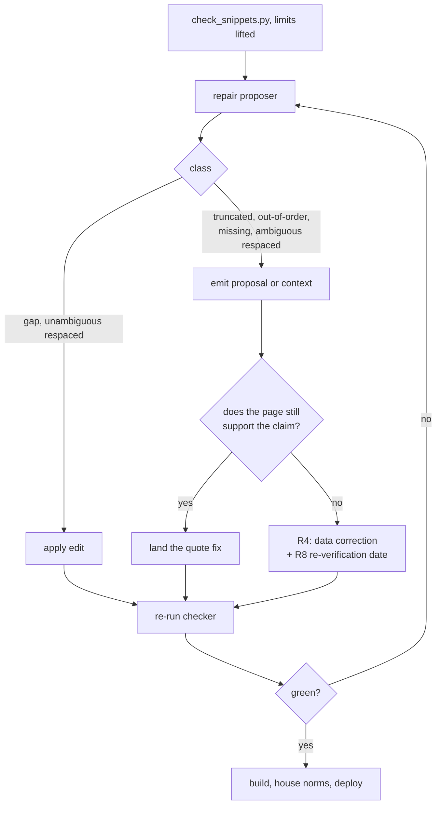

# fix: Make every published snippet a verifiable quotation

## Product Contract

### Summary

Repair every snippet that `scripts/check_snippets.py` fails — 139 in the system
records plus whatever the same check finds in the platform records, which it has
never read — and correct the public triage on issue #9, whose title and comment
thread both carry numbers since disproved.

### Problem Frame

The report's one load-bearing promise is that a reader can follow any
`source_url` and see the quoted text. `check_snippets.py` tests that promise and
finds 139 of 279 snippets failing. The tool is right and the corpus was written
to a looser standard: quotations drop interior lines without marking the cut,
re-indent code, trim a line mid-sentence, or reorder a run.

It has also never looked at `data/platforms.json`, which publishes 31 more
snippets to readers in exactly the same shape. A reader cannot tell which class
was checked, so leaving them out would keep a tenth of the published quotations
unverified while the report reads as uniformly verified.

Three things make this worth doing properly rather than quickly.

The checker's report is not a complete work list, for two separate reasons. It
appends at most three `gap` findings per snippet, and 42 snippets sit at exactly
three. It also stops after the first non-gap line in each segment, so
`truncated`, `respaced` and `missing` are under-reported too. Measured across the
corpus, 44 snippets hide more defects than the report names. A repair driven off
the report alone leaves defects behind and reports success.

The defect classes need different repairs, and two of them are not mechanical. A
dropped interior line is fixed by marking the cut. A line that is absent from the
page is either a sloppy quotation or a signal that upstream changed — and if
upstream changed, the surrounding description may now be wrong too. Absorbing
that into the quote would hide a data error behind a green check, so the plan
has to be able to tell the two apart rather than asking for a judgment with no
evidence behind it.

Finally, none of the failing snippets is pinned: 87 sit on moving refs and 52 on
live documentation pages. That shapes what a repair can promise. This is a
one-time cleanup, not a guarantee with a maintenance contract behind it.

### Requirements

- **R1.** Every snippet in `data/design-systems.json` and `data/platforms.json`
  passes `check_snippets.py`, or carries a written argument for the one
  sanctioned exception (`--allow-respaced`).
- **R2.** A repaired snippet is still a quotation. A repair may mark a cut,
  restore dropped text, or correct whitespace. It may never introduce wording
  that is not on the page. Where a repair shortens a quoted line rather than
  restoring it, the shortened line still carries the words the record's
  surrounding description depends on; where it cannot, the full line is restored
  even at the cost of length.
- **R3.** Repairs are checked against current upstream. Drift within the two days
  since the collection window is accepted as immaterial.
- **R4.** When a repair reveals that upstream changed what a system does, that is
  escalated as a data correction against the record's prose, not silently
  absorbed into the quotation. The determination is evidence-based, not a
  judgement call: see U4.
- **R5.** Repaired snippets stay inside the schema's documented limits (1,500
  characters, 40 lines) and the corpus house norms.
- **R7.** Issue #9 states the corrected figures in its title and body, and
  records what the original triage got wrong.
- **R8.** Where the evidence in R4 shows upstream genuinely changed after the
  collection window, the record carries a re-verification date alongside the
  repaired quotation rather than publishing it under the 26–28 July stamp
  unqualified.

_R6 (a CI gate on changed snippets) was cut during review. See "Alternatives
Considered"._

### Scope Boundaries

In scope: the 139 failing snippets in the system records, the 4 unfetchable ones,
whatever the checker finds once it reads the platform records, and issue #9.

Out of scope: the 136 snippets that already pass; re-researching any record's
underlying facts; the affordance and technique prose except where R4 forces a
correction, or where a snippet's source cannot be fetched and the record has to
say so.

#### Deferred to Follow-Up Work

- Migrating `source_url` values to commit-pinned permalinks corpus-wide.
  `CONTRIBUTING.md` already asks new contributions for permalinks; retrofitting
  all 310 is a separate pass with its own review burden.

---

## Planning Contract

### Key Technical Decisions

**KTD1. Quotes are re-copied from current upstream.**
_(session-settled: user-directed — chosen over pinning source URLs to
snapshot-era commits: two days of drift is immaterial, and pinning would rewrite
87 URLs as a side effect of a repair pass.)_ Governs R3.

**KTD2. Repair operation is chosen per defect class, minimal edit first.** The
matrix in High-Level Technical Design is the contract. Preferring the smallest
faithful edit keeps the author's chosen excerpt intact and keeps diffs
reviewable. Governs R2.

**KTD3. Build a repair proposer, and adjust the checker so both share one
implementation.** The checker under-reports through two mechanisms — the
three-finding `gap` cap and the early exit after the first non-gap line — so the
proposer cannot read the report and cannot re-implement the walk either, because
proposer-versus-checker drift is the failure that matters most here. The checker
gains a switch to lift its reporting limits and to return page text rather than
display strings; the proposer calls it. Governs R1, R2.

**KTD4. Auto-apply covers all `gap` repairs and the unambiguous `respaced`
ones.** Marking a cut auto-applies regardless of how much the marker hides
_(user-directed: chosen over a size threshold that would route large drops to
human review; the measured spread runs to 165 hidden lines on one snippet)_. A
`respaced` repair auto-applies only where exactly one page line matches after
squashing, that line falls inside the segment's placed span, and it comes from
the raw served bytes rather than a derived view — otherwise the substitution can
paste text that appears nowhere on the page, or text from an unrelated section,
and the round-trip check cannot catch either. Everything else is a proposal a
human lands. Governs R2, R4.

**KTD5. No automated re-checking after the repair.** _(user-directed: chosen over
both a CI gate on changed snippets and a scheduled full-corpus run.)_ This is a
one-time cleanup. `npm run check` stays offline and fast, contributors are never
blocked by an upstream server, and the corpus is re-checked when someone runs the
checker by hand. The accepted cost is that drift back toward today's state goes
unnoticed.

**KTD6. Issue #9 is corrected in place, with a comment recording the history.**
The title is the first thing a reader sees and it currently misleads; editing it
serves readers better than another correction buried in the thread. The comment
preserves what the original claimed and why it was wrong. Governs R7.

**KTD7. The proposer's tests follow the repo's in-script `_selftest()`
convention.** There is no Python test framework here; `scripts/build_dashboard.py`
asserts `_smarten_selftest()` on every run. Adding pytest for one script would be
a larger decision than this plan should make.

---

## High-Level Technical Design

### Defect class to repair operation

| Class              | What the checker means                                                                                     | Repair                                                                                        | Auto             |
| ------------------ | ---------------------------------------------------------------------------------------------------------- | --------------------------------------------------------------------------------------------- | ---------------- |
| `gap` (57)         | Quoted lines are in order, but the page has non-blank lines between them that the snippet drops unmarked   | Insert `...` on its own line at each drop point                                               | Yes, all sizes   |
| `respaced` (21)    | Line matches only after whitespace is squashed — re-indented, reflowed, or joined across a page line break | Substitute the page's exact line; for the joined case, split the quote to match the page      | Only unambiguous |
| `truncated` (29)   | The quoted line is a substring of a longer page line                                                       | Restore the full page line, or shorten to a whole line that still carries the described point | No               |
| `out-of-order` (5) | The quoted run appears on the page in a different order                                                    | Reorder to page order, or split into segments separated by `...`                              | No               |
| `missing` (27)     | The line is not on the page in any form                                                                    | Establish whether upstream changed (U4), then re-copy or escalate per R4                      | No               |

`...` is the house marker: 17 snippets already use it, against 7 for `…`. The
checker's `segments()` splits at either, so a marker restarts the contiguity
requirement rather than suppressing the check.

"Unambiguous" for `respaced` means all three of: exactly one squash-equal page
line, inside the segment's placed span, from the raw body rather than a derived
view. Seven of the 21 currently score best against a derived view and four have
more than one matching line.

### The repair loop

---

## Implementation Units

### U1. Repair proposer

**Goal:** A script that derives the complete defect list for every failing
snippet and emits a concrete proposed edit, or usable context where no edit is
derivable.

**Requirements:** R1, R2 · **Dependencies:** none

**Files:**

- `scripts/repair_snippets.py` (new)
- `scripts/check_snippets.py`

**Approach:**

1. Refactor the checker so the proposer can reuse it rather than re-implement
   it: give `check_view` an optional finding cap (default 3, uncapped for the
   proposer) and remove the early exit that stops after the first non-gap line
   per segment; change `diagnose` to return the matched page line alongside its
   message rather than a truncated display string.
2. Import `check_snippets` and drive `fetch`, `fetch_urls`, `views`, `segments`,
   `place`, `place_with_gaps`, `diagnose` and `check_view` from the proposer. Do
   not re-implement placement.
3. Record, per proposal, which candidate URL and which view won, so a `respaced`
   substitution can be restricted to the raw body per KTD4.
4. Emit one proposal per snippet: class, the exact edit, and the before/after
   body. For `missing`, no edit is derivable — emit the snippet line, the URL
   fetched, and the nearest page lines by squashed similarity, as context for the
   decision U4 makes.
5. Support `--apply` restricted to the classes KTD4 marks safe, and a
   report-only default. Scope with `--only <record>`.

**Patterns to follow:** the checker's own argument shape and cache reuse;
`_smarten_selftest()` in `scripts/build_dashboard.py` for the assert-on-run test
convention.

**Execution note:** Write the selftest cases before the transformations. Getting
`gap` insertion wrong silently corrupts 57 snippets, and the round-trip test
below cannot catch a substitution that is exact but sourced from the wrong place.

**Test scenarios** (`_selftest()`, asserted on every run):

- A snippet dropping one interior line yields exactly one `...` at the drop
  point, and no other change.
- A snippet dropping lines at two separate points yields two markers, each at its
  own point.
- A snippet whose drop is at the very start or end yields no marker — there is no
  interior cut.
- A snippet already carrying `...` at a drop point is left unchanged.
- A snippet with more than three drops yields a marker at every one, proving the
  cap was lifted.
- A snippet with two defects in one segment reports both, proving the early exit
  was removed.
- A re-indented line with exactly one squash-equal page line in the placed span,
  from the raw body, yields substitution preserving leading whitespace.
- A line with two squash-equal page lines yields a proposal, not an applied edit.
- A line whose only match is in a derived view yields a proposal, not an applied
  edit.
- A `missing` line yields context (line, URL, nearest page lines) and no
  candidate edit.
- `--apply` refuses `truncated`, `out-of-order`, `missing`, and ambiguous
  `respaced`.
- A proposal's after-body, fed back through `check_snippet`, returns `ok`.

**Verification:** the proposer reports a proposal or a flagged item for all 139
failing snippets and nothing for the 136 passing ones.

### U2. Repair the auto-applicable classes

**Goal:** Clear the 57 `gap` snippets and the unambiguous share of the 21
`respaced` ones.

**Requirements:** R1, R2, R5 · **Dependencies:** U1

**Files:** `data/design-systems.json`

**Approach:** Run the proposer with `--apply`, then read the diff record by
record. The edit is mechanical; the review is not. Confirm each inserted marker
sits at a genuine cut. Where a `respaced` case turns out to be a server-rewritten
page rather than a re-indented quote, record the argument in Open Questions
before reaching for `--allow-respaced`.

Serialize with `json.dumps(indent=2, ensure_ascii=False)` — a round-trip through
that is byte-identical to the committed file, so the diff stays reviewable. A
different serializer will rewrite the whole file and destroy per-record review.

**Execution note:** Land per record, not as one commit across 20 records.

**Test scenarios:** `Test expectation: none — this unit changes data, and the
checker is its oracle.`

**Verification:** no snippet in a touched record is _classed_ `gap`, and no
unambiguous `respaced` remains. One snippet (chakra-ui's "CLAUDE.md (repo root)")
carries `gap` findings under a `truncated` class and clears in U3.

### U3. Repair truncated quotations

**Goal:** Clear the 29 `truncated` snippets.

**Requirements:** R1, R2, R5 · **Dependencies:** U1

**Files:** `data/design-systems.json`

**Approach:** For each proposal, choose between restoring the page's full line
and shortening the quote to a whole line. Restoring is the default. Shorten only
when the tail is long and irrelevant _and_ the shortened line still carries the
words the record's description depends on — per R2, where it cannot, restore in
full. Watch R5: restoring full lines is the repair most likely to push a snippet
past 1,500 characters.

**Test scenarios:** `Test expectation: none — data change, checker is the oracle.`

**Verification:** zero `truncated` corpus-wide; no snippet exceeds the schema's
documented limits.

### U4. Resolve the judgment classes and the unreadable sources

**Goal:** Clear the 5 `out-of-order`, 27 `missing`, ambiguous `respaced` and 4
unfetchable snippets, separating sloppy quotation from upstream change on
evidence rather than impression.

**Requirements:** R1, R2, R4, R8 · **Dependencies:** U1

**Files:** `data/design-systems.json`

**Approach:**

1. For each `missing`, fetch fresh with `--refresh` _and_ retrieve the same file
   at a commit dated inside the collection window from the upstream project's own
   history. Comparing the two is what distinguishes a quotation that was always
   wrong from a page that moved. Most of these sources are git-hosted, so the
   history is available; where it is not, say so on the record rather than
   guessing.
2. Where the comparison shows upstream changed, check whether the record's
   description still holds (R4) and stamp the re-verification date (R8).
3. For `out-of-order`, prefer reordering to page order; split with markers only
   where the original order carried meaning.
4. The three Atlassian entries cite an MCP endpoint that answers HTTP 400 to a
   plain GET because it speaks JSON-RPC. Repoint all three at a `source_url` that
   serves text. Dropping the URL is not available: the checker fails a snippet
   with no `source_url`, and deleting the snippets would break the
   count-unchanged rule in the Verification Contract.
5. The Shopify entry cites an npm version page that answers 403 to a non-browser
   fetch — the same bot wall that produced eight mis-cited URLs last pass.
   Repoint to the repo or the published tarball.

**Execution note:** Any R4 escalation found here is a finding about the report's
accuracy, not a chore. Record it even if the fix lands in a later pass.

**Test scenarios:** `Test expectation: none — data change, checker is the oracle.`

**Verification:** `check_snippets.py` exits 0 across the system records.

### U5. Post-repair sweep

**Goal:** Confirm the repair pass did not violate a constraint the checker does
not police.

**Requirements:** R1, R5 · **Dependencies:** U2, U3, U4, U8

**Files:** `data/design-systems.json`, `data/platforms.json`

**Approach:** Run the house-norms check for snippet length and line count, run
prettier over both data files, and run `./scripts/build.sh` so the payload,
markdown mirrors, SQLite and MCP surfaces regenerate. Confirm the snippet count
is unchanged — a repair that deletes a snippet is a scope error, not a fix.

**Do not run `scripts/build_db.py`.** Nothing references it — not the build, not
`npm run check`, not CI — and it rewrites `data/design-systems.json` from
`data/raw/`, which holds 22 files against the current 20 records. Running it
discards every repair in this plan and changes which systems are in the report.
The SQLite export named above is written by `build_md.py` as part of the normal
build.

**Test scenarios:** `Test expectation: none — this unit runs existing checks.`

**Verification:** `npm run check` exits 0, read from a redirected log rather than
a pipe.

### U7. Correct issue #9

**Goal:** A reader arriving at issue #9 sees accurate figures without reading the
comments.

**Requirements:** R7 · **Dependencies:** U5

**Files:** none in the repo — this unit acts on GitHub.

**Approach:** Retitle from the current "142 of 278" framing to the resolved
state. Rewrite the body to the corrected class tally and the outcome. Add a
comment recording the history honestly: the original triage claimed 142 defects,
the follow-up comment claimed 39 `missing` verdicts needed re-checking through a
rendering fetch, and both were wrong — 17 of those were mis-cited URLs the
checker could not read, not corpus defects. Close it if the repair pass landed
first; leave it open pointing at the remaining work if not.

**Execution note:** This is public and outward-facing. Confirm the wording before
posting.

**Test scenarios:** `Test expectation: none — this unit edits a GitHub issue.`

**Verification:** the issue title and body state figures matching the checker's
output at the time of the edit.

### U8. Bring the platform records under the same check

**Goal:** The 31 snippets in `data/platforms.json` are checked and repaired to
the same standard as the system records.

**Requirements:** R1, R2 · **Dependencies:** U1

**Files:** `scripts/check_snippets.py`, `data/platforms.json`

**Approach:** Extend the checker's data loading to read `data/platforms.json`
alongside `data/design-systems.json`, walking capability snippets the same way it
walks affordances and techniques. Then run the proposer over the result and
repair by the same class rules as U2–U4. The damage here is unmeasured — no one
has ever run this — so size the work after the first run rather than before.

**Execution note:** Run the checker over the platform records before planning the
repair. If the failure rate resembles the system records, this is roughly 15
snippets; if the platform records were written to a tighter standard, it may be
close to zero.

**Test scenarios:** `Test expectation: none — data change, checker is the oracle.`

**Verification:** `check_snippets.py` exits 0 across both data files.

---

## Verification Contract

- `python3 scripts/check_snippets.py` exits 0 over the system and platform
  records.
- `npm run check` exits 0, with the status read from a redirected log. A pipe
  reports the pipe's status and has twice reported a failing gate as green here.
- The snippet count is unchanged at 279 system and 31 platform snippets; no
  repair deleted a snippet.
- No snippet exceeds 1,500 characters or 40 lines.
- Every `--allow-respaced` use, if any, has a written argument.

## Definition of Done

1. All 139 failing and 4 unfetchable system snippets are resolved, along with
   whatever U8 finds in the platform records, or they carry a recorded argument
   for the exception.
2. Any R4 data correction found during repair is filed or fixed, not absorbed,
   and any R8 re-verification date is recorded.
3. Issue #9 reads accurately from the title down.
4. The site is rebuilt and deployed, and the corrected snippets are live on the
   markdown mirrors and MCP surface.

## Risks & Dependencies

**A repair that hides a data error.** The `missing` class is where a changed
upstream looks exactly like a sloppy quote. U4's upstream-history comparison is
the mitigation; it depends on the implementer actually running it rather than
eyeballing today's page.

**A proposer that drifts from the checker.** Mitigated by KTD3 — one shared
implementation, with the checker refactored rather than copied — and by the
selftest that round-trips a proposal back through `check_snippet`. Note that the
round-trip is confirmation-shaped: any repair that makes the checker green with
the wrong text passes it by construction, which is why KTD4 restricts what
auto-applies.

**Diff volume.** 139 snippet edits across 20 records is a large diff in a file
that is the report's entire factual basis. Mitigated by landing per record and by
holding the serializer stable.

**No safety net after this.** KTD5 accepts that nothing re-checks the corpus.
137 of the failing snippets sit on refs that move, and they still will
afterwards. The repair is a point-in-time cleanup and the plan does not pretend
otherwise.

**Another session is active in this repo.** Two further-reading commits landed
mid-session today. Re-read the working tree immediately before committing.

## Alternatives Considered

**A CI gate on changed snippets.** Cut during review. It would have caught a
non-verbatim snippet at PR time while ignoring drift elsewhere, but three
mechanics defeated it: CI clones at depth 1 so no merge base exists; `check.sh`
also runs on push-to-main and on every local `npm run check`, neither of which
has a base ref, and it runs under `set -e`; and with no cache in CI it fetches
live, so a 403 or a timeout on a contributor's own cited page would fail their
build for a network reason. Fixing all three was possible but bought a guarantee
narrower than its cost.

**A scheduled full-corpus run.** Cut during review. A weekly job reporting drift
as an issue rather than a build failure would have caught decay without touching
contributors. Rejected in favour of treating this as a one-time cleanup.

**Whole-corpus blocking gate.** Strongest guarantee, but every failing snippet
sits on a moving ref or a live page, so an upstream edit would fail an unrelated
contributor's build.

**Loosen the checker instead of the corpus.** Accepting substring matches would
turn 139 failures into zero without changing a quotation. It would also destroy
the property that makes the checker worth having: a substring search scores a
truncated URL and a dropped parenthetical as verbatim.

**Hand-edit all 139.** No new script to maintain. Rejected on the report's
under-reporting — hand-editing from an incomplete work list produces a confident
false green.

**A size threshold on auto-applied cut markers.** Considered and declined: the
measured spread runs to 165 hidden lines, but routing large drops to human review
was judged not worth the slowdown. Recorded in KTD4.

## Open Questions

- Does any `respaced` case turn out to be a server-rewritten page rather than a
  re-indented quote? If so, U2 records the written argument and uses
  `--allow-respaced`; if none does, the flag stays unused and that is the better
  outcome.
- How much of the `missing` class is genuine upstream change rather than sloppy
  quotation? U4's comparison produces the number; nobody has measured it, and it
  determines how much of U4 is escalation rather than repair.

## Sources & Research

- `scripts/check_snippets.py` — `place`, `place_with_gaps`, `diagnose`,
  `segments` and `check_view` define every verdict this plan repairs.
  `check_view` caps `gap` findings at three and breaks after the first non-gap
  line per segment; both limits are why KTD3 exists.
- Corpus measurement, 2026-07-28: 279 system snippets, 139 failing (57 `gap`, 29
  `truncated`, 27 `missing`, 21 `respaced`, 5 `out-of-order` by worst verdict), 4
  unfetchable. 87 failures on moving refs, 52 on live docs pages, none pinned.
  `data/platforms.json` carries 31 further snippets the checker has never read.
- Elision convention: 24 of 279 snippets already mark a cut, 17 with `...`.
- `PROSE_KEYS` in `scripts/build_dashboard.py` excludes `content`, so the build's
  smart-quote pass does not rewrite snippet bodies. Checked because it would have
  been a systematic cause of `respaced`; it is not.
- `.github/workflows/ci.yml` checks out at default depth and runs on both
  `pull_request` and `push: branches: [main]` — the finding that retired the CI
  gate.
- `scripts/build_db.py` is referenced nowhere and rewrites
  `data/design-systems.json` from `data/raw/`; the SQLite export is written by
  `build_md.py`.
- Issue #9 and its comment thread — the artifact U7 corrects.

No external research was run. This is repair against a checker in this repo, with
no library or technology choice to make.
