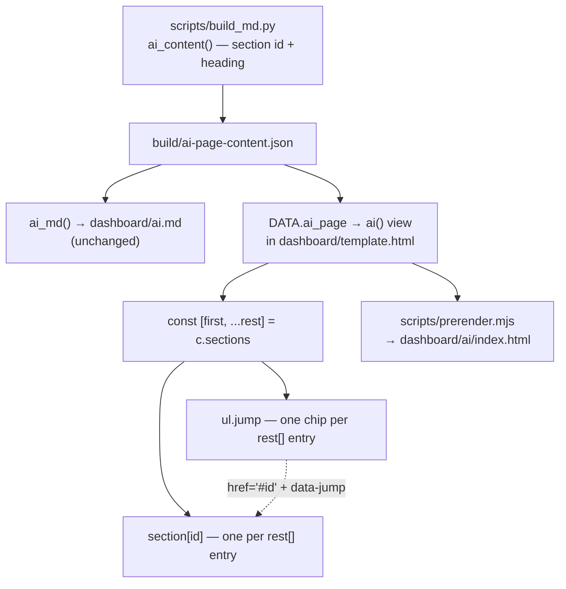

# feat: Add a section jump list to /ai

## Goal Capsule

`/ai` is the longest prose route on the site: seven `<h2>` sections, one of which
(`Connect the MCP server`) carries six editor configs and their code blocks. A
reader who arrives wanting only the Cursor snippet, or only the SQLite download,
scrolls past everything else to find it. Give the page a jump list — the same
affordance `/platforms` already ships — so the sections are addressable from the
top.

Scope is the HTML view only. The markdown twin `/ai.md` is unchanged.

---

## Problem Frame

The `/ai` view renders its first section into the page head (lede + intro prose)
and the remaining six as `<section id="…"><h2>…</h2>`. The ids exist and are
stable — they come from `build/ai-page-content.json`, compiled by
`scripts/build_md.py` — but nothing on the page links to them. There is no way to
see the page's shape without scrolling it, and no way to link a colleague to
"the MCP bit" short of telling them to scroll.

`/platforms` has the same shape and solved it: a wrapping row of chip links above
the sections. `/ai` should reuse that, not invent a second pattern.

---

## Requirements

- **R1.** `/ai` renders a jump list linking to each section that renders as a
  `<section id>` element — the six that follow the intro. The seventh, `What this
is`, is folded into the page head and has no anchor; see KTD3.
- **R2.** Every jump-list entry resolves to an element that exists on the page —
  no dead anchors, now or after the section set changes.
- **R3.** Activating an entry moves both the viewport and keyboard focus to the
  target section, and does not get intercepted by the router in either the
  path-routed site or the hash-routed single-file artifact.
- **R4.** The list is present in the prerendered static HTML, not only after the
  client script runs.
- **R5.** The markdown twin `/ai.md` is byte-unchanged.
- **R6.** The page's existing copy, section order, and section ids are unchanged.

---

## Key Technical Decisions

**KTD1. Reuse the `.jump` pattern from `/platforms` rather than designing a new
TOC component.** `dashboard/template.html:1112` already renders
`<ul class="jump" aria-label="…">` with `data-jump` attributes; the delegated
handler at `dashboard/template.html:1449` calls `preventDefault()`,
`scrollIntoView({block:'start'})` and `target.focus({preventScroll:true})`. The
`preventDefault()` is load-bearing — without it the hash-routed artifact reads
`#mcp` as a route. The CSS (`.jump`, lines 266-268, 381, 658) is already written,
already contrast-checked, and already has a touch-target bump at ≤860px.
Rejected: a bespoke sticky sidebar TOC — it would need new CSS, new responsive
rules, new contrast checks, and a second scroll-position concept, for a page with
six sections.

**KTD2. Derive the list from the `rest` array the view already computes, not from
a hand-written list of links.** `ai()` destructures
`const [first, ...rest] = c.sections;` — `rest` is exactly the set that renders as
`<section id>`. Mapping the jump list over that same array makes R2 structural:
an entry can only exist if the section it points at is being rendered in the same
expression. Rejected: a literal list of six `{id, label}` pairs, which would go
stale the first time a section is added, renamed, or reordered in
`scripts/build_md.py`, and would do so silently.

**KTD3. The first section (`What this is`) gets no entry.** It renders into the
page head with no `<section id>` wrapper, so it has no anchor to point at, and it
is the content the reader is already looking at when the list is in view. Using
`rest` rather than `c.sections` gives this for free. Rejected: wrapping the first
section so it can be listed — it would push the lede and intro below a nav
element and change the page's opening for no navigational gain.

**KTD4. `<h2>` only; the six editor configs under `Connect the MCP server` are not
listed.** They render as `<h3>` from `configs` blocks and carry no ids. A
two-level list would mean minting ids for them and a nested visual treatment the
`.jump` chip row does not have. Six top-level entries is the right density for
the page. Rejected: h2+h3, which would make a 12-entry list where six of the
entries are all inside one section.

**KTD5. No TOC in `/ai.md`.** The jump list is page chrome, not copy. Markdown
consumers navigate by heading, and `/ai.md` is concatenated into
`/llms-full.txt`, where a duplicated link list is bytes that buy an agent
nothing. This does not violate the page/twin parity rule in `AGENTS.md` — that
rule governs the _copy blocks_, which are untouched; the list is derived from
headings both surfaces already carry. Rejected: mirroring the list into
`ai_md()`, which would change `/ai.md` (violating R5) and inflate the llms
bundles.

**KTD6. Work lands on the current branch `feat/generated-og-image`.**
(session-settled: user-directed — chosen over cutting a fresh branch off `main`:
the user asked for it directly on the same branch.)

**KTD7. Placement is after the intro prose, immediately before the first
`<section>`.** `/platforms` puts its jump list directly under the accent rule
because the lede is its whole intro. `/ai`'s head carries three further prose
blocks explaining what the page is; a nav element wedged between the lede and
that explanation interrupts it. Reading order becomes: title, lede, what this
page is, what's on it, then the sections.

---

## High-Level Technical Design

The dotted edge is the only new relationship, and both of its endpoints are
generated from the same `rest` array in the same expression — which is what makes
R2 hold without a check.

---

## Implementation Units

### U1. Render the jump list and make the sections proper jump targets

**Goal:** `/ai` shows a chip row linking to its six `<h2>` sections, and those
sections behave as jump targets the way `.plat` and `.tech-cat` already do.

**Requirements:** R1, R2, R3, R6, KTD1, KTD2, KTD3, KTD7

**Dependencies:** none

**Files:**

- `dashboard/template.html` — the `ai()` view function (~line 1181-1205) and one
  new CSS rule near the other jump-target rules (`.plat` at line 572,
  `.tech-cat` at line 530)

**Approach:**

1. In `ai()`, build the list from the existing `rest` array — one `<li>` per
   section with `href="#${esc(sec.id)}"` and `data-jump="${esc(sec.id)}"`, label
   `esc(sec.heading)`. Mirror `/platforms`' markup exactly:
   `<ul class="jump" aria-label="Jump to a section">`.
2. Append it to the `head` template literal, after
   `first.blocks.slice(1).map(...)` — per KTD7 — so it sits between the intro
   prose and the first `<section>`.
3. Add `tabindex="-1"` to the `<section>` elements the view emits, matching
   `.plat`. Without it the handler's `target.focus()` is a no-op on a
   non-focusable element and the keyboard is left at the top of the page while
   the viewport moves.
4. Add a CSS rule giving those sections `scroll-margin-top: 16px`, matching
   `.plat` and `.tech-cat`. Give the sections a class to hook it (e.g.
   `class="ai-sec"`) rather than styling `#ai` descendants positionally.

No new event handler: the delegated `a[data-jump]` listener at line 1449 is
document-level and already claims these links.

**Patterns to follow:**

- `dashboard/template.html:1112-1113` — the `/platforms` jump-list markup
- `dashboard/template.html:1114` — `<section … tabindex="-1">` on a jump target
- `dashboard/template.html:572` — `.plat`'s `scroll-margin-top: 16px`
- `dashboard/template.html:266-268` — existing `.jump` styling; do not add to it

**Test scenarios:**

The repo has no DOM-level test harness — `tests/` holds `mcp.test.mjs` and
`validate_data.test.mjs`, both data-layer. The view functions are verified
through `scripts/prerender.mjs`, which executes them in `node:vm` and writes real
HTML. Verify against that output (enumerated in U2) rather than adding a first
DOM harness, which is out of scope for this change.

**Verification:** `./scripts/build.sh` completes, and `dashboard/ai/index.html`
contains a `ul.jump` whose six `href` values each match an `id` on a `<section>`
in the same file.

---

### U2. Verify the rendered surfaces and confirm the markdown twin is untouched

**Goal:** Prove R2, R4 and R5 against generated output, and that the change
passes the gate CI runs.

**Requirements:** R2, R4, R5

**Dependencies:** U1

**Files:**

- none authored — this unit reads `dashboard/ai/index.html`, `dashboard/ai.md`,
  and the output of `npm run check`

**Approach:**

Run the full build, then check the generated artifacts. `dashboard/` is
gitignored output, so nothing here is committed; the point is that the source
change produces the right generated result.

**Test scenarios:**

- Anchor integrity: every `href="#…"` inside `ul.jump` in
  `dashboard/ai/index.html` matches the `id` of a `<section>` in that file, and
  the counts are equal in both directions (six links, six sections, no orphan on
  either side).
- Prerendered presence (R4): `ul.jump` is in the static
  `dashboard/ai/index.html` on disk, not injected only at runtime.
- Label fidelity: each chip's text equals its target section's `<h2>` text.
- First section excluded (KTD3): no chip points at `#what`, and no
  `<section id="what">` exists.
- Focus target (R3): each `<section>` on `/ai` carries `tabindex="-1"`.
- Markdown twin unchanged (R5): `dashboard/ai.md` is byte-identical to its
  pre-change build. Because the build stamps a timestamp, compare against a
  rebuild of the unmodified tree rather than against a stale file — or diff only
  the body below the frontmatter.
- Gate: `npm run check` exits 0 — eslint, prettier, tsc, generated types, ruff,
  mypy, deno, the contrast check, the build, the tests, and
  `check_md_layer.py`.

**Verification:** `npm run check` exits 0 and each scenario above holds.

---

## Assumptions

Recorded because this run was headless; each is a bet the implementer should
correct on contact if the code says otherwise.

- The delegated `a[data-jump]` handler is document-level and unconditioned on
  route, so it claims `/ai`'s links without modification. Read
  `dashboard/template.html:1449-1456` to confirm before relying on it.
- No sticky top bar can obscure a jump target: `.rail` is a sticky _left_ rail at
  > 860px and goes `position: relative` below that
  > (`dashboard/template.html:635`). `scroll-margin-top: 16px` is therefore
  > breathing room, matching precedent, not a header offset.
- Chip labels are section headings verbatim. `What this site took from its own
research` is long for a chip; `.jump` is `flex-wrap: wrap`, so it wraps to its
  own row rather than overflowing. If it reads badly at 540px, shortening it is a
  copy change in `scripts/build_md.py` and is out of scope here — raise it rather
  than truncating in the view.

---

## Scope Boundaries

**In scope:** the `/ai` HTML view's jump list and its section jump-target
affordances.

**Out of scope (non-goals):**

- Any change to `/ai.md`, the copy blocks in `scripts/build_md.py`, or
  `build/ai-page-content.json`'s shape.
- Active-section highlighting as the reader scrolls. `/platforms` does not do it
  either; adding it here would introduce an IntersectionObserver and a scroll
  state concept the site currently has none of.
- Smooth scrolling. The existing handler scrolls instantly, which needs no
  `prefers-reduced-motion` guard.

### Deferred to Follow-Up Work

- The same treatment on other long routes (`/about/schema`, `/methodology`) if
  it proves useful here. Deliberately not bundled: this change should be judged
  on one page first.
- Ids on the six `<h3>` editor configs under `Connect the MCP server`, which
  would make them directly linkable (`/ai#cursor`). Useful, but a separate
  decision about the page's URL surface.

---

## Risks

- **Low — the section set changes later and the list drifts.** Structurally
  prevented by KTD2: list and sections are generated from one array in one
  expression.
- **Low — the `.jump` chip row reads heavy with six long labels where
  `/platforms` has short product names.** Visible immediately on
  `netlify serve`. Mitigation if so is a copy question, not a code one; see
  Assumptions.

---

## Verification Contract

- `npm run check` exits 0.
- `dashboard/ai/index.html` contains `ul.jump` with six entries, each `href`
  matching a `<section id>` in the same file.
- `dashboard/ai.md` body is unchanged.

## Definition of Done

`/ai` renders a jump list to its six sections; activating an entry moves both
viewport and focus; the list is in the prerendered HTML; `/ai.md` is unchanged;
`npm run check` passes; the work is committed on `feat/generated-og-image`.

---

## Sources & Research

- `AGENTS.md` — generated-vs-source boundary under `dashboard/`, the
  computed-counts rule, and the page/markdown-twin parity rule that KTD5 reasons
  against.
- `dashboard/template.html:1181-1205` — the `ai()` view.
- `dashboard/template.html:1109-1125` — the `/platforms` jump-list precedent.
- `dashboard/template.html:1447-1456` — the `data-jump` handler.
- `scripts/build_md.py:1384-1420` — `/ai` content compilation and `ai_md()`.
- `scripts/build.sh` — the five-step build; `prerender.mjs` runs the view
  functions in `node:vm`, which is why R4 is checkable on disk.
- `modern-web-guidance` (2026_05_16) — searched for in-page TOC / anchor
  navigation guidance. No matching guide (top similarity 0.56, on scroll-snap
  state sync). The repo's existing handler already implements the accessible
  shape such a guide would prescribe: focus moves with the viewport, and the
  activation is not left to default anchor behavior.
