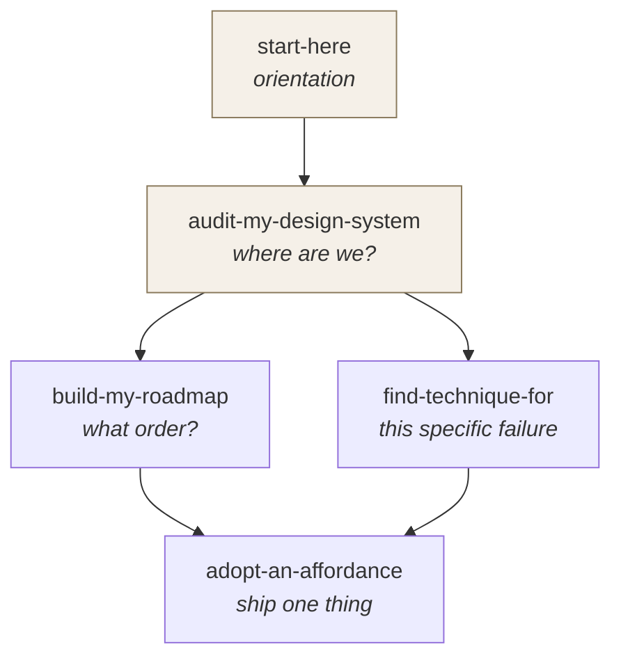
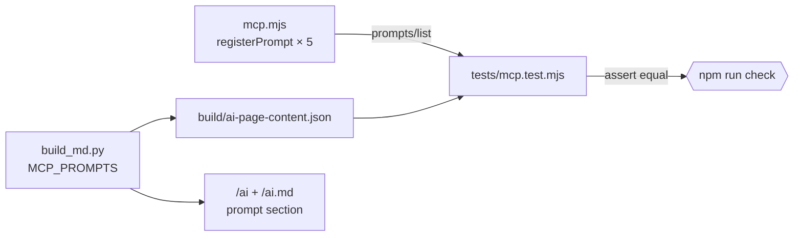

# feat: Ship the audit workflow as MCP prompts

## Goal Capsule

The server already registers two prompts — `audit-my-design-system` and
`find-technique-for`. In Claude Code they appear as
`/mcp__ds-state-of-ai__<name>`; in other clients they appear in a prompt picker.
They ship with the deploy, need no install, and depend on nothing outside this
repo. They are also documented nowhere a person would look.

Take that surface seriously: rework the audit prompt so it hands the agent the
corpus vocabulary instead of telling it to go fetch it, add three prompts that
cover the rest of the job (orientation, adoption, sequencing), bind the published
prompt list to the registered one so it cannot drift again, and put the whole set
on `/ai` where the rest of the connection instructions already live.

Five prompts total when this lands. No new install path, no external skill, no
dependency on any third-party inspection kit.

---

## Problem Frame

Someone connects `ds-state-of-ai` to audit a design system that is not in the
survey. Three things go wrong today.

**The commands are invisible.** `/ai` is the route whose entire job is "read this
report with an AI assistant" — markdown twins, a prompt to paste, the MCP server,
the raw data, the tools the page registers. It documents all of that and never
mentions the two prompts the server ships. `AGENTS.md` describes nine tools and
two resources and is silent on prompts. The only trace in the repo is
`README.md:117` counting "2 prompts" inside a build-output table. The report's own
Station-10-shaped finding applies to its author: a capability nobody knows about
is worth what no capability is worth.

**The audit prompt makes the agent go and get what the server already holds.**
`netlify/functions/mcp.mjs:1194` instructs the agent to "Call get_stats to learn
the affordance types and the coverage baseline." But `ENUMS` is a module-scope
constant, derived from the payload, in scope at registration time. The prompt
could hand over the 15 affordance types, the 11 technique categories and the
maturity tiers directly — costing one round trip less and removing the window in
which a model invents a filter value that no tool accepts.

**Two of the four jobs have no prompt.** The existing pair covers auditing against
the survey and finding a technique for a known failure. Nothing covers orienting a
fresh agent to the server's retrieval contract, nothing covers adopting one
specific affordance with the verbatim examples that make it buildable, and nothing
covers turning audit gaps into sequenced work.

A fourth problem surfaced while planning and is handled here as a correction
rather than a feature: **the build does not catch what the docs say it catches.**
`scripts/build_md.py:1018` states that `scripts/prerender.mjs` "runs the browser
module and fails the build if this list and the registered tools disagree", and
`AGENTS.md` repeats it in the list of what the build catches. A grep across
`scripts/*.py`, `*.sh` and `*.mjs` for `webmcp`, `modelContext`, `registerTool`
and `ai-page-content` finds the claim in `build_md.py` and nowhere else.
`prerender.mjs` has no such check. The sentence being corrected is the same one
that has to change to mention prompts, so leaving a known-false clause standing
inside an edit to that clause is not defensible.

---

## Requirements

- **R1.** The server registers five prompts: `start-here`,
  `audit-my-design-system`, `adopt-an-affordance`, `build-my-roadmap`,
  `find-technique-for`.
- **R2.** Every prompt that depends on the controlled vocabulary embeds it,
  generated from the payload at registration time — no prompt instructs the agent
  to discover a vocabulary the server can hand it.
- **R3.** `audit-my-design-system` reads as a procedure any MCP client can follow,
  with a single clearly-marked clause describing how to fan the phases out when
  the client supports subagents.
- **R4.** The audit prompt distinguishes "we do not ship this" from "this does not
  apply to us", so a private single-consumer system is not scored against
  affordances that exist to serve external consumers.
- **R5.** The prompt names published on `/ai` are bound to the names the server
  registers; the two disagreeing fails `npm run check`.
- **R6.** `/ai`, `/ai.md`, `README.md` and `AGENTS.md` document the prompt surface
  and how to invoke it.
- **R7.** The false WebMCP drift-guard claim is either made true or removed from
  `AGENTS.md` and `scripts/build_md.py`.
- **R8.** No prompt instructs the agent to depend on anything outside this server
  and the repo it is pointed at.

---

## Key Technical Decisions

**KTD1 — Slash commands are MCP prompts, not a distributed skill.**
`server.registerPrompt` is the only mechanism that satisfies "bundled and
distributed along with the MCP": it deploys with the function, needs no install
step, and every MCP client exposes it. A skills directory or plugin would be a
second artifact with its own install path and its own version skew. Rejected.

**KTD2 — Bake the vocabulary at registration time, not request time.** The prompt
factory closes over `ENUMS`, `SYSTEMS` and the counts. A prompt body interpolates
the real affordance types and technique categories. This makes prompts longer and
couples their text to the payload, which is the correct coupling — it is what
every other published surface in this repo already does, and a stale vocabulary
becomes a build failure rather than a bad answer.

**KTD3 — One portable audit prompt with an escalation clause, not two prompts.**
An MCP prompt runs in Cursor, VS Code and chat connectors where fan-out does not
exist. The audit reads as an ordered single-agent procedure; one marked paragraph
says how to distribute the phases if the client can, and names the one phase that
*must* go to a context that has not read the system — the build test. A separate
`-deep` variant would double the maintenance and mislead in every client that
cannot run it.

**KTD4 — Bind the prompt list in the Node test, not in the Python build.**
`scripts/build_md.py` gains an `MCP_PROMPTS` list beside the existing
`WEBMCP_TOOLS`, emitted into `build/ai-page-content.json`. `tests/mcp.test.mjs`
already imports the server and already asserts the exact sorted prompt list; it
reads the emitted list and asserts equality. Teaching Python to parse JavaScript
would add a seam this repo does not have, to prove something the Node side can
prove directly.

**KTD5 — The clean-room instruction is text, not machinery.** The audit's build
test is only meaningful from a context that has not read the system. The prompt
cannot enforce that. It states the requirement, says plainly what an unenforced
test is worth, and instructs the agent to record the result as provisional when
it cannot comply — the same discipline the report applies to its own claims.

---

## High-Level Technical Design

The five prompts and what each one is for:

The binding that keeps the published list honest:

Directional guidance for review, not implementation specification.

---

## Implementation Units

### U1. Corpus-derived prompt preamble

- **Goal:** One helper in `mcp.mjs` that renders the controlled vocabulary and the
  headline counts as prompt-ready text, so every prompt below interpolates the
  same generated block instead of restating it.
- **Requirements:** R2
- **Dependencies:** none
- **Files:** `netlify/functions/mcp.mjs`, `tests/mcp.test.mjs`
- **Approach:**
  1. Add a module-scope function near the existing prompt section that returns a
     short block naming the affordance types, technique categories, maturity
     tiers, system and platform counts, and the snapshot date — all read from
     `ENUMS`, `SYSTEMS`, `PLATFORMS` and `META`.
  2. Keep it under roughly 15 lines of rendered text. It is a preamble, not a data
     dump; `get_stats` still exists for the full breakdown.
  3. Carry the standing retrieval rule the report applies to itself: cite the
     `source_url` on each record, and say plainly when something could not be
     found rather than treating a failed lookup as an absence.
- **Patterns to follow:** the `ENUMS` construction at `mcp.mjs:57`; the
  `uniqSorted` helper above it.
- **Test scenarios:**
  - The rendered preamble contains every value in `ENUMS.affordance_type`.
  - The rendered preamble contains every value in `ENUMS.technique_category`.
  - The system and platform counts in the preamble equal `SYSTEMS.length` and
    `PLATFORMS.length` — a hand-typed count here would be the exact defect the
    repo's hand-count checks exist to prevent.
- **Verification:** `npm run check` passes; the preamble text is derived, with no
  literal enum value typed into `mcp.mjs`.

### U2. Rework `audit-my-design-system`

- **Goal:** Turn the existing prompt into one that hands over the vocabulary, runs
  a build test, distinguishes absent from inapplicable, and scales to a large
  system without assuming subagents.
- **Requirements:** R2, R3, R4, R8
- **Dependencies:** U1
- **Files:** `netlify/functions/mcp.mjs`, `tests/mcp.test.mjs`
- **Approach:**
  1. Interpolate the U1 preamble in place of step 1's "call get_stats to learn the
     affordance types".
  2. Keep the existing `target` and `compare_to` arguments and their current
     semantics. Add nothing that changes the shape of a call already in use.
  3. Replace "pick two comparable systems" with selection criteria: comparable in
     category, consumer model and team size — explicitly *not* the most advanced
     systems in the survey.
  4. Add the N/A rule: several affordance types exist to serve external consumers;
     where the target has no such consumers, record N/A with the reason rather
     than a gap.
  5. Add the build test as a numbered step: build one real screen from the
     target's own docs and context, and record where the agent guessed. State
     that it is only meaningful from a context that has not already read the
     system, and that an unrun test means the finding is provisional.
  6. Add the escalation clause as one marked paragraph: which phases parallelize,
     and that the build test is the one that must go to an agent told nothing.
  7. Keep the closing instruction that absence must be stated as "could not find",
     never inferred.
- **Execution note:** The existing prompt is live and asserted by name in the test
  suite. Change its body, not its name or its argument schema.
- **Patterns to follow:** the current prompt at `mcp.mjs:1164`; the
  `compare_to ? … : …` conditional-step idiom already used there.
- **Test scenarios:**
  - `prompts/get` with only `target` returns text containing the target string and
    the comparable-selection instruction.
  - `prompts/get` with `target` and `compare_to` returns text naming the
    `compare_to` id, and does not emit the generic pick-two-systems branch.
  - The returned text contains the affordance types from `ENUMS`, confirming the
    preamble interpolated rather than instructing a `get_stats` call.
  - The returned text contains the N/A rule and the build-test step.
- **Verification:** `npm run check` passes; `prompts/list` still reports the same
  name for this prompt.

### U3. `start-here`

- **Goal:** A no-argument prompt that orients a fresh agent: what the server holds,
  the nine tools and when each is the right one, the vocabulary, and the retrieval
  contract.
- **Requirements:** R1, R2, R8
- **Dependencies:** U1
- **Files:** `netlify/functions/mcp.mjs`, `tests/mcp.test.mjs`
- **Approach:**
  1. Register with an empty `argsSchema` — the value is that it costs nothing to
     invoke.
  2. Body: the U1 preamble, then a short tool-selection guide (start at
     `get_stats`; `search` when the question is a phrase, `list_*` when it is a
     filter; `get_snippet` only when the verbatim text is needed, because snippet
     bodies are opt-in to keep responses small), then the two standing rules —
     cite `source_url`, and the data is a snapshot that can be contradicted by a
     newer reality.
  3. Name the other four prompts and what each is for, so the orientation prompt
     is also the index for the rest.
- **Patterns to follow:** the tool descriptions at `mcp.mjs:948` and the
  `AGENTS.md` paragraph describing the nine tools.
- **Test scenarios:**
  - `prompts/get` with no arguments returns a message.
  - The returned text names all nine tools.
  - The returned text names the other four prompts.
- **Verification:** invoking it in a client with no other context produces an agent
  that can answer a corpus question without a wrong-vocabulary tool call.

### U4. `adopt-an-affordance`

- **Goal:** Given one affordance type, return the instruction to gather the working
  examples from comparable systems and turn them into something the caller can
  ship.
- **Requirements:** R1, R2, R8
- **Dependencies:** U1
- **Files:** `netlify/functions/mcp.mjs`, `tests/mcp.test.mjs`
- **Approach:**
  1. Arguments: `affordance` typed as `z.enum(ENUMS.affordance_type)` so the client
     surfaces the 15 valid values and an invalid one is rejected at the schema
     rather than producing an empty result; optional `context` free text for team
     size, consumer model, public or internal.
  2. Body: call `list_affordances` filtered to that type, then `get_system` on the
     two or three whose situation matches `context`, then `get_snippet` for the
     verbatim text.
  3. Require the output to carry the `source_url` for every example and one line on
     what would have to change for it to work in the caller's situation.
  4. Require it to say so when the corpus has nothing appropriate, rather than
     stretching a platform-team technique onto a two-person team.
- **Patterns to follow:** the `z.enum(ENUMS.affordance_type)` argument on
  `list_affordances` at `mcp.mjs:817`; the closing instruction shape of
  `find-technique-for`.
- **Test scenarios:**
  - `prompts/get` with `affordance: "llms-txt"` returns text naming that type.
  - `prompts/get` with an affordance value outside `ENUMS.affordance_type` returns
    a JSON-RPC error, not a message.
  - `prompts/get` with `affordance` and `context` interpolates the context text.
  - `prompts/get` with `affordance` only omits the context clause cleanly, leaving
    no dangling sentence.
- **Verification:** `npm run check` passes; the enum in the prompt schema matches
  the enum the corresponding tool accepts.

### U5. `build-my-roadmap`

- **Goal:** Turn a set of audit findings into sequenced work with the survey's
  evidence attached.
- **Requirements:** R1, R8
- **Dependencies:** U1
- **Files:** `netlify/functions/mcp.mjs`, `tests/mcp.test.mjs`
- **Approach:**
  1. Arguments: `findings` (required free text — what the audit surfaced) and
     `constraints` (optional — people, time, horizon).
  2. Body: for each finding, look for a survey analog and attach the
     `source_url`; then sequence into now / next / later with the dependency order
     made explicit.
  3. Require the critical path to be stated, using the concrete failure the report
     itself demonstrates: a query surface built on top of docs a machine cannot
     parse ships confusion faster.
  4. Require each item to carry what an agent can do versus what needs a person,
     and an observable done-when.
  5. Require it to flag findings the survey cannot speak to, rather than inventing
     an authority for them.
- **Patterns to follow:** the numbered-steps-then-report-shape structure shared by
  both existing prompts.
- **Test scenarios:**
  - `prompts/get` with `findings` returns text containing the findings string.
  - `prompts/get` with `findings` and `constraints` interpolates both.
  - `prompts/get` with `findings` only produces no dangling constraints clause.
  - `prompts/get` with `findings` missing returns a JSON-RPC error.
- **Verification:** `npm run check` passes.

### U6. Bind the published prompt list to the registered one

- **Goal:** Make `/ai` naming a different set of prompts than the server registers
  a build failure.
- **Requirements:** R5
- **Dependencies:** U2, U3, U4, U5
- **Files:** `scripts/build_md.py`, `tests/mcp.test.mjs`
- **Approach:**
  1. Add `MCP_PROMPTS` to `scripts/build_md.py` beside `WEBMCP_TOOLS` at line
     1021, as a list of `(name, one-line purpose)` pairs — the page needs the
     purpose, the assertion needs the name.
  2. Emit the names into `build/ai-page-content.json` next to the existing
     `webmcp_tools` key at line 1387.
  3. In `tests/mcp.test.mjs`, extend the existing `prompts/list` test to read the
     emitted list and assert it equals the registered names, sorted. Replace the
     hardcoded two-name array with the emitted list so there is one source of
     truth rather than three.
- **Execution note:** The test currently hardcodes the expected names. Land the
  emitted-list assertion and delete the literal in the same change, or the third
  copy survives.
- **Patterns to follow:** `WEBMCP_TOOLS` at `build_md.py:1021` and its emission at
  line 1387 — the shape to copy, not the guarantee, which does not exist (see U7).
- **Test scenarios:**
  - `prompts/list` equals the names in `build/ai-page-content.json`, sorted.
  - Adding a name to `MCP_PROMPTS` without registering it fails the suite.
  - Registering a prompt without adding it to `MCP_PROMPTS` fails the suite.
  - The second and third scenarios are verified by temporary local edit during
    implementation and reverted — they prove the guard bites, which is the whole
    point of adding it.
- **Verification:** `npm run check` passes; both directions of drift were observed
  failing before the change was finalized.

### U7. Publish the prompt surface, and correct the guard claim

- **Goal:** Put the five prompts where someone will find them, and stop asserting a
  build guarantee that does not exist.
- **Requirements:** R6, R7
- **Dependencies:** U6
- **Files:** `scripts/build_md.py`, `README.md`, `AGENTS.md`
- **Approach:**
  1. Add a section to `ai_content()` in `scripts/build_md.py`, inside or directly
     after `Connect the MCP server`, built from `MCP_PROMPTS` using the existing
     `prose` and `list` block types — no new block type, so `dashboard/template.html`
     is untouched.
  2. Say how to invoke them: `/mcp__ds-state-of-ai__<name>` in Claude Code, a
     prompt picker elsewhere. Both `/ai` and `/ai.md` get this from the same
     blocks.
  3. Update `README.md:117` from "2 prompts" to the real count, and add the prompt
     surface to the `AGENTS.md` MCP paragraph that currently documents nine tools
     and stops.
  4. Correct the WebMCP claim. First re-verify it: grep `scripts/` for `webmcp`,
     `modelContext`, `registerTool` and `ai-page-content`. If the guard genuinely
     does not exist, strike the clause from the `AGENTS.md` build-catches sentence
     and fix the comment at `build_md.py:1018` to describe what is actually true.
     Do not describe the new prompt guard as covering WebMCP — it does not.
- **Execution note:** The `/ai` copy passes through the `check_md_layer.py` grep
  gate, which fails on `verify_note`, `"verified"` and the word `critic` in
  generated files. Keep those words out of the new copy.
- **Patterns to follow:** the `Tools on the page itself` section at
  `build_md.py:1278` — the closest existing section in both shape and subject.
- **Test scenarios:**
  - Test expectation: none for the prose itself — `npm run check`'s markdown-layer
    self-check covers the generated route, and U6 covers the names. The
    correctness of the corrected sentence is verified by the grep in step 4, not
    by a test.
- **Verification:** `/ai` and `/ai.md` both list five prompts with their purposes;
  `README.md` and `AGENTS.md` agree with the registered count; no sentence in the
  repo claims a guard that grep cannot find.

---

## Verification Contract

- `npm run check` exits 0, run unpiped with the exit status captured — piping to
  `tail` reports the pager's status, not the gate's.
- `prompts/list` returns exactly five names, equal to the list emitted into
  `build/ai-page-content.json`.
- Both drift directions were observed failing before U6 was finalized.
- No literal enum value is typed into any prompt body in `mcp.mjs`.
- `grep -rn "webmcp\|modelContext" scripts/ AGENTS.md README.md` returns no claim
  the code does not support.

## Definition of Done

Five prompts registered and tested; the published list bound to the registered
list with both drift directions proven to fail; `/ai`, `/ai.md`, `README.md` and
`AGENTS.md` documenting the surface and its invocation; the false WebMCP guard
claim corrected; `npm run check` green.

---

## Scope Boundaries

**In scope.** The five prompts, the build-to-test binding, the `/ai` section, the
count and documentation updates across `README.md` and `AGENTS.md`, and the
correction to the WebMCP guard claim.

**Not in scope.** Any new tool or resource. Any change to the nine tools' schemas
or the two resources. Any install path — no skills directory, no plugin, no
`npx` step. Any dependency on a third-party inspection kit.

### Deferred to Follow-Up Work

- **Implement the WebMCP guard the docs describe.** U7 corrects the claim; making
  it true means asserting `WEBMCP_TOOLS` against the tools `registerReportTools()`
  registers in `dashboard/template.html`, which needs the test to parse the
  template or the prerender step to execute the browser module. Real work, its own
  change, and not a prerequisite for anything here.
- **A `compare-two-systems` prompt.** Plausible and cheap, but it is a reading
  aid rather than part of the audit workflow this plan is scoped to.
- **Localising the prompts.** The corpus is English-only; nothing to translate
  into yet.

---

## Risks & Dependencies

- **The llms.txt size budget is nearly spent.** The last gate run reported 16,610
  bytes against a 17,408 ceiling — 798 bytes of headroom. A new `/ai` section
  grows `/ai.md`, and `llms.txt` records measured file sizes. The listing gains no
  new entry, so the growth should be a few digits, not a few hundred bytes. Watch
  step 2 of the markdown-layer check; if it trips, the section prose is the thing
  to shorten, not the budget to raise.
- **Prompt bodies are wire-visible.** Anything registered here is public and
  clients may cache prompt lists. Renaming a prompt later is a breaking change for
  anyone who scripted it, which is why U2 changes the audit prompt's body and
  leaves its name and arguments alone.
- **Baked vocabulary couples prompt text to the payload.** Intended, and consistent
  with every other generated surface. The cost is that a schema change to an enum
  now also changes prompt output — which the U1 test scenarios will catch, since
  they assert derivation rather than literals.
- **`start-here` naming the other prompts creates an internal reference.** Adding a
  sixth prompt later means updating U3's body. Acceptable at five; worth
  generating from `MCP_PROMPTS` if the set grows.

## Open Questions

- Should `start-here` also name the two MCP *resources*, or would that make an
  orientation prompt into a manifest? Leaning no — the tools and prompts are what
  an agent acts through. Resolve while writing U3; either answer is defensible and
  neither blocks.

## Sources & Research

- `netlify/functions/mcp.mjs:1163-1252` — the existing prompt registrations, the
  `registerPrompt` signature, and the argument-schema idiom.
- `netlify/functions/mcp.mjs:57-70` — `ENUMS`, derived from the payload.
- `tests/mcp.test.mjs:141-155` — the current `prompts/list` and `prompts/get`
  assertions, including the hardcoded name array U6 replaces.
- `scripts/build_md.py:1018-1021` — `WEBMCP_TOOLS`, and the comment describing a
  guard that grep cannot find in `scripts/`.
- `scripts/build_md.py:1387` — where `webmcp_tools` is emitted into
  `build/ai-page-content.json`; the parallel U6 follows.
- `scripts/build_md.py:1197-1378` — the `/ai` section and block-type structure;
  `prose`, `list`, `links`, `code` and `configs` are the available block types,
  rendered by `dashboard/template.html:1204-1209`.
- `README.md:117`, `AGENTS.md` MCP paragraph — the hand-typed counts and the
  build-catches sentence this plan corrects.
- No external research was run. The work is entirely internal to this repo's
  existing MCP surface, and local patterns for every piece of it are direct rather
  than adjacent.
