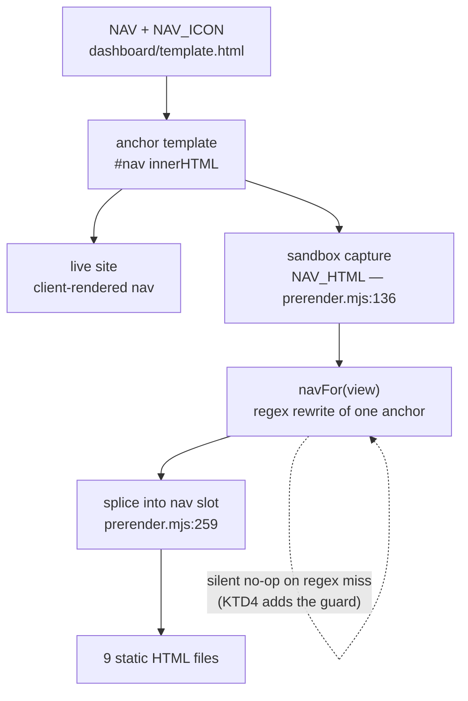

# feat: Add icons to the side nav

## Summary

Give each of the nine rail nav items a small inline SVG icon, so the left rail
reads as a scannable set of destinations rather than a stack of uppercase words.
Icons are decorative: the text labels stay, accessible names do not change, and
nothing new is fetched over the network.

The work is three units. One adds the icons to `dashboard/template.html`. One
closes a latent build gap the change exposes — `navFor()` in
`scripts/prerender.mjs` rewrites the active nav anchor with a silent
`String.replace()`, so a markup change that broke its regex would ship nine
prerendered pages with no `aria-current` and a passing build. One is the
verification pass across both themes and both nav layouts.

---

## Problem Frame

The rail nav is nine uppercase 12px labels in a vertical stack
(`dashboard/template.html:183-191`). Every row looks identical until you read
it, so returning to a section means re-reading the list rather than recognising
a shape. The active row is marked by colour, a right border, and a wash — good
signal, but only after you have located the row.

The nav is generated, not hand-authored. A `NAV` array of `[route, label]` pairs
(`dashboard/template.html:1427`) is mapped to anchors and injected into an empty
`<nav id="nav">`. `scripts/prerender.mjs` then reads that generated `innerHTML`
out of a sandboxed DOM (`NAV_HTML`, line 136) and splices it into all nine
static pages, rewriting one anchor per page to carry `class="on"` and
`aria-current="page"`.

So this is not a markup edit. It is a change to a value that flows through the
client renderer, a sandboxed capture, a regex rewrite, and nine written files —
with one silent failure mode along the way.

---

## Requirements

- **R1.** Every rail nav item renders an icon alongside its existing text label.
- **R2.** Icons are decorative. The visible label stays, the accessible name of
  each link is unchanged, and the icon is hidden from assistive technology.
- **R3.** Icons inherit the anchor's colour, so the default, hover, and
  active/`aria-current` states tint the icon without new colour rules or new
  tokens.
- **R4.** No new network request. Icons ship inline in the document, matching
  the existing theme-toggle convention.
- **R5.** The prerender pipeline keeps working: the nav-vs-routes count check
  still passes, and the active-anchor rewrite still fires on all nine
  prerendered pages.
- **R6.** Icons render correctly in both the wide vertical rail and the narrow
  (`max-width: 860px`) horizontally scrolling row, in both light and dark
  themes.

---

## Key Technical Decisions

**KTD1. Icons ship as inline SVG in the anchor, not an icon font, sprite sheet,
or background image.**
The repo already established this: the theme-toggle moon and sun are inline
`<svg viewBox="0 0 24 24" fill="none" stroke="currentColor" stroke-width="2"
aria-hidden="true">` (`dashboard/template.html:801-802`). Inline SVG is the only
option that satisfies R3 and R4 together — `currentColor` gives the active-state
tint for free, and nothing is fetched. Governs R3, R4.

**KTD2. The icon markup lives in a route-keyed `NAV_ICON` map, not as a third
element in `NAV`.**
`scripts/prerender.mjs:429,434` destructures `NAV` as `[route]` pairs and
validates the item count against `routes.json`. A separate map keeps `NAV` a
clean route/label table — the thing the build validates — and keeps nine SVG
path strings in one readable block instead of bloating each `NAV` row. Governs
R1, R5.

**KTD3. The icon goes *inside* the anchor, after the opening tag, with the
anchor's attributes untouched.**
`navFor()` matches `<a href="([^"]*)" data-r="${active}">` — attribute names,
order, and spacing are all load-bearing. Adding child content changes nothing
the regex looks at. This is the lowest-risk insertion point; changing the
anchor's attributes would require editing the regex in lockstep. Governs R5.

**KTD4. Add a build assertion that the active-anchor rewrite actually landed.**
`navFor()` uses `String.replace()`, which returns the input unchanged when the
pattern misses. Today nothing checks the result, so a future markup change could
silently strip `aria-current` from every prerendered page while the build stays
green. The repo's stated posture is that the build is not quiet (`AGENTS.md`,
"Commands"), and this is the one place it is. Governs R5.

**KTD5. Icons stay visible in the narrow-screen nav row.**
Under `max-width: 860px` the nav becomes one horizontally scrolling row. Icons
add roughly 26px per item, and the row already scrolls, so the cost is a little
more scroll distance rather than a broken layout. Hiding them there would make
the nav two different components at two widths for no accessibility or
performance gain. Governs R6.

**KTD6. Work stays on the current branch (`main`); no feature branch is cut.**
_(session-settled: user-directed — chosen over cutting a feature branch: the
user explicitly asked to work on the same branch.)_

---

## High-Level Technical Design

The icons enter at one point and fan out to ten rendered surfaces. Understanding
that path is what makes the `navFor()` regex constraint (KTD3) and the new
assertion (KTD4) non-obvious:

The prose is authoritative where the two disagree.

---

## Icon Assignment

One glyph per route, drawn in the existing 24×24 stroked style. Path data is the
implementer's call; the glyph and its reason are the decision.

| Route         | Label       | Glyph              | Why                                              |
| ------------- | ----------- | ------------------ | ------------------------------------------------ |
| `overview`    | Overview    | house              | The front page — the way back to the top.        |
| `matrix`      | Matrix      | 3×3 grid           | The page is literally a grid of systems × affordances. |
| `systems`     | Systems     | stacked layers     | Twenty records, one per system.                  |
| `techniques`  | Techniques  | wrench / tool      | Techniques are the instruments, not the subjects. |
| `platforms`   | Platforms   | stacked server bars| Platforms sit under the systems rather than beside them. |
| `insights`    | Insights    | bar chart          | The findings are what the counts say.            |
| `methodology` | Methodology | clipboard          | How the work was done and what counted.          |
| `reading`     | Reading     | open book          | Other people's writing.                          |
| `ai`          | For agents  | terminal prompt    | The one page addressed to machines, not readers. |

**Attribution:** the existing moon and sun are Feather-derived (MIT). Whether
the new glyphs are drawn fresh in the same style or adapted from Feather, add a
single comment above `NAV_ICON` naming the source and its licence. The repo
ships no such note today; this is the moment to add one rather than deepening an
undocumented dependency.

---

## Assumptions

Recorded because this plan was written headlessly, without a scoping
confirmation:

- **A1.** Icons are additive — labels are not being replaced by icons, and the
  rail is not becoming icon-only or collapsible. The ask was "add icons", not
  "redesign the rail".
- **A2.** One icon per nav item, no icons elsewhere (the brand block, rail foot,
  in-page jump lists, and footer are untouched).
- **A3.** Sizing lands around 16px in a 24px viewBox at the existing 12px label
  size, with the anchor's existing 44px min-height and `align-items: center`
  doing the vertical alignment. Exact size is an implementation judgement made
  against the running page, not a plan decision.
- **A4.** Icons carry no independent opacity or colour. If the stroked glyph
  reads too heavy next to 550-weight 12px uppercase text, reducing icon opacity
  in the resting state is an acceptable in-unit adjustment — but it must not
  drop the active-state icon below the label's own contrast.

---

## Implementation Units

### U1. Render an icon in every rail nav anchor

**Goal:** Each of the nine nav anchors carries a decorative inline SVG before
its label, tinted by `currentColor`, in both nav layouts and both themes.

**Requirements:** R1, R2, R3, R4, R6. Implements KTD1, KTD2, KTD3, KTD5.

**Dependencies:** none.

**Files:**

- `dashboard/template.html` — modify (CSS near lines 182-191 and the media-query
  block near 692-701; the `NAV` block and anchor template near line 1427)

**Approach:**

1. Add a `NAV_ICON` const beside `NAV` (`dashboard/template.html:1427`) mapping
   each route key to its `<svg>` markup string, per the Icon Assignment table.
   Match the theme-toggle attribute set exactly: `viewBox="0 0 24 24"`,
   `fill="none"`, `stroke="currentColor"`, `stroke-width="2"`,
   `stroke-linecap="round"`, `stroke-linejoin="round"`, `aria-hidden="true"`.
   Prepend the licence/source comment described under Icon Assignment.
2. Change the anchor template on the `$('#nav').innerHTML = …` line so the icon
   markup is emitted immediately after the opening `<a …>` tag, followed by the
   label wrapped in a `` so the flex row has two children to space. Leave
   the `href` and `data-r` attributes, their order, and the surrounding
   whitespace exactly as they are (KTD3).
3. Add a `gap` to `.rail nav a` and a sizing rule for its `svg` child — fixed
   width and height, `flex: none` so a long label cannot squash it. No colour
   declaration: `currentColor` already inherits the hover and
   `aria-current` colours from the existing rules on lines 190-191.
4. Confirm the narrow-screen block (`max-width: 860px`) needs no icon-specific
   rule beyond what step 3 adds. `.rail nav a` there only overrides `padding`,
   `border-right`, and `flex-shrink`, so the gap and svg sizing carry over.
   Icons stay visible (KTD5).
5. No print rule is needed — the whole `.rail` is `display: none` in the print
   media query (line 770).

**Patterns to follow:**

- The theme-toggle SVGs at `dashboard/template.html:801-802` — attribute set,
  stroke style, `aria-hidden`.
- `.theme-toggle .i-moon` / `.i-sun` for how an inline icon is sized and
  theme-switched in this file.
- Existing comment voice in the stylesheet: explain *why* a rule exists when it
  is non-obvious, in full sentences.

**Test scenarios:**

- Wide viewport, `/`: the Overview anchor shows the house glyph and the text
  "Overview"; the accessible name of the link is still "Overview" alone, with no
  icon contribution.
- Wide viewport, `/matrix`: the Matrix anchor's icon renders in the accent ink
  colour, matching its label, while the other eight icons render in `--ink-2`.
- Hover a non-active anchor: the icon darkens to `--ink` in step with the label,
  from `currentColor` inheritance and no separate hover rule.
- Dark theme: all nine icons render at the dark-theme ink values with no
  hardcoded stroke colour leaking through.
- Narrow viewport (≤860px): the nav is still one horizontally scrolling row,
  each pill shows icon + label, nothing wraps, and no icon is squashed below its
  declared width.
- A long label at a narrow width does not shrink its icon (guards the
  `flex: none`).
- Keyboard focus on a nav anchor: the focus ring still surrounds the whole
  anchor, and the icon is inside it.

**Verification:** the rail shows nine icon+label rows at wide and narrow widths
in both themes; the active item's icon and label share one colour; screen-reader
link names are unchanged.

---

### U2. Assert in the build that the active nav anchor is actually marked

**Goal:** The build fails loudly if `navFor()`'s regex ever stops matching,
instead of silently shipping nine pages with no `aria-current`.

**Requirements:** R5. Implements KTD4.

**Dependencies:** U1 (the assertion should be written against the new markup, so
it proves the change rather than the old shape).

**Files:**

- `scripts/prerender.mjs` — modify (`navFor()` near line 160, and the nav
  validation block near lines 428-437)

**Approach:**

1. In `navFor()`, verify the rewrite landed rather than returning the result
   blindly. The existing `die()` helper and the `sub()` helper's
   pattern-not-found message (line 152) are the house style for this: a missed
   pattern is a build failure with a message naming what was being looked for.
2. In the nav validation block that already checks nav items against
   `routes.json`, add a check that the captured `NAV_HTML` carries one icon per
   nav item — so removing an icon, or adding a tenth nav item without one, fails
   the build rather than degrading the rail quietly.
3. Keep both messages in the voice of the surrounding `die()` calls: name the
   thing that is wrong and the count that proves it.

**Execution note:** prove each assertion fires before trusting it. Temporarily
break the anchor shape (or drop one icon), confirm the build dies with the new
message, then restore. This is the whole value of the unit — an assertion that
cannot fail is worse than none, because it reads as coverage.

**Patterns to follow:**

- `die()` and the `sub()` "head pattern not found" failure at
  `scripts/prerender.mjs:151-153`.
- The existing count-mismatch message shape at lines 430-433, which quotes both
  numbers.

**Test scenarios:**

- Baseline: `./scripts/build.sh` passes unchanged with U1's markup in place.
- Deliberately alter the anchor's attribute order so `navFor()`'s regex misses:
  the build dies naming the view whose active anchor could not be marked, and
  the exit status is non-zero.
- Deliberately drop one entry from `NAV_ICON`: the build dies reporting the
  icon count against the nav item count.
- After restoring both, grep the nine prerendered files: each contains exactly
  one `aria-current="page"` and it sits on the anchor matching that page's view.
- `/systems/<id>` pages still mark `systems` as current — `navFor()` maps the
  `system` view onto the `systems` nav item (line 161), and the new assertion
  must not misfire on that alias.

**Verification:** the build passes on correct markup and fails with a specific,
readable message on each of the two break cases above.

---

### U3. Verify across themes, widths, and the full check suite

**Goal:** Confirm the change is correct on the real rendered site, not just in
source, and that the repository's own gate agrees.

**Requirements:** R2, R3, R5, R6.

**Dependencies:** U1, U2.

**Files:**

- none (verification only; any fix lands back in U1 or U2)

**Approach:**

1. Run `npm run check` — it is the full CI sequence (eslint, prettier, tsc,
   generated types, ruff, mypy, deno, contrast, build, tests, markdown-layer
   self-check) and it must pass end to end. Prettier and eslint both read
   `dashboard/template.html`'s neighbours, so formatting drift surfaces here.
2. Serve the built site and inspect the rail at a wide width and below 860px, in
   both themes, on at least three routes including `/` and one `/systems/<id>`
   detail page.
3. Check the accessible name of a nav link in the accessibility tree — it must
   read the label alone, with no icon text.
4. Confirm no new network request appears for the nav.

**Execution note:** this is a runtime-proof unit, not a unit-test unit. The
evidence is the passing check run plus what the rendered page shows, since the
repo has no DOM test harness — `scripts/prerender.mjs` is where build-time
correctness is asserted, and U2 put the guard there.

**Test scenarios:**

- `npm run check` exits zero.
- The contrast check passes — expected, since no new colour token is introduced,
  but it is the check that would catch an icon-specific colour slipping in.
- No console error or warning on any of the three inspected routes.
- `git status` shows only `dashboard/template.html` and `scripts/prerender.mjs`
  as tracked modifications; the regenerated `dashboard/` output stays untracked
  and uncommitted (`AGENTS.md`, "Never edit these").

**Verification:** `npm run check` passes, the rail looks right at both widths in
both themes, and the diff touches exactly two tracked files.

---

## Scope Boundaries

**In scope:** icons on the nine rail nav items, the CSS to size and space them,
and the build assertion that keeps the prerendered active state honest.

**Non-goals:**

- Redesigning the rail, its typography, or its active-state treatment.
- An icon-only or collapsible rail.
- Icons anywhere else on the site — the brand block, rail foot, in-page jump
  lists, system cards, and footer are untouched.
- Any change to `data/*.json`, the markdown mirrors, the MCP surface, or the
  social card.

### Deferred to Follow-Up Work

- Icons in the in-page jump lists (`.jump`, `.spec-band`) if the rail treatment
  proves useful there. Separate change, separate judgement.
- A shared icon registry, if a third surface ever needs the same glyphs. Two
  call sites do not justify an abstraction.

---

## Risks & Dependencies

- **The `navFor()` regex is the sharp edge.** Any change to the anchor's
  attributes breaks the prerendered active state silently. KTD3 avoids touching
  them and U2 makes the failure loud. This is the one risk worth real care.
- **Nine stroked glyphs at 16px can read as noise** next to nine uppercase
  labels. Mitigation is A4: adjust resting-state icon opacity, not colour, and
  keep the active state at full strength.
- **Narrow-screen scroll length grows** by roughly 26px per item. Accepted under
  KTD5; the row already scrolls and has a fade affordance
  (`.navwrap::after`).
- **Build output noise.** `./scripts/build.sh` stamps a timestamp, so a rebuild
  dirties many generated files. Those are gitignored and must not be committed.

---

## Verification Contract

- `npm run check` passes end to end.
- The build fails, with a specific message, when the active-anchor rewrite
  misses or an icon is missing — demonstrated, not assumed (U2's execution
  note).
- Each of the nine prerendered pages carries exactly one `aria-current="page"`,
  on the anchor for its own view.
- Nav link accessible names are unchanged.
- The tracked diff is `dashboard/template.html` and `scripts/prerender.mjs`
  only.

---

## Definition of Done

1. All nine rail nav items render a decorative inline SVG icon beside their
   label, in both nav layouts and both themes (R1, R2, R6).
2. Icons tint with the anchor through `currentColor` in default, hover, and
   active states, with no new colour rule or token (R3).
3. Nothing new is fetched (R4).
4. The prerender pipeline validates the nav count *and* proves the active-anchor
   rewrite landed and every nav item has an icon (R5).
5. `npm run check` passes, and the change is committed on `main` (KTD6) with no
   generated `dashboard/` output in the commit.
