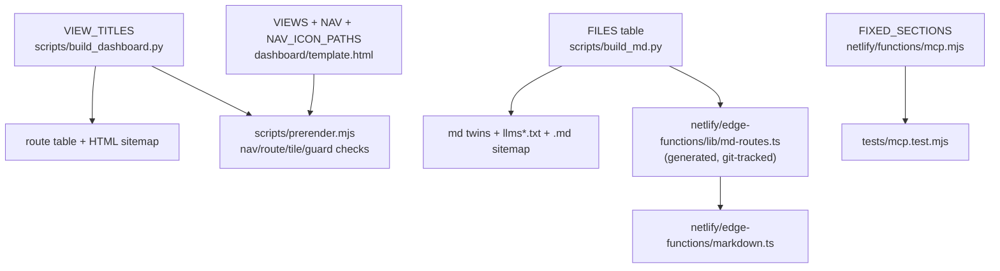

# Matrix Becomes the Systems Page - Plan

## Goal Capsule

- **Objective:** Merge the site's two system-index pages into one: the affordance matrix moves from `/matrix` to `/systems`, titled "The systems", the current systems list view is deleted, and the `/matrix` route stops existing — no redirects.
- **Product authority:** This Product Contract, confirmed in dialogue. The site has no users yet; breaking existing `/matrix` URLs is accepted.
- **Stop conditions:** Surface a blocker instead of guessing if a build guard failure cannot be resolved by the coordinated edits U1 names, or if a change would require touching `data/*.json` (no data change belongs in this work).
- **Execution profile:** Verification is the repo's own build gate (`npm run check`); the prerender guards act as the tests for the page swap.

---

## Product Contract

### Summary

The matrix view becomes the site's systems page. It moves to `/systems` under the name "The systems" (nav label "Systems"), keeping its matrix form and content. The systems list view is removed, and every URL form of the old matrix page stops existing.

### Problem Frame

The site currently carries two adjacent indexes of the same 20 systems: `/matrix` (systems against 11 affordance groups) and `/systems` (one line per system with maturity, counts, and record links). Recent work converged them — both now break into the same maturity cohorts, and the matrix already links every system name to its `/systems/<id>` record — so the list page no longer earns its nav slot. The agent-facing layer (`llms.txt`, `llms-systems.txt`) indexes the per-system record files directly, not the list page, so the list can go without breaking agent discovery.

### Key Decisions

- KD1. **The merged page is named "The systems", with the matrix form explained in its intro** (session-settled: user-directed — chosen over keeping "The affordance matrix" as the title: the nav says "Systems", and a page whose nav label and name disagree reads as two things). Governs R2.
- KD2. **The `/matrix` route is dropped with no redirects** (session-settled: user-directed — chosen over 301s: the site has no users yet, and an honest 404 matches the site's no-fallback routing philosophy). Governs R4.
- KD3. **The merged page's markdown twin absorbs the list's record links** (session-settled: user-approved — chosen over keeping the twin a bare-name table: the list's md twin was the hop from index to records for agents, and deleting it without a replacement would orphan that path). Governs R6.
- KD4. **The MCP `get_report` `matrix` section is removed outright, no alias** (session-settled: user-directed — chosen over keeping a compatibility alias: no users to preserve compatibility for). Governs R10.

### Requirements

**The merged page**

- R1. The matrix view is served at `/systems` and is the only systems index in the nav, labeled "Systems"; the separate "Matrix" nav entry is gone.
- R2. The page's browser title, H1, md-twin title, and citation line name it "The systems"; the intro prose still explains the matrix form (20 systems against 11 affordance groups).
- R3. The matrix's content is otherwise unchanged: same columns, cohort strips, rung counts, and per-system record links.
- R4. `/matrix`, `/matrix.md`, and `/matrix.html` stop existing and return the site's static 404; no redirect rules are added anywhere.

**The removed list**

- R5. The systems list view is deleted: its HTML view, its md twin content, and its registry entry. Nothing of the list's one-line-per-system format survives on the site.

**The markdown twin**

- R6. The new `/systems.md` carries, per system row, links to that system's record twin (`/systems/<id>.md`) and JSON twin (`/systems/<id>.json`), so an agent reading the table can hop to any record without a second index.

**Cross-references**

- R7. Everything that pointed at either page points at the merged one: nav, overview tiles, sitemap, and any prose links to `/matrix` across pages, md twins, and README.
- R8. Per-system record pages at `/systems/<id>` are untouched — same URLs, same content.
- R9. Canonical URLs, descriptions, and citation metadata on the merged page and its twin reference `/systems`, not `/matrix`.
- R10. The MCP `get_report` tool no longer offers a `matrix` section; the `systems` section serves the merged twin with a description that names the matrix content.

### Acceptance Examples

- AE1. **Covers R4.** **Given** a reader follows an old link to `/matrix`, `/matrix.md`, or `/matrix.html`, **when** the page is requested, **then** they get the site's static 404, same as any unknown route.
- AE2. **Covers R1, R2, R6.** **Given** an agent fetches `/systems.md`, **when** it reads the document, **then** the title says "The systems", the body is the matrix table, and each row links to that system's record and JSON twins.
- AE3. **Covers R10.** **Given** an MCP client calls `get_report`, **when** it reads the table of contents, **then** no `matrix` section is listed, and requesting `section: "matrix"` fails the way any unknown section fails.

### Success Criteria

- The full check gate (`npm run check`) passes — lint, types, build (including every prerender guard), tests, and the markdown-layer self-check.

### Scope Boundaries

- The matrix's content and design are not being reworked — columns, cohorts, and rung counts ship as they are today.
- The list's per-system affordance and technique totals are not salvaged onto the merged page; `llms.txt` already carries those counts per record.
- The agent-facing layer (`llms.txt` variants, MCP tools other than `get_report`'s section list, per-record twins) is otherwise untouched.
- `data/*.json` is untouched — a source-file grep confirmed every "matrix" in the data is about GitHub Actions or decision matrices in the corpus, not this page.

---

## Planning Contract

**Product Contract preservation:** changed during planning, both user-directed — R4 rewritten from 301 redirects to no-redirects/404 (KD2 updated to match), R10 and KD4 and AE3 added for the MCP section removal. All other R/AE/KD meaning unchanged.

### Key Technical Decisions

- KTD1. **No Netlify config change beyond the edge function's path list.** `netlify.toml` gains no `[[redirects]]` (per KD2, R4); the swap is expressed entirely in the generators and `dashboard/template.html`. The one routing edit outside them: remove `'/matrix'` from the `config.path` list in `netlify/edge-functions/markdown.ts` so the edge function stops intercepting a dead route.
- KTD2. **The merged nav entry keeps the existing "Systems" layers glyph.** The icon names the collection, not the table form; the matrix grid glyph is deleted with its nav row. Rejected alternative: adopting the grid glyph, which would make the surviving label change appearance for no reason.
- KTD3. **Guards follow content, not route names.** The `matrix.html` prerender guards (system-row count, group/tbody agreement, `scope="rowgroup"`) move onto `systems.html` verbatim; the three syslist guards (`sysrow`, `sysgroup`, `syslist-head`) are deleted with the view they check.
- KTD4. **The systems twin is the matrix twin body plus link columns.** `matrix_md()`'s table becomes the `/systems.md` emitter, adding Record and JSON columns per row using the URL pattern the deleted list twin already used. Its "Per-system detail: /systems.md" pointer is dropped as self-referential. Frontmatter is the union of the two current shapes: `id: systems`, both `system_count` and `column_count`.
- KTD5. **`md-routes.ts` is regenerated and committed in the same change.** It is generated by `scripts/build_md.py` but git-tracked (the edge function imports it), and `prettier --check` runs before the build in `scripts/check.sh` — a stale committed copy passes CI silently while leaving the tree dirty.

### High-Level Technical Design

One registry feeds many surfaces; the edits must move together within each fan-out. The template/registry/guard cluster (U1) is one atomic change because the prerenderer cross-checks all three.

### Sequencing

U1 must land as one edit (build dies otherwise). U2 depends on U1 (the twin's canonical route must exist). U3 depends on U2; U4 depends on U1. U3 and U4 can otherwise land in any order.

---

## Implementation Units

### U1. Swap the view: template, registry, and prerender guards

- **Goal:** `/systems` renders the matrix titled "The systems"; the list view and the `/matrix` route are gone; every prerender guard agrees.
- **Requirements:** R1, R2, R3, R4, R5, R7, R9 (per KD1, KD2).
- **Dependencies:** None.
- **Files:** `dashboard/template.html`, `scripts/build_dashboard.py`, `scripts/prerender.mjs`.
- **Approach:** One atomic change across three files — the prerenderer cross-checks them, so a partial edit fails the build.
  1. `scripts/build_dashboard.py` — delete the `matrix` entry from `VIEW_TITLES` (line ~49); rewrite the `systems` entry: title "The systems · State of AI in Design Systems", description carrying the matrix framing (what each of 20 systems ships, by affordance group). Update the client-side-title comment near line 577.
  2. `dashboard/template.html` — replace the `VIEWS.systems` body (~line 1394) with the matrix view body (~1351-1392): H1 becomes "The systems", intro keeps the matrix explanation, `mdDownload('matrix')` becomes `mdDownload('systems')`. Delete `VIEWS.matrix`, `renderSyslist()` (~1622-1644) and its call site (~1773), the `matrix` NAV row (~1696), `NAV_ICON_PATHS.matrix` (~1707). Point the `setupMatrixFades()` gate (~1774) at the `systems` view. Repoint the three overview stat tiles passing `'matrix'` (~1339-1341) to `'systems'`. Remove or re-merge the now-dead syslist CSS (~230, 547-558, 573-583, 604-630, 903-910) and fix comments that reference the matrix/list split.
  3. `scripts/prerender.mjs` — delete the `__renderSyslist` export use (~140) and the `route.view === 'systems'` syslist injection (~299-307). Replace the three syslist guards on `systems.html` (~395-410) with the matrix guards currently run on `matrix.html` (~412-427), reading `systems.html`; delete the old matrix guard block. Update the nav-count comments (~471-476, nine becomes eight) and the summary log line (~594) (per KTD3).
- **Patterns to follow:** The matrix guard block itself (`scripts/prerender.mjs:412-427`) is the pattern — port it, don't rewrite it.
- **Test scenarios:** Test expectation: none — the prerender guards are the tests for this unit. The build must prove:
  - `dashboard/systems.html` contains `<table class="mx">`, 20 `<th scope="row" class="sys">` rows, and group/tbody/rowgroup agreement.
  - No `matrix.html` or `matrix/` output exists in a fresh build.
  - Nav count check passes at eight entries with eight icons.
- **Verification:** `./scripts/build.sh` completes with no `die()`. Delete stale generated `dashboard/matrix.html` and `dashboard/matrix.md` from any earlier local build first — the prerender cleanup loop only removes twins of routes that still exist, and a stale file masks the change locally. Remove only those two files; `dashboard/template.html` and `dashboard/favicon.svg` are source.

### U2. Move the markdown twin and purge `/matrix` from the md layer

- **Goal:** `/systems.md` is the matrix table with per-row Record and JSON links; no generated surface mentions `/matrix.md` or `/matrix`.
- **Requirements:** R2, R5, R6, R7, R9 (per KD3, KTD4, KTD5).
- **Dependencies:** U1.
- **Files:** `scripts/build_md.py`, `netlify/edge-functions/lib/md-routes.ts` (regenerated output, committed).
- **Approach:**
  1. Make `matrix_md()`'s body the `/systems.md` emitter, deleting the old `systems_md()` list body; add Record and JSON columns per row reusing the deleted list's URL pattern (`U('/systems/' + s['id'] + '.md')` / `.json`); drop the self-referential "Per-system detail" pointer; emit the union frontmatter (per KTD4).
  2. Delete every `/matrix.md` and `/matrix` entry: module docstring (~15), `VIEW_META` (~174), `HTML_TWIN` (~281), the `index_md()` "Where to go next" bullets (~702-703, two collapse to one), `ai_content()` link list (~1080-1084), the `llms.txt` cross-cutting block (~2002-2012), the `main()` `add("/matrix.md", ...)` call (~2390), `view_paths` (~2407-2417), the `llms-insights.txt` slice list and description (~2453-2459), and the `html_routes` tuple feeding `write_edge_route_table()` (~2519-2528).
  3. Rebuild so `netlify/edge-functions/lib/md-routes.ts` regenerates without `/matrix`, and commit it (per KTD5). The sitemap needs no hand edit — both its HTML and `.md` sides derive from the registries already changed.
- **Patterns to follow:** The Record/JSON column emission in the current `systems_md()` (`scripts/build_md.py:732-739`) before deleting it.
- **Test scenarios:** Test expectation: none — `scripts/check_md_layer.py` and the build are the harness. The gate must prove:
  - `dashboard/systems.md` frontmatter says `title: "The systems"`, `id: systems`, and carries both `system_count` and `column_count`; every row links its record and JSON twins.
  - `llms.txt` link resolution passes (no dangling `/matrix.md`), and the byte budget still clears.
  - `md-routes.ts` on disk matches the freshly generated output and contains no `/matrix` key.
- **Verification:** `npm run check` passes through the markdown-layer self-check; `git status` shows `md-routes.ts` modified and staged, nothing else generated left tracked.

### U3. Remove `/matrix` from the edge function and the MCP report sections

- **Goal:** The edge function no longer claims the dead route; `get_report` no longer offers a `matrix` section.
- **Requirements:** R4, R10 (per KD4, KTD1).
- **Dependencies:** U2 (the regenerated `md-routes.ts` no longer maps `/matrix`).
- **Files:** `netlify/edge-functions/markdown.ts`, `netlify/functions/mcp.mjs`, `tests/mcp.test.mjs`.
- **Approach:**
  1. Remove `'/matrix'` from `config.path` in `netlify/edge-functions/markdown.ts` (~61) — Netlify runs edge functions ahead of routing, so a leftover entry intercepts the dead route.
  2. In `netlify/functions/mcp.mjs`, delete the `matrix` row from `FIXED_SECTIONS` (~185) and rewrite the `systems` row's description (~184) to name the matrix content (affordance coverage per system).
  3. In `tests/mcp.test.mjs`, drop `/matrix.md` from the `isReportPath()` whitelist (~636-637) so the `toc.sections.length` equality (~624-627) holds.
- **Test scenarios:**
  - Covers AE3. `get_report` TOC lists no `matrix` section and its section count matches the whitelist.
  - `get_report({section: "systems"})` returns the matrix-table twin.
  - `get_report({section: "matrix"})` fails with the tool's normal unknown-section error.
- **Verification:** `npm test` passes; `deno check` and `deno lint` over `netlify/edge-functions/` pass (both run inside `npm run check`).

### U4. Resync hand-typed prose, counts, and internal docs

- **Goal:** No prose anywhere still points at `/matrix` or states the old route and nav counts.
- **Requirements:** R7 (per the house rule that counts go stale silently — none of these are machine-checked).
- **Dependencies:** U1 (the route count changes there).
- **Files:** `README.md`, `netlify.toml`, `dashboard/template.html`, `docs/semantic-audit.md`, `docs/design-audit.md`.
- **Approach:**
  1. `README.md` — repoint the `/matrix` prose link (~22) to `/systems`; "29 routes" (~109) becomes 28.
  2. `netlify.toml` — the route-count comment (~26) is already stale; set it to 28.
  3. `dashboard/template.html` — "all 29 routes" (~1234) becomes 28.
  4. `docs/semantic-audit.md` — line ~530 argues a change is unnecessary because `/matrix/` duplicates `/systems/`; rewrite now that the premise is gone. Update the audited-URL list (~13).
  5. `docs/design-audit.md` — the "Matrix: make it fit" entries (~104-127) name the view function being renamed; update the references.
  New prose follows the house voice rules: US spelling, no hand-typed counts where a placeholder exists, write like a person.
- **Test scenarios:** Test expectation: none — prose-only; nothing machine-checks these strings, which is why the unit exists.
- **Verification:** `rg -n '/matrix' README.md netlify.toml docs/ dashboard/template.html data/` returns only intentional matches (corpus text about CI/decision matrices in `data/`, historical notes in docs if kept deliberately).

---

## Verification Contract

| Check | Command | Proves |
|---|---|---|
| Full gate | `npm run check` | Lint, format, types, generated types, ruff/mypy, deno, contrast, build with every prerender guard, MCP tests, md-layer self-check |
| Fresh-output check | `./scripts/build.sh` after deleting stale `dashboard/matrix.html` and `dashboard/matrix.md` | `/matrix` outputs are gone and `/systems` is the matrix (U1, U2) |
| MCP suite | `npm test` | Section list, whitelist, and TOC equality after the `matrix` section removal (U3) |
| Reference sweep | `rg -n '/matrix'` over source files | No stray hand-authored references (U4) |

Build output carries a generation timestamp, so a rebuild always dirties every generated file — do not read a large diff of `dashboard/` as a regression signal, and do not commit `dashboard/` output (only `dashboard/template.html` is source, plus the tracked `netlify/edge-functions/lib/md-routes.ts`).

---

## Definition of Done

- All four units are complete and `npm run check` passes end to end.
- A fresh build emits no `matrix.html`, `matrix.md`, or `matrix/` under `dashboard/`.
- `/systems` and `/systems.md` render the matrix titled "The systems", the twin rows linking every record and JSON twin.
- The MCP TOC lists no `matrix` section and the suite passes.
- The commit set contains no regenerated `dashboard/` output and no leftover experimental code; `netlify/edge-functions/lib/md-routes.ts` is committed in its regenerated form.

---

## Sources

- `scripts/build_dashboard.py` — `VIEW_TITLES` (~49) is the single page registry; routes, sitemap, and prerenderer all read it.
- `dashboard/template.html` — `VIEWS` (~1320), `NAV` (~1695), `NAV_ICON_PATHS` (~1705); the matrix view body at ~1351-1392 is the content being promoted.
- `scripts/prerender.mjs` — guard blocks at ~395-427, nav/route agreement at ~456-482, file-form publishing and stale-twin cleanup at ~319-378.
- `scripts/build_md.py` — `matrix_md()` (~753-792) and `systems_md()` (~714-750); the latter's link columns (~732-739) are the pattern R6 reuses.
- `docs/architecture.md` — the no-SPA-fallback rationale KD2 leans on.
