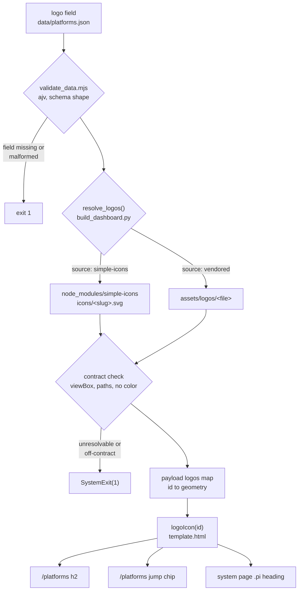

# Platform Logos - Plan

## Goal Capsule

- **Objective:** give each of the 6 records in `data/platforms.json` a logo, reused across every place a platform is named on the site.
- **Product authority:** the Product Contract below. Where planning and product conflict, the Product Contract wins on behavior and the Key Technical Decisions win on mechanism.
- **Execution profile:** one branch off `main`, five units in dependency order. U1 is asset and provenance work done in a browser; U2–U4 are code; U5 is a runtime verification pass. There is no DOM test harness in this repo, so correctness is proved by a build gate that fails on demand plus a rendered inspection.
- **Stop conditions:** stop and ask if a platform's mark cannot be sourced or normalized without redrawing it, or if a platform's published terms forbid the monochrome treatment. Both change product scope, not just implementation.
- **Tail ownership:** the invoking session owns commit and push. Do not commit regenerated `dashboard/` output.

---

## Product Contract

**Product Contract preservation:** changed — R3, R4, R8. Research found that none of the three uncovered platforms publishes a brand or press page, so R3's sourcing widens from "brand/press page" to the platform's own published artwork, and R4's "license/usage terms" becomes "terms where the platform publishes any, and a plain statement where it publishes none." R8 gains a qualifier for `other`, a value the system schema permits and three records use, which has no platform record and therefore no mark. R10 is new, covering the published schema prose. R1, R2, R5–R7, R9 and all three Key Decisions are unchanged.

### Summary

Each platform record gets a monochrome logo, sourced from Simple Icons where it's covered and vendored from the platform's own published artwork where it's not, and reused at three places the platform is currently named by text alone: the `/platforms` page headings, the `/platforms` jump list, and system pages' platform-integration headings. A platform record with no resolvable logo fails the build.

Each record's logo resolves to path geometry at build time, and the resolution is kept honest by a check that sits alongside the existing URL validator rather than in the schema step. The logo is presentation, so it does not reach the report's published data surfaces.

### Problem Frame

Six platforms are named on this site in three places, and in all three they are text alone. On `/platforms` the six sections are separated only by an `<h2>` of the record's `name`, and the jump list above them is six identical bordered pills. On a system page, the "Platform integrations" block repeats the platform's short label as a 14px `<h3>` for each integration, so a reader scanning a system's integrations reads six near-identical headings rather than recognizing which vendor each one belongs to.

The rail nav already solved the equivalent problem for routes: nine uppercase labels became nine recognizable shapes. Platforms are the one remaining set of repeated proper nouns on the site with no visual identity attached, and unlike routes, these are brands the reader already knows by mark.

### Requirements

**Data & sourcing**

- R1. Every platform record in `data/platforms.json` carries a required `logo` field identifying where its mark comes from.
- R2. Figma, Storybook, and Penpot source their logo from the `simple-icons` package, which already ships all three.
- R3. Supernova, Knapsack, and zeroheight source their logo from an SVG vendored locally from that platform's own published artwork — `simple-icons` doesn't cover them, and none of the three publishes a brand or press page to take a mark from.
- R4. Each vendored logo asset (R3) is documented with where it came from, when it was retrieved, what was changed to normalize it, and the platform's usage terms where it publishes any — recording plainly that none were published where that is the case. This follows the spirit of `assets/fonts/README.md`.

**Rendering**

- R5. Every logo renders as a single-color mark, not the platform's full-color brand version, matching the site's existing icon system.
- R6. The logo appears next to each platform's `<h2>` heading in the six `/platforms` sections.
- R7. The logo appears in the `/platforms` "Jump to a platform" chip row, alongside each chip's label.
- R8. The logo appears next to a system page's per-platform "Platform integrations" heading (the existing `platLabel()` lookup). `other` is exempt: `schema/design-system.schema.json` permits it, 17 of the 20 system records use it, and it has no platform record and therefore no mark. Its heading renders exactly as it does today.

**Build enforcement & documentation**

- R9. A platform record with a missing or unresolvable `logo` fails the build, the same way a missing `source_url` does today — never a silent gap.
- R10. The published schema documentation at `/about/schema.md` names the `logo` field in its platform entity description.

### Key Decisions

- **Mixed sourcing — Simple Icons for Figma/Storybook/Penpot, vendored SVGs for Supernova/Knapsack/zeroheight** (session-settled: user-directed — chosen over vendoring all six uniformly or relying on an icon library alone): Simple Icons doesn't cover the three niche platforms, so they need a vendored asset regardless of what's chosen for the rest. Governs R2, R3.
- **Monochrome over full-color brand marks** (session-settled: user-directed): matches the site's existing single-color icon system rather than introducing per-platform brand color. Governs R5.
- **`logo` as a required schema field over a separate build-time lookup table** (session-settled: user-directed — chosen over a table keyed by platform id, the pattern `NAV_ICON_PATHS` already uses in `dashboard/template.html`): keeps the platform-to-logo mapping inside `data/platforms.json` as a single source of truth, even though a logo isn't a sourced factual claim the way the rest of `platform.schema.json`'s required properties are. Governs R1, R9.

### Scope Boundaries

- `data/design-systems.json`'s 20 system records are out of scope — logos are for the 6 platform records only, this pass.
- Full-color or branded logo treatment is out of scope — monochrome only (see Key Decisions).
- The `logo` field does not reach the MCP `get_platform` tool, the platform markdown twins, or the SQLite export (see KTD7). The record's JSON twin and `/data/platforms.json` carry it because they serialize the record verbatim.
- No shared icon registry is introduced. Nav icons and platform logos stay separate systems (see KTD4).

#### Deferred to Follow-Up Work

- `schema/design-system.schema.json`'s `platform_integrations[].platform` enum omits `penpot` while `data/platforms.json` carries the record. Pre-existing drift from the Penpot addition, and a separate one-file fix.
- The platform-count prose in `schema/platform.schema.json`'s top-level description and in `VIEW_TITLES["platforms"]` still names five platforms. Same pre-existing staleness, same separate fix.
- Logos for the 20 system records, if the platform treatment proves useful.
- Teaching `check_house_norms.py`, `verify_claims.py`, and `check_snippets.py --links` about `data/platforms.json`. The standing workaround map is `docs/solutions/workflow-issues/platform-records-systems-only-tooling.md`.

### Dependencies / Assumptions

- Normalizing Supernova's, Knapsack's, and zeroheight's marks into clean monochrome assets is real design work beyond a straight download — none of the three publishes a downloadable standalone glyph. Budget planning time for it accordingly. Simple Icons already ships single-path, single-color geometry for the other three, so they need no equivalent conversion.
- `check_house_norms.py` and `verify_claims.py` only read `data/design-systems.json` today and don't cover platform records. This plan changes record shape rather than record claims, so the affected gates are `scripts/validate_data.mjs` and the build, not those two scripts.
- Netlify installs npm dependencies before running `./scripts/build.sh`, so a build-time package in `dependencies` is present on deploy. This is already true of `ajv`, which `scripts/validate_data.mjs` needs at build time.

### Acceptance Examples

- AE1. **Covers R9.** Given a platform record that omits `logo`, when `scripts/validate_data.mjs` runs, then the build fails naming the platform id — the same failure class as a missing `source_url`.
- AE2. **Covers R9.** Given a platform record whose `logo` names a Simple Icons slug or a vendored file that does not exist, when the build runs, then it fails naming the platform id and what could not be resolved.
- AE3. **Covers R6, R7, R8.** Given a platform record with a resolvable `logo`, when the site builds, then its mark appears at the `/platforms` heading, the `/platforms` jump-list chip, and every system page's platform-integration heading that references it.

---

## Planning Contract

### Key Technical Decisions

- KTD1. **Logos resolve to path geometry at build time, and ship in the payload as an id-keyed map rather than on the records.** `scripts/build_dashboard.py` already loads `data/platforms.json` whole and serializes it into `payload["platforms"]`, so a `logo` field reaches the template as data with no plumbing. The resolved geometry is different: it is derived, not authored. Keeping it in a sibling map leaves the six records byte-identical to the source file, which matters because `scripts/build_md.py` serializes each record verbatim into `/platforms/<id>.json` and `/data/platforms.json`. It also mirrors the id-keyed `NAV_ICON_PATHS` idiom already in `dashboard/template.html`. Governs R5, R6, R7, R8.

- KTD2. **`logo` is an object with a `source` enum and a `value`, not a scheme-prefixed string.** The resolver branches on `source` explicitly instead of splitting a string, the schema constrains the vocabulary the way the rest of the file constrains its controlled vocabularies, and a reader opening `data/platforms.json` sees what the field means without knowing a convention. Rejected: `"simple-icons:figma"`, where a typo in the scheme is still a valid string and only fails later. Governs R1, R2, R3.

- KTD3. **Enforcement splits across two gates: schema shape in `scripts/validate_data.mjs`, resolvability in `scripts/build_dashboard.py`.** ajv validates JSON shape and cannot ask whether a file exists on disk or whether a slug is real, so a single-gate reading of R9 is not implementable. `validate_urls()` in `build_dashboard.py` is the established precedent for a build-time content check: it walks every record, collects offenders, prints them together, and raises `SystemExit(1)`. Rejected: resolving in `validate_data.mjs` instead, which is Node and could import `simple-icons` natively. It would have to hand the resolved geometry to the Python step through a temp artifact, since `build_dashboard.py` is what assembles the payload — a new build stage and a new intermediate file to keep in sync, in exchange for avoiding one `node_modules` read. Governs R9.

- KTD4. **Platform logos get their own render helper with `fill="currentColor"`; no shared icon registry.** Every existing icon in `dashboard/template.html` is stroke-based (`fill="none" stroke="currentColor" stroke-width="2"`), and Simple Icons ship fill-based solid glyphs. Passing a logo through `navIcon()` renders nothing visible. The side-nav icons plan deferred a shared registry until a third surface needed the same glyphs; three surfaces now need glyphs, but a different set drawn in the opposite paint model, so a merged helper would carry two paint models for zero reuse. Governs R5.

- KTD5. **`simple-icons` enters as a runtime dependency, read from its per-icon SVG files.** Version 16.27.1, package license CC0-1.0. The package ships `data/simple-icons.json` carrying metadata only — `title`, `slug`, `hex`, `source`, and `license` or `guidelines` where known — and the path geometry lives in `icons/<slug>.svg`, each a single `<path>` on a `0 0 24 24` viewBox. `build_dashboard.py` reads that SVG directly, so no Node bridge is needed to get geometry into a Python build step. It goes in `dependencies`, not `devDependencies`, for the same reason `ajv` does: the build needs it. _Conflict noted against the settled mixed-sourcing decision: this is the first icon dependency in a two-dependency manifest and the first time `build_dashboard.py` reads `node_modules`. Workable, and the cost of sourcing three marks from a maintained package rather than freezing copies of them._ Governs R2.

- KTD6. **Vendored marks are normalized to the same contract a Simple Icons file already satisfies, read at build time, and never published.** The contract is `viewBox="0 0 24 24"`, path geometry only, and no `fill`, `stroke`, or `style` attribute carrying a color. The build enforces it on every resolved file regardless of source, which makes R5 machine-checked rather than eyeballed. Nothing under `assets/` is served — `netlify.toml` publishes `dashboard/` only — and `scripts/build_og.mjs` already establishes the pattern of reading a vendored asset at build time and publishing only what it produces. Governs R3, R5, R9.

- KTD7. **The `logo` field stays out of the MCP tool output, the platform markdown twins, and the SQLite export.** (session-settled: user-approved — chosen over exposing it on every data surface: a logo is presentation, and the report's data surfaces carry sourced claims.) `platformRecord()` in `netlify/functions/mcp.mjs` and `platform_md()` in `scripts/build_md.py` are hand-maintained field allowlists, so this is the default outcome of not editing them; it is recorded because it is a decision, not an oversight. Governs R10 by exception: the schema prose still names the field, because `/about/schema.md` describes the schema rather than the report.

- KTD8. **The three uncovered marks come from each platform's own published artwork, with the provenance gap recorded honestly.** (session-settled: user-approved — chosen over a monogram fallback: a real mark is worth the sourcing work, and a monogram would read as a placeholder next to three real logos.) No brand or press page was found for any of the three, and no standalone monochrome glyph. Knapsack publishes a white wordmark lockup whose symbol has to be isolated. The README records the URL, the date, and the modification rather than implying a grant that was never given. Governs R3, R4.

### High-Level Technical Design

One authored field per record fans out through one resolution step to three rendered surfaces, with two failure gates on the way. The gates are the non-obvious part: they are at different stages, in different languages, and only one of them can see the filesystem.

The prose is authoritative where the two disagree.

**What fails where.** R9 reads as one requirement and implements as two gates, because no single stage can catch all of it.

| Failure | Caught by | Stage | Why not the other gate |
| --- | --- | --- | --- |
| `logo` absent from a record | `scripts/validate_data.mjs` | Build step 0 | Pure schema shape; ajv owns it |
| `source` outside the enum | `scripts/validate_data.mjs` | Build step 0 | Pure schema shape; ajv owns it |
| Simple Icons slug does not exist | `resolve_logos()` | Build step 1 | ajv cannot read `node_modules` |
| Vendored file absent from `assets/logos/` | `resolve_logos()` | Build step 1 | ajv cannot read the filesystem |
| Vendored file has the wrong viewBox | `resolve_logos()` | Build step 1 | Not expressible in JSON Schema |
| Vendored file carries a hardcoded color | `resolve_logos()` | Build step 1 | Not expressible in JSON Schema |
| Vendored file contains no `<path>` element | `resolve_logos()` | Build step 1 | Not expressible in JSON Schema |
| Mark renders but reads as a blob at 16px | A person, in U1 | Review | No check can read an SVG's legibility |

### Sequencing

U1 is asset work with no code dependency and gates everything downstream, because U2 names files that U1 creates and U3 fails the build if they are absent. U2 makes the field required before anything resolves it, so the records and the schema move together. U3 adds the dependency and the gate. U4 renders. U5 proves it on the running site. Each unit leaves the build green.

---

## Implementation Units

### U1. Vendor the three uncovered marks and document their provenance

**Goal:** `assets/logos/` holds a normalized monochrome SVG for Supernova, Knapsack, and zeroheight, each traceable to where it came from and what was done to it.

**Requirements:** R3, R4. Implements KTD6, KTD8.

**Dependencies:** none.

**Files:**

- `assets/logos/supernova.svg` — create
- `assets/logos/knapsack.svg` — create
- `assets/logos/zeroheight.svg` — create
- `assets/logos/README.md` — create

**Approach:**

1. For each platform, find the mark in a real browser rather than trusting the automated sweep in Sources. That sweep could not read Knapsack's terms page or zeroheight's terms app, and could not see logos rendered as inline SVG, so its absences are unconfirmed rather than settled. Check the footer, `/press`, `/brand`, `/media-kit`, and the terms page by hand before falling back to marketing artwork.
2. Take the symbol only, never the wordmark lockup — the mark has to read at 16px beside a 14px heading. Knapsack's white lockup, linked in Sources, is the known starting point and its symbol has to be isolated from it.
3. Normalize each file to the contract KTD6 sets: `viewBox="0 0 24 24"`, path geometry only, and no `fill`, `stroke`, `style`, `class`, or `id` attribute, no `<title>`, no embedded color. Optimize the path, but do not redraw letterforms or alter proportions.
4. Write `assets/logos/README.md` in the register of `assets/fonts/README.md`: what reads these files (the build, not the browser), why they are vendored rather than pulled from a package, and per mark the exact URL it came from, the date retrieved, what was changed to normalize it, and the platform's usage terms where it publishes any. Where a platform publishes none, say so plainly rather than implying a grant. Record Supernova's terms clause verbatim — it is the one confirmed constraint of the three.
5. Note in the README that these are third-party trademarks, used to identify the products this report covers, and that the repository's own MIT and CC BY licenses do not extend to them. `assets/fonts/README.md` already makes the equivalent point about the fonts' OFL license not propagating to the site.

**Execution note:** this is asset and provenance work, not code. It is done when three files read correctly at 16px in a browser and the README accounts for each one — not when a script passes. Stop and ask if a mark cannot be isolated without redrawing it, or if a platform's terms forbid the monochrome treatment; both change product scope.

**Patterns to follow:**

- `assets/fonts/README.md` — it names what reads the asset, why it is vendored, the exact reproduction command, and why the upstream license does not propagate. Match that specificity.
- The Simple Icons files themselves are the shape target: one `<path>`, `0 0 24 24`, roughly 600–1100 bytes, no styling.

**Test scenarios:**

- Each of the three files parses as SVG and carries exactly `viewBox="0 0 24 24"`, with no `fill`, `stroke`, or `style` attribute on any element.
- Rendered at 16px in `--ink`, each mark is legible as that product's symbol rather than a solid blob.
- Rendered at 16px in dark theme, each mark takes the light ink color, with no hardcoded black leaking through.
- Each mark sits on the same optical weight as a Simple Icons glyph at the same size — a mark that reads twice as heavy as Figma's beside it needs its geometry revisited, not a CSS opacity patch.
- Every URL the README cites loads and shows the mark it is cited for.

**Verification:** three normalized files exist, each legible at 16px in both themes, and the README accounts for every one with a URL that loads.

---

### U2. Add the required `logo` field to the schema, the six records, and the published schema prose

**Goal:** `logo` is a required, vocabulary-constrained field on every platform record, and the site's own schema documentation says so.

**Requirements:** R1, R2, R3, R10. Implements KTD2.

**Dependencies:** U1.

**Files:**

- `schema/platform.schema.json` — modify (`properties`, `required`)
- `data/platforms.json` — modify (all six records)
- `scripts/build_md.py` — modify (the hand-typed platform field list in the `/about/schema.md` entity prose)
- `types/data.d.ts` — regenerate (written by `scripts/generate_types.mjs`)

**Approach:**

1. Add `logo` to `properties` as an object with `required: ["source", "value"]` and `additionalProperties: false`, where `source` is an enum of `simple-icons` and `vendored` and `value` is a non-empty string.
2. Add `logo` to the schema's top-level `required` array in the same edit. The schema is `additionalProperties: false`, so a property present in records but absent from `properties` fails validation, and one listed in `required` but absent from a record fails too — the two edits cannot land separately without a red build.
3. Write a `description` for each new property in the file's existing register: plain sentences, US spelling.
4. Fill in all six records — `simple-icons` with the slug for `figma`, `storybook`, and `penpot`; `vendored` with the filename for `supernova`, `knapsack`, and `zeroheight`.
5. Update the platform field list in the `/about/schema.md` entity prose so it names `logo`. It is a hardcoded string in `scripts/build_md.py`, and nothing catches it going stale.
6. Run `npm run types` and commit the regenerated `types/data.d.ts`. `scripts/check.sh` runs `generate_types.mjs --check` and fails on a stale file, and this step is not part of `./scripts/build.sh`.

**Patterns to follow:**

- The `capabilities[].snippet` object in the same schema — an object property with its own `required` list and a constrained `language` enum.
- The controlled-vocabulary style in `schema/design-system.schema.json`, where an enum names the allowed values rather than a pattern describing them.

**Test scenarios:**

- All six records validate: the build's step 0 exits 0.
- Covers AE1. Remove `logo` from one record: validation fails, naming `data/platforms.json` and `must have required property 'logo'`, and exits non-zero.
- Set a record's `source` to a value outside the enum: validation fails on the enum, naming the offending record's position.
- Add an extra key inside a record's `logo` object: validation fails on `additionalProperty`.
- Set `value` to an empty string: validation fails rather than passing through to the resolver.
- `scripts/generate_types.mjs --check` passes after regeneration and fails before it.
- The built `/about/schema.md` names `logo` in the platform entity's field list.

**Verification:** the six records validate, each of the four malformed cases above fails validation with a message naming the problem, and the generated types and schema prose are both current.

---

### U3. Resolve every logo at build time and fail the build on one that cannot be resolved

**Goal:** the build turns each record's `logo` into path geometry, refuses to continue when any of the six cannot be resolved or breaks the monochrome contract, and hands the resolved map to the page.

**Requirements:** R2, R3, R5, R9. Implements KTD1, KTD3, KTD5, KTD6.

**Dependencies:** U1, U2.

**Files:**

- `package.json`, `package-lock.json` — modify (add `simple-icons` to `dependencies`)
- `scripts/build_dashboard.py` — modify (a `resolve_logos()` beside `validate_urls()`, and the payload assembly)

**Approach:**

1. Install `simple-icons` into `dependencies` rather than `devDependencies` — the build needs it at build time, which is why `ajv` sits there too.
2. Add `resolve_logos(platforms)` next to `validate_urls()`. For `source: simple-icons`, read `node_modules/simple-icons/icons/<value>.svg`; for `source: vendored`, read `assets/logos/<value>`. Extract the path geometry from each.
3. Enforce the KTD6 contract on every resolved file regardless of source: the viewBox is exactly `0 0 24 24`, there is at least one `<path>`, and no element carries a `fill`, `stroke`, or `style` attribute holding a color. A Simple Icons file satisfies this by construction, so the check earns its keep on the vendored three and on the day Simple Icons changes its output shape.
4. Collect every failure across all six records and report them together, naming the platform id and what was wrong with it, then raise `SystemExit(1)`. Follow `validate_urls()`'s shape — gather offenders, print the list, exit once — rather than throwing on the first bad record, so a contributor fixing three mistakes learns about all three in one run.
5. Distinguish "this package is not installed" from "this slug does not exist" in the message. This is the first time the Python build reads `node_modules`, so a contributor who has not run `npm install` would otherwise see three missing-file errors that read as a data problem. Name the missing package once instead.
6. Put the resolved geometry in the payload as an id-keyed map, and leave the six records untouched (KTD1). `scripts/build_md.py` serializes each record verbatim into `/platforms/<id>.json` and `/data/platforms.json`, so mutating the record here would push derived geometry onto a published data surface.

**Execution note:** prove each failure fires before trusting it. Point one record at a Simple Icons slug that does not exist, one at a vendored file that does not exist, and one vendored file at a hardcoded `fill`; confirm the build dies naming the record in each case; then restore all three. A gate that cannot fail reads as coverage while providing none — the same trap the side-nav icons plan wrote its build assertion to avoid.

**Patterns to follow:**

- `validate_urls()` and `_url_faults()` in `scripts/build_dashboard.py` — walk the records, collect faults, print the offenders, exit non-zero once.
- `scripts/build_og.mjs` reading `assets/fonts/*.ttf` at build time and publishing only what it produces. Same relationship to `assets/`.

**Test scenarios:**

- Baseline: `./scripts/build.sh` passes with all six resolving, and the payload's logo map has six entries.
- Covers AE2. A record naming a Simple Icons slug that does not exist fails the build, naming the platform id and the slug.
- Covers AE2. A record naming a vendored file absent from `assets/logos/` fails the build, naming the platform id and the path it looked for.
- A vendored file whose viewBox is not `0 0 24 24` fails the build, naming the platform id and the viewBox it found.
- A vendored file carrying a hardcoded `fill` fails the build.
- A vendored file containing no `<path>` at all fails the build rather than resolving to empty geometry.
- Two bad records at once produce a single report listing both and one non-zero exit, not a traceback on the first.
- With `node_modules/simple-icons` absent, the build fails naming the missing package once, rather than reporting three unrelated missing files.
- After each failing case is restored, the build passes and the resolved map is identical to the baseline.
- `/platforms/<id>.json` and `/data/platforms.json` in the built output carry the declarative `logo` field and no resolved geometry.

**Verification:** the build passes on six good records, fails with a specific message on every break case above, and the published record twins are unchanged apart from the declarative field.

---

### U4. Render the logo at the three placements

**Goal:** each platform's mark appears beside its `/platforms` heading, its jump chip, and every system page's platform-integration heading, inheriting the ink color at each, with no accessible name changed.

**Requirements:** R5, R6, R7, R8. Implements KTD4.

**Dependencies:** U3.

**Files:**

- `dashboard/template.html` — modify (a `logoIcon()` helper beside `navIcon()`; the `platforms()` view; `jumpList()`; the `.pi` heading in the system view; CSS for the three placements)

**Approach:**

1. Add `logoIcon(id)` beside `navIcon()`. It wraps the resolved geometry from the payload map in `<svg viewBox="0 0 24 24" fill="currentColor" aria-hidden="true">`. It does not reuse `navIcon()`'s `fill="none" stroke="currentColor"` attributes, which render a fill-based glyph as nothing (KTD4).
2. Treat the mark as decorative at all three placements. The heading text and the chip label already name the platform, so the icon is `aria-hidden="true"` and no accessible name changes — the same treatment the rail nav icons got.
3. `/platforms` headings: emit the icon inside the `<h2>` before `esc(p.name)`.
4. Jump chips: give `jumpList()` an optional `icon` field on each item rather than changing its signature or its escaping. `jumpList()` runs `esc()` over `i.label` and `i.id`; the icon is build-resolved markup and is interpolated raw, so keep the raw field and the escaped fields visually distinct on the line. Other pages call `jumpList()` with plain items and must render unchanged.
5. Platform-integration headings: emit the icon inside the `<h3 class="pi">` before `esc(platLabel(p.platform))`. `platLabel()`'s parenthetical stripping is untouched.
6. Return an empty string from `logoIcon()` for an id with no resolved geometry, so the heading renders unchanged rather than carrying an empty `<svg>` or throwing. `other` is the live case, and the dominant one — `schema/design-system.schema.json` permits it, 17 of the 20 system records use it across 18 integration entries, and `PLAT_LABEL` already special-cases its label for the same reason (R8). This is the only placement where it can happen: `/platforms` iterates the records themselves, so every id there resolves by construction.
7. Size each placement in CSS rather than by a helper argument, the way `.rail nav a svg` sizes the nav icons. The three contexts differ — a section `<h2>`, a 2px-padded bordered pill, and a 14px heading — so each gets its own rule, with `flex: none` so a long label cannot squash the mark.
8. Add no color declaration. `fill="currentColor"` inherits the ink of whatever it sits in, which is what makes R5 true without a new token and leaves `scripts/check_contrast.js` with nothing new to check.

**Patterns to follow:**

- `navIcon()` and `NAV_ICON_PATHS` in `dashboard/template.html` — helper shape, `aria-hidden`, and CSS-side sizing with `flex: none`.
- `.rail nav a svg` for how an inline icon is sized and kept from shrinking.
- The `esc()` and `fmt()` discipline throughout the view functions: record strings reach the DOM through one of the two, always.

**Test scenarios:**

- Covers AE3. `/platforms`: all six sections show a mark beside the heading, and the heading text is unchanged.
- Covers AE3. `/platforms`: all six jump chips show a mark beside the label, and the pill row neither wraps nor gains a scrollbar at a narrow width.
- Covers AE3. A system page with platform integrations: each `.pi` heading shows the mark for the platform it names, and the parenthetical stripping still applies to the text.
- A system record whose integration names `other` renders that `.pi` heading exactly as it does today — no mark, no empty `<svg>`, no gap where one would sit (R8). 17 of the 20 system records exercise this, so it is the common path on system pages rather than an edge case.
- Dark theme: every mark at every placement renders at the dark-theme ink value, with no hardcoded color leaking through.
- Hovering a jump chip tints its mark with the label, from `currentColor` inheritance and no separate hover rule.
- Screen reader: the `/platforms` headings, the jump-chip links, and the `.pi` headings expose the same accessible names as before the change.
- A page other than `/platforms` that calls `jumpList()` with iconless items renders exactly as it did before.
- A record string containing a `<` still escapes at all three placements — the icon change must not route data around `esc()`.
- No new network request is made for any mark.

**Verification:** six marks on `/platforms` at both the heading and the chip, a mark on every platform-integration heading, correct in both themes and at both widths, with no accessible name changed and nothing new fetched.

---

### U5. Verify across themes, widths, and the full check suite

**Goal:** confirm the change is right on the built site and that the repository's own gate agrees.

**Requirements:** R5, R6, R7, R8, R9, R10.

**Dependencies:** U1, U2, U3, U4.

**Files:** none — verification only. Any fix lands back in the unit that owns it.

**Approach:**

1. Run `npm run check` end to end. It is the full CI sequence, and the build inside it is where U3's gate runs.
2. Serve the built site and inspect `/platforms` and at least one `/systems/<id>` page carrying platform integrations, at a wide width and below 860px, in both themes.
3. Confirm the published data surfaces match KTD7: the MCP `get_platform` output, the platform markdown twins, and the SQLite export carry no `logo`, while `/platforms/<id>.json` and `/data/platforms.json` carry the declarative field.
4. Confirm the built `/about/schema.md` names the field.
5. Confirm the tracked diff is only the intended files, and that regenerated `dashboard/` output stays uncommitted.

**Execution note:** this is a runtime-proof unit, not a unit-test unit. The repo has no DOM harness; build-time correctness is asserted by the gate U3 added, and visual correctness by looking at the page.

**Test scenarios:**

- `npm run check` exits zero.
- `scripts/check_contrast.js` passes — expected, since no color token was introduced, and it is the check that would catch a logo-specific color slipping in.
- `tests/mcp.test.mjs` passes unchanged, and `get_platform` returns no `logo` — the field allowlist was deliberately not touched.
- No console error or warning on `/platforms` or on the inspected system page.
- `scripts/check_md_layer.py` passes; the markdown layer gained no research-process fields.
- `git status` shows only the intended tracked files as modified or added, with the regenerated `dashboard/` output untracked.

**Verification:** `npm run check` exits zero, both inspected routes look right at both widths in both themes, and the tracked diff contains nothing generated.

---

## Open Questions

- **Deferred, resolved inside U1.** Knapsack's and zeroheight's usage terms are unverified — the automated sweep hit a 404 on Knapsack's terms page and a client-rendered shell on zeroheight's, both known false-absence failure modes. Supernova's terms are confirmed and prohibit altering or obscuring its marks. If a hand check finds that any of the three forbids the monochrome treatment, that contradicts R5 for that platform and is a product decision, not an implementation one: stop and raise it rather than shipping the mark anyway or silently dropping it.

---

## Risks & Dependencies

- **Simple Icons removes brands.** Its disclaimer states that icons no longer meeting its criteria are removed "twice a year in our major releases", and that a brand can request removal at any time. A release that drops `penpot`, `figma`, or `storybook` turns a routine dependency bump into a red build. This is R9 working rather than failing, and the blast radius is bounded: every dependency in this repo is pinned to an exact version with no range prefix, so it can only bite on a deliberate upgrade. The recovery is to vendor the dropped mark under `assets/logos/` and flip that record's `source` — the same two-source design the plan already carries. No new mechanism needed.
- **Three marks are used without a published grant.** No brand or press page exists for Supernova, Knapsack, or zeroheight, and Supernova's terms prohibit altering or obscuring its marks. Mitigation is nominative use of unmodified geometry, monochrome rendering only, provenance recorded in `assets/logos/README.md`, and the Open Question above gating U1. If a hand check finds a prohibition, that is a product decision, not an implementation workaround.
- **The Python build gains a `node_modules` dependency.** `scripts/build_dashboard.py` has never read from it. Netlify installs before running `./scripts/build.sh`, so deploys are fine, but a contributor running the Python step alone gets a resolution failure. U3 step 5 makes that message name the missing package.
- **Two hand-maintained field allowlists will not carry the new field**, by design (KTD7) — `platformRecord()` in `netlify/functions/mcp.mjs` and `platform_md()` in `scripts/build_md.py`. The risk is that a future contributor adds a field expecting it to flow through and finds it silently absent from three published surfaces. U5 checks the current state explicitly so the decision is visible rather than inferred from an omission.
- **A vendored mark can pass every build check and still be wrong.** The gate proves the viewBox, the geometry, and the absence of color. It cannot tell whether the symbol is the right one, whether it was redrawn rather than isolated, or whether it reads at 16px. That judgment lives in U1 and nowhere else.

---

## Verification Contract

| Gate | Command | Proves |
| --- | --- | --- |
| Schema shape | `node scripts/validate_data.mjs` (build step 0) | R1, and AE1's failure case |
| Logo resolvability | `./scripts/build.sh` | R2, R3, R9, and AE2's failure cases |
| Monochrome contract | `./scripts/build.sh` | R5 at the asset level |
| Generated types current | `node scripts/generate_types.mjs --check` | The schema change is reflected in `types/data.d.ts` |
| Full suite | `npm run check` | Everything CI runs, end to end |
| Rendered proof | Serve the built site; inspect `/platforms` and a `/systems/<id>` page at both widths in both themes | R6, R7, R8 |
| Published surfaces | Read the built `/platforms/<id>.json`, the platform markdown twins, and `/about/schema.md` | R10 and KTD7 |

Every break case U3 enumerates is demonstrated, not assumed — a gate is only proved by watching it fail.

---

## Definition of Done

1. All six platform records carry a required, schema-validated `logo`, and the generated types are current (R1, R2, R3).
2. Three normalized monochrome marks exist under `assets/logos/`, each documented with its URL, retrieval date, modification, and terms where any are published (R3, R4).
3. Every logo renders as a single-color mark inheriting the surrounding ink, with no new color token (R5).
4. Each platform's mark appears at its `/platforms` heading, its jump chip, and every system page platform-integration heading that references it, in both themes and at both widths (R6, R7, R8).
5. A missing `logo` fails schema validation, and an unresolvable or off-contract one fails the build with a message naming the platform id — both demonstrated by deliberately breaking and restoring each case (R9).
6. `/about/schema.md` names the field, and the MCP tool, markdown twins, and SQLite export do not (R10, KTD7).
7. `npm run check` exits zero, and the commit contains no regenerated `dashboard/` output.
8. Any experimental or dead-end code from the build-gate work is removed rather than left in the diff.

---

## Sources / Research

- `simple-icons@16.27.1`, package license CC0-1.0. The published package ships `data/simple-icons.json` with metadata only — `title`, `slug`, `hex`, `source`, and `license` or `guidelines` where known — and per-icon geometry in `icons/<slug>.svg`. Figma, Storybook, and Penpot are each a single `<path>` on a `0 0 24 24` viewBox, 651–1093 bytes. `supernova`, `knapsack`, and `zeroheight` return 404 against the package's icon set, confirming they need vendoring.
- `simple-icons` `DISCLAIMER.md`: "Simple Icons is released under CC0 — though that doesn't mean to imply that all icons within the project are also CC0", and it disclaims responsibility for brand objections. Per-icon terms where the package records them: Storybook carries `license: MIT`; Figma carries `guidelines: https://www.figma.com/using-the-figma-brand/`; Penpot carries a source URL only.
- Supernova Terms and Conditions, section 4.9 (`https://www.supernova.io/legal/terms-and-conditions`, fetched 2026-07-31): "Nothing in the Terms gives you the right to use Supernova's brand names, trademarks, Service marks, logos, domain names, or other distinctive brand features in a way that could cause confusion", and "You must not remove, alter, or obscure any such names, marks, or copyright notices." The one confirmed constraint of the three.
- An automated sweep of supernova.io, knapsack.cloud, and zeroheight.com found no brand, press, or media-kit page on any of them, and no standalone monochrome glyph. Knapsack's white wordmark lockup is at `https://cdn.prod.website-files.com/61826e16a7bbc91004c691b8/63f6c561c991f9c72ad82cdc_Knapsack-Logo-white.svg`. The sweep could not read Knapsack's terms page (404 to the fetcher) or zeroheight's terms app (client-rendered), and could not see logos delivered as inline SVG — treat its absences as unconfirmed, per U1 step 1.
- `dashboard/template.html` — `NAV_ICON_PATHS` and `navIcon()` are the id-keyed map and render helper this work parallels, and they establish the stroke-based icon convention that KTD4 deliberately departs from. `esc()` and `fmt()` are the mandated escaping helpers. `jumpList()` escapes both fields it renders, which is why U4 adds an optional raw field rather than changing its signature.
- `scripts/build_dashboard.py` — `validate_urls()` and `_url_faults()` are the precedent for a build-time content check that collects offenders and exits once. The platforms payload is serialized whole, so an authored field reaches the template with no plumbing.
- `scripts/build_md.py` — `platform_md()` and the `/about/schema.md` entity prose are hand-maintained field lists; the record JSON twins and `/data/platforms.json` serialize records verbatim. This split is what KTD1 and KTD7 are built around.
- `netlify.toml` publishes `dashboard/` only, and `scripts/build_og.mjs` reads `assets/fonts/*.ttf` at build time while publishing only the PNG it renders. Together they establish that vendored assets are build inputs, not served files.
- `assets/fonts/README.md` — the provenance-documentation precedent R4 follows: what reads the asset, why it is vendored, how to reproduce it, and why the upstream license does not propagate to the site.
- `docs/plans/2026-07-30-002-feat-side-nav-icons-plan.md` — the inline-SVG icon convention, the decorative-icon accessibility treatment, and the deferred "shared icon registry" item that KTD4 answers.
- `docs/solutions/workflow-issues/platform-records-systems-only-tooling.md` — the standing map of which corpus scripts refuse a platform id. Relevant to anyone editing `data/platforms.json`, though this plan changes record shape rather than record claims.
