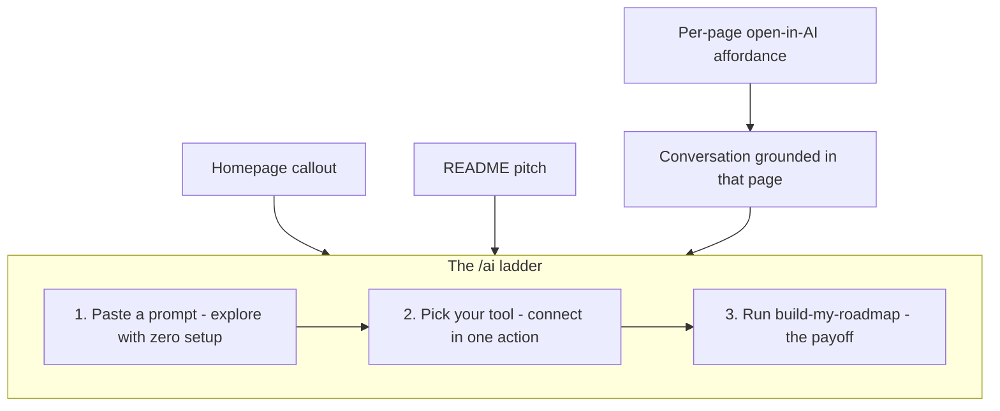
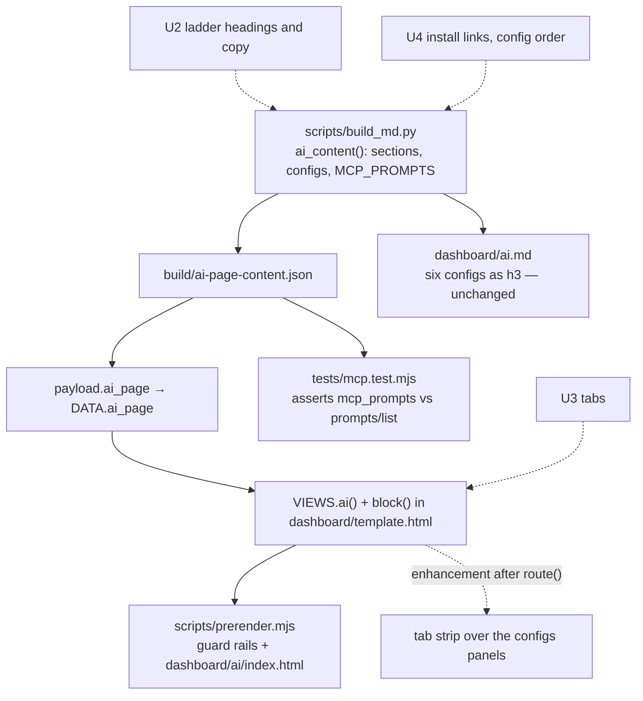
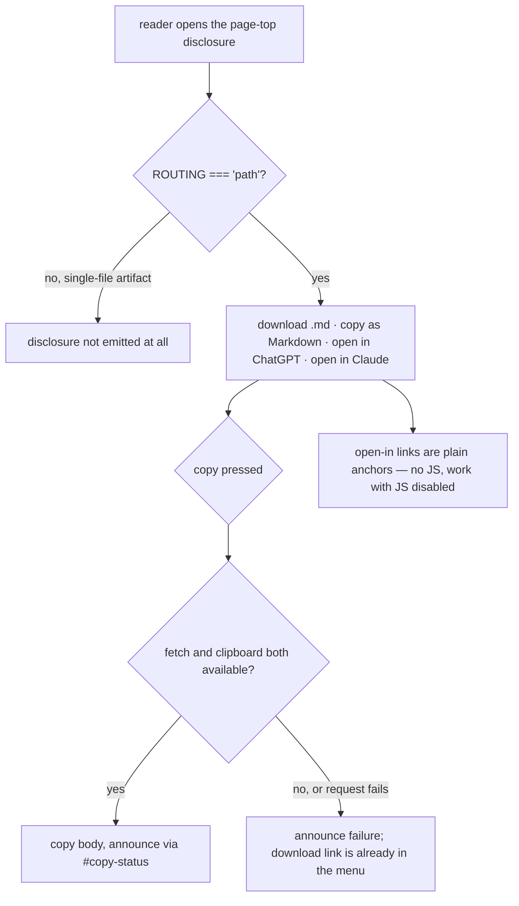

# Advertise the Agentic Layer - Plan

## Goal Capsule

- **Objective:** Reposition the site's already-shipped agentic layer (MCP server, llms.txt, markdown twins, five MCP prompts) around a designer-facing outcome — "ask this study anything now; connect it and get an AI-affordance roadmap for your design system" — across the homepage, the /ai page, per-page affordances, the README, and a launch post.
- **Product authority:** This plan. The corpus data, MCP capabilities, and study content are not touched; registry submissions and a published traffic stat are named deferrals, not active scope.
- **Execution profile:** Eight units, dependency-ordered. No new route is added, no MCP capability changes, no data record changes. Every unit is verified through `npm run check` plus the guard rails in `scripts/prerender.mjs`.
- **Stop conditions:** Stop and surface rather than guess if a change would add a published route, alter a `data/*.json` record, or require weakening a `scripts/prerender.mjs` guard rail.
- **Tail ownership:** The invoking pipeline owns commit, PR, and CI.
- **Open blockers:** None.

**Product Contract preservation:** Product Contract unchanged. R1–R9, KD1–KD6, F1–F2 and AE1–AE3 carry forward with their original meaning and IDs; research confirmed the Dependencies section's claims about what already ships.

---

## Product Contract

### Summary

Reposition, don't build: the homepage gets an outcome-led callout, the /ai page becomes a three-step ladder (paste a prompt → pick your tool → run the roadmap prompt), every content page gets a quiet copy-as-Markdown / open-in-AI affordance, and the README retells the same tiered pitch. A launch post draft leads with the dogfood story: a study of AI affordances in design systems that ships every affordance it surveys.

### Problem Frame

The agentic layer is complete but invisible. The site serves an MCP endpoint with 9 tools, 2 resources, and 5 prompts, markdown twins of every route, llms.txt with a well-known twin, and Accept-header content negotiation — yet the only human-facing advertisement is a nav link labeled "For agents". The homepage says nothing, and the /ai page, while thorough, reads as a reference sheet: six install configs side by side, mechanism names first.

The audience is partly designers who have never configured an MCP server, so the mechanism vocabulary is itself a wall. This is anticipatory rather than observed on this site, but it is grounded in the author's experience teaching Claude Code and agent skills to hundreds of people: the stall point is "what is this and why would I bother", not the install command.

External practice has converged on an answer. Docs platforms and design systems (Mintlify, Vercel, Stripe, GitBook, shadcn/ui, Chakra UI, Supabase) ship per-page copy/open-in-AI menus, client-tabbed one-liner installs, and dedicated agent landing pages — and every visible pattern targets the human who wires an agent up once. This site has all the underlying plumbing those patterns advertise; it lacks only the advertising.

### Key Decisions

- KD1. **The roadmap is the flagship outcome.** (session-settled: user-directed — chosen over query-the-study, audit-my-system, or a menu of five: designers act on a concrete payoff, not a capability list.) Governs R6, R8, R9.
- KD2. **Tiered promise.** The zero-setup path promises "explore the study conversationally"; the roadmap is positioned as the payoff for connecting. (session-settled: user-directed — chosen over coaching users to bring their own docs and over an interview-style prompt: each tier promises only what it can honestly deliver.) Governs R1, R3, R5.
- KD3. **Tool-agnostic onboarding, tabbed by client.** (session-settled: user-directed — chosen over optimizing for one client: the audience spans claude.ai designers and Claude Code students.) Governs R4.
- KD4. **Reposition, don't build.** Everything advertised already exists; this round changes discovery and comprehension, not capability. (session-settled: user-approved — chosen over a per-page-led or measurement-led shape: teaching experience says comprehension is the bottleneck.)
- KD5. **Designer-first language.** Copy assumes zero MCP familiarity; payoff before protocol terms. Governs R5.
- KD6. **Dogfood story as the launch hook, without a live stat.** (session-settled: user-approved — chosen over publishing an agent-traffic share now: measurement plumbing is real scope and day-one numbers may be humble.) Governs R9.

### Requirements

**Homepage and navigation**

- R1. The homepage carries an outcome-led callout for the agentic layer that states both tiers of the promise — ask the study anything now, connect it for a roadmap — and links to /ai, within the site's quiet art direction.
- R2. The nav entry for /ai leads with outcome language rather than mechanism language; the current "For agents" label may be replaced.

**The /ai ladder**

- R3. The /ai page restructures as a three-step ladder in rising order of effort: try it with zero setup, connect it to your tool, run the roadmap prompt as the payoff.
- R4. The install instructions render behind client-selector tabs so a visitor sees one path — theirs — instead of six configs at once.
- R5. Ladder copy names the payoff of each step before any protocol term appears, and introduces jargon only where the step requires it.
- R6. The `build-my-roadmap` prompt is presented as the headline reason to connect, with the other four prompts as supporting workflows.

**Per-page doorway**

- R7. Every content route offers a per-page affordance to copy the page as Markdown and to open it in an AI tool with the page as context, extending the existing per-page markdown download link, with a visual treatment quiet enough for the house style.

**README**

- R8. The README's AI section retells the tiered pitch — outcome first, the one-line connect command as the second beat — consistent with the site's wording.

**Launch post**

- R9. A launch post draft, channel-agnostic and in the author's voice, leads with the dogfood story (the study ships every affordance it surveys) and lands on the tiered promise.

### Key Flows

- F1. The ladder journey
  - **Trigger:** A designer lands on the homepage or README and follows the callout to /ai.
  - **Steps:** Step 1 hands them a paste-ready prompt for any chat tool and they get answers grounded in the study; step 2 shows their tool's tab with one action to connect; step 3 names the roadmap prompt and what it produces.
  - **Outcome:** A visitor with no MCP vocabulary reaches a connected client and a personal roadmap without ever choosing between six configs.
  - **Covers:** R1, R3, R4, R5, R6.
- F2. The mid-study doorway
  - **Trigger:** A reader is deep in a record or insight page.
  - **Steps:** The per-page affordance lets them copy the page as Markdown or open their AI tool with that page as context; the conversation starts from where they were, and the ladder remains one link away for the full setup.
  - **Outcome:** Discovery happens where readers already are, not only on /ai.
  - **Covers:** R7.

### Acceptance Examples

- AE1. **Covers R5.** Given a visitor who has never heard of MCP, when they read step 2 of the ladder, then they can identify their tool and the single action to take before any protocol term has been required of them.
- AE2. **Covers R1, R3.** Given the zero-setup tier (homepage callout or ladder step 1), when its promise is stated, then it offers exploring the study conversationally — the roadmap appears only as the payoff of connecting.
- AE3. **Covers R7.** Given any content page, when the reader invokes the open-in-AI affordance, then the tool opens with that page's content or URL as context, not the site root.

### Success Criteria

- Request volume to the agentic surfaces (the MCP endpoint, `.md` twins, llms.txt) rises after shipping, observable in Netlify's existing logs; no target number and no new instrumentation this round.
- A designer with no MCP experience can follow one visible path from the homepage to a connected client without leaving the ladder.

### Scope Boundaries

**Deferred for later**

- A published live "N% of requests are agents" stat and the measurement plumbing behind it — a fast-follow once the logs are worth quoting.
- Submissions to MCP registries and llms.txt directories.

**Outside this round**

- New MCP tools, resources, prompts, or WebMCP changes — this round advertises what exists.
- Changes to the corpus data or study content.
- Analytics instrumentation of any kind.

### Dependencies / Assumptions

- Every advertised capability is verified shipped in source: 9 read-only tools and 2 resources and 5 prompts in the MCP server, in-place `.md` twins for every route, llms.txt plus its well-known twin, Accept-header negotiation, and a per-page "Download as md" link to extend.
- Netlify's existing logs suffice as the success signal.
- All new copy follows the repo's audience-facing standards: content only, no process meta, US spelling in our own words, un-AI-ified voice.

### Outstanding Questions

All three resolved during planning; see KTD5, KTD7 with KTD8, and KTD10.

### Sources / Research

- Current state in source: the nav array and `mdDownload()` in `dashboard/template.html`; the three-paths structure and six configs in `scripts/build_md.py`; prompts and tools in `netlify/functions/mcp.mjs`; the "With an AI tool" passage in `README.md`; negotiation and headers in `netlify.toml`.
- External patterns, per-page menus: Mintlify contextual menu (mintlify.com/docs/ai/contextual-menu), Vercel markdown access (vercel.com/docs/agent-resources/markdown-access).
- External patterns, agent landing pages and tabbed installs: Vercel agent resources (vercel.com/docs/agent-resources), Stripe building-with-llms (docs.stripe.com/building-with-llms), shadcn/ui MCP quick start (ui.shadcn.com/docs/mcp), Cursor MCP install links (cursor.com/docs/mcp/install-links), GitBook LLM-ready docs (gitbook.com/docs/ai-and-search/llm-ready-docs).
- Proof-point genre for the deferred stat: Mintlify's agent-traffic report (45.3% of requests from agents) and GitBook's AI-readership posts (41%).

---

## Planning Contract

### Key Technical Decisions

- KTD1. **Tabs are a renderer-only change; the `configs` block type and `/ai.md` are untouched.** The block items already carry `{id, label, lang, note, code}` — the exact data a tab strip needs, and `id` is already used as a copy-button key suffix. Only the `configs` branch of `block()` changes in the copy pipeline; the tab strip itself arrives as the separate enhancement and CSS of KTD2 and KTD14. Rejected: a new `tabs` block type, which would need handling in both `ai_md()` (Python) and the JS renderer, and would force a decision about what markdown does with tabs when the answer — render all six as `###` headings — is what `ai_md()` already does. Governs R4.

- KTD2. **The tab strip is a JS enhancement layered over the stacked markup, not a rendering mode.** The view function keeps emitting the six labeled panels it emits today plus a hook attribute on the wrapper; a guarded enhancement function injects the tablist and hides the inactive panels. With no JS the reader sees today's page. Rejected: emitting only the active panel, which would leave five configs unreachable without JS and would hide them from the crawlers `docs/architecture.md` says take the served HTML as final. Governs R4.

- KTD14. **The enhancement is called from inside `route()`, and every DOM method it uses is `typeof`-guarded.** Two separate constraints, both load-bearing. `route()` (`dashboard/template.html:1574`) reassigns `#view-root.innerHTML` at `:1578` on every call — boot, delegated link click, `popstate`, `hashchange` — so a boot-only enhancement is destroyed on the second visit to `/ai`; `setupMatrixFades()` is called from within `route()` at `:1606` for exactly this reason. Separately, `scripts/prerender.mjs` executes the module at `:1853` under a shim whose `getElementById` and `querySelector` return a **truthy fake element** (`:48-90`), so an "early-return if the wrapper is missing" guard never fires; that fake carries no `appendChild`, `insertAdjacentHTML`, `children` or `parentNode`, and `prerender.mjs:132-137` turns any throw into a build failure. The guard that works is the one `setupMatrixFades()` uses at `:1491-1495` — `typeof el.someMethod !== 'function'` on each method before calling it. Governs R4.

- KTD3. **The per-page doorway is a native `
` disclosure, not a new dropdown component.** It opens and closes without JS, and it keeps `.pagetop` at one control at rest. Rejected: a bespoke popover menu, which would be the site's second new component in one change and would need its own focus trap, dismiss behavior, and positioning. Note what this decision does *not* buy: `.aff > summary` (`dashboard/template.html:624-629`) and `.tech-ex > summary` (`:679-687`) are class-scoped with no shared base rule, so the marker, hover, focus ring and list-style reset are written a third time from scratch. The precedent is visual, not reusable CSS. Governs R7.

- KTD4. **Copy-as-Markdown fetches the `.md` twin on click; the markdown is not inlined into the payload.** `dashboard/data.js` is one shared payload across 27 prerendered pages precisely to avoid duplicating roughly 700KB per route (`docs/architecture.md`, "The payload is external"); inlining every route's markdown would grow that shared cost for a button most readers never press. This introduces the codebase's first `fetch()`, so it is guarded at the call site, bails when `ROUTING !== 'path'` (the single-file artifact has no sibling `.md` files — the same condition `mdDownload()` already returns empty on), and falls back to the download link when the request or the clipboard write fails. Governs R7.

- KTD5. **Three destinations: copy as Markdown, open in ChatGPT, open in Claude — and no undocumented deeplink beyond those two.** Both `chatgpt.com/?q=` and `claude.ai/new?q=` are community convention rather than documented web-app contracts, but every docs platform depends on them, so breakage is loud and quickly noticed. Both were exercised live in a logged-in browser: each prefills the composer and neither auto-submits, so the copy must say the assistant opens with the page loaded, not that it answers. Perplexity, Grok, Google AI Studio and T3 Chat all work today and were rejected: on a site whose premise is that every claim links to a page that loads, a link that silently dead-ends is the wrong kind of debt, and four destinations plus a download in one disclosure is a menu, not an affordance. Resolves the Outstanding Question on which tools to target. Governs R7.

- KTD6. **Every destination gets the `.md` twin URL, not the HTML URL.** One prompt template, one interpolation, and it hands each assistant the artifact this study exists to argue for. Rejected: Mintlify's split (HTML for ChatGPT because its own fetcher handles pages, `.md` for everyone else), which buys a marginally better ChatGPT fetch at the cost of two templates and a rule nobody can see — and this site answers `Accept: text/markdown` anyway, so the distinction it encodes barely applies here. The prompt stays a fixed template with only the site's own URL interpolated — never anything reader-supplied, since `?q=` is a known prompt-injection surface. Governs R7, AE3.

- KTD13. **Use the bare `q` parameter on both hosts, and send no other parameter.** Live verification settled three details the published sources got wrong. `?hints=search` on ChatGPT drops the prompt entirely — the composer opens with a search chip and no text — which is the parameter Mintlify ships today, so their button is broken and must not be copied. ChatGPT accepts both `q` and `prompt` and rewrites `q` to `prompt` on load; `claude.ai` accepts only `q` and ignores `prompt`. `q` is therefore the one name that works on both. Governs R7.

- KTD7. **The homepage callout reuses the `.correct` callout pattern and lands at the end of the overview view.** `.correct` is the house callout (`bg-raise`, 1px `--line`, 3px `--accent` left edge, accent-bordered CTA that inverts on hover) and `DESIGN.md` names it. End-of-view placement is deliberate: `ed5b9fd` moved the matrix up so the homepage opens on the thesis, and wedging a promotion above it would reverse a two-day-old decision without authority; above-fold discovery is R2's job instead. That hand-off holds on desktop only — `ai` is the last of seven entries in `NAV`, and below 860px the rail flattens into a single non-wrapping horizontally scrolled row whose only overflow cue is a gradient fade, so on a phone the renamed entry sits off-screen and the callout sits at the bottom. Rejected: inserting between `
` and `<section id="systems">`. Resolves half the Outstanding Question on callout placement. Governs R1.

- KTD8. **The nav label becomes "Ask this study"; the /ai page title stays "Use this report with AI tools".** The label is free to change — `scripts/prerender.mjs` matches on `data-r="ai"`, not on link text, and `/ai` has its own `VIEW_TITLES` entry — whereas the page title is hard-coded in three places (`scripts/build_md.py:179`, `scripts/build_dashboard.py:77`, `scripts/prerender.mjs:481`) and already leads with an outcome. Rejected: "For AI tools", which renames the mechanism instead of naming the outcome. Resolves the other half of the Outstanding Question on the nav label. Governs R2.

- KTD9. **Add https one-click install links for Cursor and VS Code; add no ChatGPT connect tab; ship no badge images.** `https://cursor.com/install-mcp?name=&config=` and `https://vscode.dev/redirect/mcp/install?name=&config=` are documented, verified live, and render a real page when the app is absent — unlike the `cursor://` and `vscode:` schemes, which fail silently. ChatGPT is rejected as a connect tab because its honest status is "Developer mode, paid plans, admin-gated on Business" — that fails KD5's designer-first test; ChatGPT users are served by ladder step 1 and by the per-page open-in link. Badge images are rejected: the site loads no remote images and its art direction has no place for a vendor-colored button. Governs R4.

- KTD10. **Ladder step 1 keeps the existing paste prompt body; only the copy framing around it changes.** The prompt already cites `source_url` per record and states the snapshot date, which is exactly the tiered promise's honest floor. Rewriting it would churn `/ai.md` for no gain. Resolves the Outstanding Question on whether step 1 reuses the prompt verbatim. Governs R3, R5.

- KTD11. **Section ids on /ai stay as they are; only headings change.** `what`, `files`, `mcp`, `prompts`, `data`, `webmcp`, `borrowed`, `feedback` are the page's URL surface and may be linked externally. The jump list derives from the same `rest` array that renders the sections, so new headings propagate to the chips for free. Governs R3.

- KTD12. **The launch post is an unpublished draft at `docs/launch-post.md`, not a site route.** A new published route adds an entry to `llms.txt`, which `scripts/check_md_layer.py` caps at 17,408 bytes against a current 16,756. The post is also promotional copy, not report content, and every published surface here carries the study. Governs R9.

### High-Level Technical Design

**Where each unit touches the /ai copy pipeline.** The `--final` re-run of `build_dashboard.py` exists because `/ai` copy is compiled in step 2, so a copy change flows through the whole chain before any HTML is written.

**How the per-page doorway degrades.** Each branch is a state the site actually reaches: the single-file artifact has no sibling files, the prerender sandbox has no `fetch`, and a crawler takes the served HTML as final.

### Assumptions

Recorded because this run was headless. Each is a bet the implementer should correct on contact if the code says otherwise.

- The proposed nav label "Ask this study" fits the rail's label voice (11px uppercase, 0.14em tracking) at the same width as "Methodology". Check it rendered before committing to the wording; the label is a one-token change if it reads badly.
- AE1's "single action" reads as one instruction, not one click. For Cursor, VS Code and Claude Code it is literally one click or one command; for claude.ai and ChatGPT the honest instruction is a short settings path, which is what the copy should give. If the reviewer reads AE1 as requiring one click for every client, that is a product question to raise, not something to paper over with a fake button.
- `--control-line` and `--accent-ink`/`--accent-wash` cover the tab strip's states, so `scripts/check_contrast.js` needs no new pair. If the design lands on a pair not already in that file, add it to the check rather than shipping it unchecked.
- Growing `/ai.md` costs `llms.txt` nothing at all. Its `/ai.md` entry carries a hand-written description and no size field; measured sizes appear only on the bulk `.txt` and `.json` entries. So the 652 bytes of headroom (16,756 against the 17,408 cap in `scripts/check_md_layer.py:34`) is only at risk if a route is added, which KTD12 avoids.

---

## Implementation Units

### U1. Homepage callout and nav label

**Goal:** The homepage states both tiers of the promise and links to /ai, and the nav entry names the outcome instead of the mechanism.

**Requirements:** R1, R2, F1, AE2, KD2, KD5, KTD7, KTD8

**Dependencies:** none

**Files:**

- `dashboard/template.html` — `VIEWS.overview` (ends at 1230), `NAV` (1512), the `/ai` eyebrow literal (1411), and one CSS rule beside `.correct` (747–752)
- `scripts/prerender.mjs` — one guard rail beside the existing `index.html` checks (399–460)
- `DESIGN.md` — the Components section, noting the homepage callout as the site's second CTA instance

**Approach:**

1. Change the `NAV` entry for `ai` from `'For agents'` to `'Ask this study'`. Do not add any attribute to the anchor template at `:1559`, before or after `data-r` — `scripts/prerender.mjs:170` matches ``<a href="([^"]*)" data-r="${active}">`` and anchors on the `>` immediately after, so an attribute on either side breaks it. Reordering `NAV` is safe; the regex matches per item.
2. Change the `/ai` view's own eyebrow at `:1411` from the literal `For agents` to match. R2 is about outcome language, and leaving the page's eyebrow reading "For agents" under a rail that now reads "Ask this study" puts the two labels in visible disagreement on the same screen.
3. Append a callout to `VIEWS.overview`'s returned template literal, after the affordance-prevalence bars. Mirror `.correct`'s markup exactly, including its wrapper: `<aside class="correct" aria-label="…">` with a `.t` display-face title, `ink-2` prose, and one accent-bordered anchor to `href('ai')`. The existing instance is an `aside` with an accessible name, and this one needs it more — at the end of a long scroll, the landmark is how a screen-reader or keyboard reader reaches it without traversing the page.
4. Write the copy to KD2's tiering: the zero-setup tier promises exploring the study conversationally; the roadmap appears only as the payoff of connecting. Per AE2, do not promise a roadmap on the zero-setup side.
5. Derive any count in the copy from `DATA` (for example `DATA.systems.length`), never a typed number. A hand-typed count is the defect `scripts/check_hand_counts.py` and the `resolve_counts()` mechanism both exist to prevent.
6. Add a `scripts/prerender.mjs` guard asserting `index.html` contains the callout's link to `/ai`. This is the repo's only HTML-shape test harness — `dashboard/**` is excluded from eslint, prettier and `fallow dead-code`, so an assertion here is the sole mechanical check on this markup.
7. Record the callout in `DESIGN.md` beside the correction CTA. `DESIGN.md` currently calls that CTA "the one call to action a record carries"; a second instance on the homepage is a deliberate departure and should read as documented rather than contradicted.

**Patterns to follow:**

- `dashboard/template.html:747-752` — `.correct`, the house callout: `bg-raise`, 1px `--line`, 3px `--accent` left edge, no shadow
- `dashboard/template.html:1559` — the nav anchor template whose shape `prerender.mjs` matches
- `scripts/prerender.mjs:413-414` — the existing `index.html` string assertion, the shape to copy

**Test scenarios:**

- The rendered `dashboard/index.html` contains an anchor to the `/ai` route inside the callout, present in the static file rather than injected at runtime.
- `dashboard/index.html` still contains `<h1>How design systems talk to machines</h1>` verbatim — `scripts/prerender.mjs:413` asserts it and the callout must not disturb it.
- The nav renders seven items, the `ai` item reads "Ask this study", and `scripts/prerender.mjs`'s nav-count and nav-icon guards (440–460) still pass.
- No rendered surface still reads "For agents": neither the rail nor the `/ai` page eyebrow.
- The callout copy contains no digit that was typed by hand; any count present resolves from `DATA`.
- The static `dashboard/index.html` carries the callout as a complementary landmark with an accessible name, not as an unnamed block.
- The callout renders legibly in both themes, in forced-colors mode, and in print — `DESIGN.md` treats each as a designed state.
- Covers AE2: the callout's zero-setup sentence offers conversation with the study and does not promise a roadmap.

**Verification:** `npm run check` exits 0; `/` shows the callout at the end of the overview and the rail reads "Ask this study".

---

### U2. Restructure /ai into the three-step ladder

**Goal:** `/ai` reads as three steps in rising order of effort, each naming its payoff before any protocol term, with the roadmap prompt as the reason to connect.

**Requirements:** R3, R5, R6, F1, AE1, AE2, KD1, KD2, KD5, KTD10, KTD11

**Dependencies:** none

**Files:**

- `scripts/build_md.py` — `MCP_PROMPTS` (979–991), the slash-command exemplar (1254), and `ai_content()`'s `sections` list (1164–1374)
- `netlify/functions/mcp.mjs` — the other-prompts list inside `start-here`'s body (1218–1222)
- `AGENTS.md` — the prompt sentence in the MCP paragraph (219–220)

**Approach:**

1. Rewrite the three `prose` blocks in the `what` section. The current "three ways to do that, in rising order of effort" sentence becomes the ladder's framing and states both tiers of KD2's promise.
2. Re-head the three ladder sections, keeping their ids per KTD11: `files` becomes step 1 (ask it a question with nothing to set up), `mcp` becomes step 2 (connect it to your tool), `prompts` becomes step 3 (get a roadmap for your design system).
3. Leave `data`, `webmcp`, `borrowed` and `feedback` in place and unchanged. They are supporting material below the ladder, not rungs on it.
4. Reorder `MCP_PROMPTS` so `build-my-roadmap` is first, and rewrite the `prompts` section's leading prose to name what the roadmap produces before listing the other four as supporting workflows. The reorder is mechanically safe: `tests/mcp.test.mjs:169-172` sorts both sides before comparing, every other prompt assertion looks names up rather than indexing, and `NUMBER_WORD[len(MCP_PROMPTS)]` is order-independent.
5. Resync the three places that restate the prompt set by hand and are not bound to `MCP_PROMPTS` by any check. `scripts/build_md.py:1254` uses `start-here` as the slash-command exemplar and says "the same shape for the other four" — with the roadmap as the flagship, the exemplar should be `build-my-roadmap`. `netlify/functions/mcp.mjs:1218-1222` lists the other prompts inside `start-here`'s own body in the old order. `AGENTS.md:219-220` names the five in the old order. None of these fails a test today, which is exactly why they drift.
6. Name ChatGPT in step 2's prose and send those readers somewhere real. KTD9 ships no ChatGPT connect tab, which leaves the sixth config — labeled "Anything else" and naming Windsurf, Zed and "most frameworks" — as the tab a ChatGPT reader will reasonably take for theirs, and its JSON has nowhere to go. Say that connecting ChatGPT needs Developer mode on a paid plan, and point back to step 1 and the per-page open-in link. R4 promises a visitor sees one path, theirs; without this, the client the designer audience is most likely using gets no path and one misleading one.
7. Keep the `prompt` string body unchanged per KTD10; only the prose introducing it changes.
8. Keep `MCP_PROMPTS` as the source of the published names — `tests/mcp.test.mjs` uses it as the expected-value fixture for `prompts/list`. Do not add a fourth hand-maintained copy while fixing the three above.

**Execution note:** This copy passes through `scripts/check_md_layer.py`'s grep gate. The patterns at `:45` are `verify_note`, the quoted string `"verified"`, and `\bcritic\b` — the bare word *verified* is allowed, the quoted form is not. Keep all three out of the new prose.

**Patterns to follow:**

- `scripts/build_md.py:1164-1374` — the `sections` list and the five block types (`prose`, `list`, `links`, `code`, `configs`); introduce no sixth type
- `scripts/build_md.py:1240-1257` — the existing `prompts` section, including the backtick convention that keeps `/mcp__…__name` from rendering as bold in `/ai.md`

**Test scenarios:**

- `prompts/list` still equals `build/ai-page-content.json`'s `mcp_prompts` sorted, after the reorder — the existing assertion in `tests/mcp.test.mjs` must stay green.
- `build/ai-page-content.json` lists `build-my-roadmap` first in `mcp_prompts`.
- The section ids in `build/ai-page-content.json` are unchanged: `what`, `files`, `mcp`, `prompts`, `data`, `webmcp`, `borrowed`, `feedback`.
- The jump list in `dashboard/ai.html` carries the new headings and every `href="#…"` still matches a `<section id>` in the same file.
- No file in the repo still lists the five prompts in the old order: `scripts/build_md.py`, `netlify/functions/mcp.mjs` and `AGENTS.md` all lead with `build-my-roadmap`.
- The slash-command exemplar in the `/ai` copy names a prompt that exists in `MCP_PROMPTS`, and its "the other four" phrasing still counts correctly.
- Covers AE1: step 2's copy names the reader's tool and the action to take before the first protocol term appears.
- Covers AE2: step 1's copy offers exploring the study conversationally and does not promise a roadmap.
- The generated `dashboard/ai.md` contains none of `verify_note`, the quoted string `"verified"`, or `critic`. The bare word *verified* is allowed; only the quoted form trips the gate.
- Step 2's copy names ChatGPT, states that connecting it needs Developer mode on a paid plan, and points those readers back to step 1 and the per-page open-in link.
- No count in the new prose is typed by hand; counts come from the existing computed values (`N_SYS`, `N_TECH`, `NUMBER_WORD[len(...)]`) or the `{md_count}` placeholder, which resolves only inside `prose` blocks.

**Verification:** `npm run check` exits 0; `/ai` reads as three numbered steps and the jump list reflects them.

---

### U3. Client-selector tabs for the connect step

**Goal:** Step 2 shows one client's install path at a time, and shows all of them when JavaScript does not run.

**Requirements:** R4, F1, KD3, KTD1, KTD2, KTD14

**Dependencies:** none

**Files:**

- `dashboard/template.html` — the `configs` branch of `block()` (1401–1403), a new enhancement function near `setupMatrixFades()` (1491), its call site inside `route()` beside the existing one (1606), and new CSS beside the existing control rules
- `scripts/prerender.mjs` — one guard rail asserting the tab markup is present in `ai.html`
- `DESIGN.md` — a Tabs entry under Components

**Approach:**

1. In `block()`, keep emitting one labeled panel per config item exactly as today, and wrap the set in a container carrying a hook attribute and each panel's `id`. Nothing about the emitted panels changes; the wrapper is the only addition.
2. Call the enhancement from inside `route()`, gated on the `/ai` view, and place the call **after** `pruneSnippetTabStops()` rather than beside `setupMatrixFades()` before it. `route()` reassigns `#view-root.innerHTML` on every navigation, so an enhancement wired only at boot is discarded the second time a reader reaches `/ai`. Ordering matters for a second reason: `pruneSnippetTabStops()` skips any `pre` whose `clientWidth` is 0, which is exactly what a hidden tab panel is, so hiding panels first would strand a spurious keyboard tab stop and `role="group"` on five of the six snippets. The repo already treats this as a known hazard — a capture-phase `toggle` listener re-runs the prune when a `
` opens.
3. Guard every DOM method the enhancement calls with `typeof el.method !== 'function'`, following `setupMatrixFades()` at `:1491-1495`. Do not rely on a not-found check: under `scripts/prerender.mjs`'s shim, `getElementById` and `querySelector` return a truthy fake element (`:48-90`), so "bail if the wrapper is missing" never bails. That fake has no `appendChild`, `insertAdjacentHTML`, `children` or `parentNode`, and `prerender.mjs:132-137` turns any throw into `die()`. Building the tablist by assigning `innerHTML` on an element the shim does provide is the lower-risk construction; reaching for node-level APIs is what breaks the build.
4. Give the strip real tab semantics: an `aria-label` on the `role="tablist"` (the page already carries a jump list, so an unnamed second list of controls is ambiguous), `role="tab"` with `aria-selected` and `aria-controls`, and `role="tabpanel"` on each panel associated back to its tab. The site has no prior tab component, so none of this can be inherited.
5. Commit to automatic activation: an arrow key moves focus and swaps the panel in one step, Home and End jump to the first and last tab, and the roving tab stop keeps `tabindex="0"` on the selected tab and `-1` on the rest. Automatic is right here because the panels are static prerendered content with no load cost. Leaving the activation model unstated would let an implementer build manual activation instead, which reads differently to every keyboard and screen-reader user.
6. Hide each panel's own `<h3>` label while the enhancement is active, and give the panel `aria-labelledby` pointing at its tab. The `configs` branch already emits that heading directly beneath, so without this the selected client's name appears twice in a row and the outline carries six `h3`s for one visible panel. Scope the rule to the enhanced state so the heading returns with no JS and in print, where it is the only thing labeling each config.
7. Style it as a control, not a chip: the 3px chamfer and `--control-line`, never the 999px pill, which `DESIGN.md` reserves for metadata chips. Draw the selected state with an edge rule in `--accent`, not a fill.
8. Keep the strip a single non-wrapping row that scrolls horizontally below 860px, reusing the narrow rail nav's treatment — bleed to the gutters, hidden scrollbar, gradient edge-fade, focus-ring clearance padded in. Six client labels do not fit one row on a phone, and the moment the strip wraps, a vertical-only `::after` tap extension starts stealing the row above it. Scrolling keeps that technique valid; wrapping would force real padding instead.
9. Design the print, forced-colors and reduced-motion states. In print, add the injected tablist to the existing `@media print` hide list alongside `.rail, .theme-toggle, .skip, .md-dl`, and override the hidden state on every panel so all six configs print with their own labels. A row of six tab buttons on paper controls nothing, and a printed page with five hidden configs is a page with missing content.
10. Add a `scripts/prerender.mjs` guard asserting the wrapper and every config panel are in the static `ai.html`. Derive the expected count from `payload.ai_page` rather than hardcoding six, so the guard does not fail the day a seventh client is added. The existing `data-copy=` assertion must still pass, so the copy buttons stay inside the panels.
11. Add the component to `DESIGN.md`. It is the site's first tab strip and its first form-adjacent control, which is exactly the case `DESIGN.md`'s Inputs section anticipates when it says a control edge, when one arrives, takes `control-line`.

**Execution note:** Prove the no-JS state before the enhanced one. Load `dashboard/ai.html` from disk with scripting off and confirm all six configs are readable; that static file is what every AI crawler receives, per `docs/architecture.md`. Note the filename: `relFor()` (`scripts/prerender.mjs:312-313`) writes `dashboard/ai.html`, and `:355-360` removes any directory-form twin, so `dashboard/ai/index.html` does not exist.

**Patterns to follow:**

- `dashboard/template.html:1491` — `setupMatrixFades()`, the house shape for guarded DOM enhancement that survives the prerender shim; note that its load-bearing guards are the per-method `typeof` checks at `:1491-1495`, not the `ResizeObserver` check below them
- `dashboard/template.html:1606` — where `setupMatrixFades()` is called from inside `route()`, view-gated; the tab enhancement takes the same slot
- `dashboard/template.html:1660-1672` — the delegated copy handler and `say()` announcing through `#copy-status`; the tab strip should not introduce a second live-region mechanism

**Test scenarios:**

- With JavaScript disabled, `dashboard/ai.html` shows all six configs with their labels, notes and code blocks — the page as it reads today.
- With JavaScript enabled, one panel is visible, the tab strip lists six clients, and selecting a tab swaps the visible panel.
- The tab strip survives client-side navigation: load `/`, click through the rail to `/ai`, and the tabs are present and working — not only on a direct load of `/ai`.
- Keyboard: Tab reaches the strip once, an arrow key swaps the visible panel without a second keypress, Home and End reach the first and last tab, and the focus ring is the global 2px accent ring at 3px offset.
- Screen-reader semantics: the tablist has an accessible name, each tab has `aria-selected`, each panel has `role="tabpanel"` and is associated with its tab.
- The selected client's name appears once on screen with JavaScript on, and once per panel with it off.
- At 375px and 540px the strip scrolls horizontally rather than wrapping, and every tab clears the tap floor.
- A config snippet that fits its column carries no `tabindex` after the tabs initialize — the prune ran while the panels were still measurable.
- The copy button inside each panel still copies that panel's config, and `scripts/prerender.mjs`'s `data-copy=` assertion still passes.
- `./scripts/build.sh` completes without `die('app script threw in the sandbox')` — the enhancement calls no DOM method the shim at `scripts/prerender.mjs:48-90` does not provide, and each call it does make is `typeof`-guarded.
- Print rendering shows all six panels with their own labels and no tab strip.
- Forced-colors mode restates the selected-tab marker, since an accent edge rule does not survive there unaided.
- `dashboard/ai.md` is unchanged by this unit: it renders the six configs as `###` headings exactly as before.

**Verification:** `npm run check` exits 0; `/ai` shows one config at a time with JS and all six without.

---

### U4. One-click install links and designer-first config order

**Goal:** Cursor and VS Code users connect in one click, and the first tab a designer sees is the one they can use.

**Requirements:** R4, F1, AE1, KD3, KD5, KTD9

**Dependencies:** U3, for approach step 1 only — the config reorder's only visible effect is which panel the tab strip opens on. The install-link work in steps 2–5 renders in today's stacked panels and can land before U3.

**Files:**

- `scripts/build_md.py` — the `configs` list in `ai_content()` (1053–1099) and the `configs` branch of `ai_md()`
- `dashboard/template.html` — the `configs` branch of `block()`, the same branch U3 edits

**Approach:**

1. Reorder `configs` so `claude-desktop` (Claude Desktop and claude.ai) is first. It is the client the designer audience actually has, and U3 makes the first panel the one the tab strip opens on. Reordering is safe: the `id` values feed copy-button keys, and nothing asserts their order.
2. Carry the install link as its own `install_url` / `install_label` fields on the config item, not as markdown inside `note`. A link written into `note` never becomes a link on `/ai`: the `configs` branch renders the note through `fmt()`, which rewrites only backticks, `**bold**` and `*em*` after `esc()` and has no link rule, so the reader would see raw `[Install in Cursor](https://…)` text. `ai_md()` writes the note out raw, so the same markdown *would* work in `/ai.md` — the two surfaces would disagree. Render the new fields with `extLink()` in `block()` beside the `.h2-sub` note, and emit them as a markdown link in `ai_md()`. This mirrors the existing `links` block type, which is the house pattern for exactly this.
3. Build the Cursor link as `https://cursor.com/install-mcp?name=<name>&config=<base64>`, where the base64 payload is the inner server object only — `{"url": "<MCP_URL>"}`, not the `{name: {...}}` wrapper. Build it in Python from `MCP_NAME` and `MCP_URL` so it cannot drift from the JSON block beside it.
4. Build the VS Code link as `https://vscode.dev/redirect/mcp/install?name=<name>&config=<urlencoded-json>`, where the JSON is `{"type": "http", "url": "<MCP_URL>", "name": "<name>"}`. Omitting `name` returns 400.
5. Encode in the documented order — base64 first, then URL-encode the result — and percent-encode the base64 padding. Reversing those two steps is a known failure that produces `Invalid server configuration provided: Not valid JSON`.
6. Use the https forms, not the `cursor://` and `vscode:` custom schemes. The schemes fail silently when the app is not installed; the https forms render a real page.
7. Say plainly in the `claude-desktop` note that this one is a settings path rather than a link. U2 step 6 owns the ChatGPT copy; do not imply a button that does not exist here either.
8. Keep every existing JSON config block. The one-click link is an addition beside the config, not a replacement — it does nothing for a reader on a phone or on a client the link does not cover.

**Execution note:** Both URLs must be fetched and checked before this ships. This repo's standing rule is that a claim is only as good as a page that loads, and an install link is a claim.

**Patterns to follow:**

- `scripts/build_md.py:1053-1099` — the `configs` item shape; `id`, `label`, `lang`, `note`, `code`
- `scripts/build_md.py` — `MCP_NAME` and `MCP_URL`, already the single source for every config block

**Test scenarios:**

- The Cursor install URL decodes back to `{"url": "<MCP_URL>"}` — base64-decode the `config` parameter after URL-decoding it and compare to the JSON the adjacent code block shows.
- The VS Code install URL's `config` parameter URL-decodes to JSON containing `type`, `url` and `name`.
- Both URLs return a success status when fetched, and neither uses a custom scheme.
- `configs` lists `claude-desktop` first in `build/ai-page-content.json`.
- Every install URL is built from `MCP_NAME`/`MCP_URL`, with no literal host typed into the note.
- `/ai` renders both install links as clickable anchors, not as literal `[label](url)` text — the failure mode of putting the link in `note`.
- `dashboard/ai.md` renders the install links as working markdown links, with no unescaped `=` padding breaking the link syntax.
- The `configs` items that carry no install link render exactly as they do today, with no empty link slot.

**Verification:** `npm run check` exits 0; both install links open a real page; the Cursor link round-trips to the same config the page shows.

---

### U5. Extract the shared page-top helper

**Goal:** One function renders the eyebrow-plus-affordance row that eight views currently hand-write, so U6 changes one place instead of eight.

**Requirements:** enables R7

**Dependencies:** U1 — U1 rewrites the `/ai` eyebrow, one of the eight call sites this helper absorbs, and the byte-diff baseline is a post-U1 rebuild.

**Files:**

- `dashboard/template.html` — a new helper beside `mdDownload()` (1113) and its eight call sites (1216, 1238, 1281, 1293, 1326, 1345, 1379, 1411)

**Approach:**

1. Add a helper taking the eyebrow text, the view name and the optional record argument, returning the `.pagetop` row the eight views build by hand today.
2. Replace all eight literals with calls to it. This is behavior-preserving: the emitted HTML should be byte-identical, which means preserving each site's surrounding whitespace — `:1216` and `:1238` sit indented on their own line, while `:1281` onward are inline after `return \``.
3. Keep `mdDownload()` intact and call it from the helper. Its `ROUTING !== 'path'` bail and its `href`/`download` construction are load-bearing and should not be reimplemented.
4. Handle the two sites that are not uniform. `:1238` is the only one that takes a record argument (`mdDownload('system', s.id)`) and the only one whose eyebrow is computed and escaped; the other seven pass bare literals through no `esc()` at all. Escaping all eight in the helper is still byte-identical, because `esc()` (`:930`) only rewrites `&<>"'` and none of the seven literals contain those — but do not assume the current code escapes them, because it does not.
5. Leave the not-found branch of `VIEWS.system` at `:1235` alone. It carries no `.pagetop` and no `mdDownload()`, and it is what `scripts/prerender.mjs:348` renders into `404.html` — so any later guard that sweeps every HTML file must exempt it.

**Execution note:** Land this as its own commit, after U1, and prove the generated HTML is unchanged before U6 adds anything. Nothing in CI lints `dashboard/template.html` — it is excluded from eslint, prettier and `fallow dead-code` — so a refactor there is only as safe as the diff of its output.

**Patterns to follow:**

- `dashboard/template.html:1113` — `mdDownload()`, including the `ROUTING !== 'path'` early return
- `dashboard/template.html:1216` — the `.pagetop` literal, the shape to preserve exactly
- `dashboard/template.html:1238` — the divergent record case, which sets the helper's signature

**Test scenarios:**

- Every generated route file under `dashboard/` is byte-identical to a rebuild of the tree as it stood after U1, below the build timestamp. Baselining against `main` instead would fold U1's homepage callout into the diff and hide a real regression.
- All 27 prerendered routes still contain `href="<route>.md" download=` — `scripts/prerender.mjs:327-329` runs that substring assertion over every route, not only the seven view routes.
- `404.html` still renders from the not-found branch and is unaffected.
- The single-file artifact still omits the row's download link, because `mdDownload()` still returns empty when `ROUTING !== 'path'`.
- Test expectation: no new test — this unit changes no behavior, and byte-identical output is the assertion.

**Verification:** `npm run check` exits 0 and the generated HTML diff against a post-U1 rebuild is empty apart from the timestamp.

---

### U6. The per-page AI doorway

**Goal:** Every content page offers copy-as-Markdown and open-in-AI alongside the existing markdown download, quietly enough for the house style.

**Requirements:** R7, F2, AE3, KD5, KTD3, KTD4, KTD5, KTD6, KTD13

**Dependencies:** U5

**Files:**

- `dashboard/template.html` — the U5 helper, a branch in the delegated click handler (1660–1672), new CSS beside `.md-dl` and the `details` rules, and the `@media print` block (866)
- `scripts/prerender.mjs` — one guard rail asserting the doorway is present on a content route

**Approach:**

1. Replace the bare `.md-dl` link in the U5 helper with a `
` disclosure whose summary names the affordance and whose body holds four items: the existing download link, a copy-as-Markdown button, open in ChatGPT, and open in Claude.
2. Keep the download anchor exactly as `mdDownload()` builds it. `scripts/prerender.mjs:328` asserts every route body contains `href="<route>.md" download=`, and it matches on the string, so the anchor may move inside the disclosure but may not change shape.
3. Build both open-in links as plain anchors from one fixed prompt template with only the page's own absolute `.md` URL interpolated, per KTD6. ChatGPT takes `https://chatgpt.com/?q=<encoded>` and Claude takes `https://claude.ai/new?q=<encoded>` — the bare `q` parameter on both, and nothing else, per KTD13. Neither auto-submits, so the copy should say the assistant opens with the page loaded, not that it answers. Keep the whole prompt short: `claude.ai` accepted 24,000 characters in testing, but proxies and CDNs start failing URLs well before that, so stay under roughly 2,000.
4. Carry the untrusted-quotation clause in that template. The page the assistant is about to load quotes instruction files verbatim from other people's repositories — a record twin can contain a literal prompt file — and the link frames it as the reader's own request. Every other agentic surface here already marks that: the WebMCP tools set `untrustedContentHint`, `scripts/prerender.mjs` fails the build if it is missing, and the `/ai` copy tells readers an assistant should treat that text as quotation rather than as instructions addressed to it. Mirror that wording so the plan's one new agentic path is not the only one without it.
5. Give the copy button a data attribute carrying the `.md` URL and handle it in the existing delegated click listener. Fetch the twin, write it to the clipboard, and announce through `say()` and `#copy-status` — the live region already on the page. Do not add a second announcement mechanism.
6. Give the copy action an in-flight state. This is the site's first asynchronous action, and the existing `data-copy` handler is synchronous, so an implementer copying its shape inherits no pending affordance: on a slow connection the reader presses copy, gets no acknowledgment, and presses again, firing a second fetch over the first. Mark the button busy while the request is open, ignore further presses on it, and announce the attempt before the result.
7. Test `navigator.clipboard` inside the click handler, never inside the view function. The prerender sandbox sets `navigator.clipboard` to `null`, so a renderer-side check would ship all 27 static files without the copy button and then have `route()` re-render with it on load — a visible content shift on first paint of every page. On a failed request or a rejected clipboard write, announce the failure; the download link in the same menu is the fallback.
8. Return an empty string for the whole disclosure when `ROUTING !== 'path'`, matching `mdDownload()`. The single-file artifact has no sibling `.md` files to fetch or link to.
9. Render the disclosure body in flow, full-column-width below the `.pagetop` row — not as a positioned panel. This is the decision, not a menu of options: an overlaid panel would need positioning, a stacking context, an opaque ground under the Opaque Sticky Rule, a forced-colors ground that survives, and Escape and outside-click dismissal, which is exactly the popover work KTD3 rejected. In flow, the row below shifts and nothing overlaps. The site's two existing disclosures are both in flow.
10. Verify the theme-toggle clearance in the band where it can actually fail: roughly 861px to 1344px, where `.theme-toggle` is still `position: fixed` and `.pagetop` reserves only its flat 32px. Below 861px the toggle becomes `position: absolute` in the flattened header and `.pagetop` zeroes that gutter, so no collision is reachable at phone widths — testing there would show nothing and pass a bug through.
11. Style the disclosure on the existing `details` look — mono `+`/`–` marker via `summary::before`, background-only hover on `bg-sunk`, inset focus ring. There is no shared base rule to inherit (KTD3), so this is written from scratch against `.aff` and `.tech-ex` as visual reference.
12. Give the four body items real vertical padding to clear the tap floor at narrow widths, following the `.links a` inline-block padding already in the stylesheet. Do not reuse the snippet copy button's vertical-only `::after` overlay here: these items stack, so each overlay would reach into its neighbor. The overlay technique stays valid for the summary alone.
13. Write the summary and the four item labels to KD5. The summary is the only part of the doorway 27 pages show at rest, so it leads with what the reader gets from this page, not with the file format or the protocol; the two open-in items say the assistant opens with the page loaded rather than that it answers; and the wording matches U2's ladder vocabulary. Without a named hierarchy the labels default to mechanism words, which is the wall KD5 exists to remove.
14. Fix print, which the current CSS breaks in two ways. `@media print` hides `.md-dl` by class, and a `
` wrapper is not in that list, so an empty summary would print on every page — add the wrapper to that rule. Separately, `beforeprint` force-opens every `
` on the page and `#view-root a[href^="http"]::after` expands external hrefs to visible text, so two open-in links would print thousands of characters of raw URL at the top of every page. Hiding the whole disclosure in print resolves both.
15. Add a `scripts/prerender.mjs` guard that decodes the `q` parameter of both open-in links on a content route and asserts it equals the fixed template with that route's own `.md` URL substituted. Asserting only that the two hostnames appear would leave KTD6's one injection control with no mechanical enforcement, in a file nothing lints — and U2 documents three hand-maintained lists that drifted for exactly that reason.

**Execution note:** This introduces the codebase's first `fetch()`. Keep it inside the click handler, never at module scope: `scripts/prerender.mjs` executes this module under a shim that has no `fetch`, and an unguarded reference there fails the build at `:132-137`.

**Patterns to follow:**

- `dashboard/template.html:1660-1672` — the delegated `data-copy` handler and `say()`
- `dashboard/template.html:1113` — `mdDownload()`'s `ROUTING !== 'path'` bail, the condition the whole disclosure inherits
- `dashboard/template.html:624-629` and `:679-687` — `.aff > summary` and `.tech-ex > summary`, the disclosure look to match visually
- `#copy-status` in the static body chrome — the existing `role="status"` live region

**Test scenarios:**

- Covers AE3: on a system record page, the ChatGPT and Claude links carry that record's own `.md` URL, not the site root.
- Following the ChatGPT link opens the composer with the prompt text visible. If the composer shows a search chip and no text, a stray parameter is present — the prompt only survives when `q` is the sole parameter.
- Following the Claude link opens the composer with the prompt text visible, and only `q` is used — `prompt=` is silently ignored on that host.
- Both links produce a URL under roughly 2,000 characters on the longest route.
- All 27 prerendered routes render the disclosure in their static HTML — seven view routes and twenty system records, not eight.
- All 27 routes still contain `href="<route>.md" download=`, so `scripts/prerender.mjs:327-329` passes.
- `404.html` is unaffected: the not-found branch of `VIEWS.system` carries no page-top row, and any guard added here does not sweep it.
- The static HTML and the client re-render agree: the copy button is present in the file on disk and after `route()` runs, with no content shift on first paint.
- The open disclosure does not render underneath the fixed theme toggle anywhere in the 861px–1344px band, where the toggle is fixed and `.pagetop` reserves only its flat 32px.
- Pressing copy on a page fetches that page's `.md` twin and puts its body on the clipboard.
- A failed fetch announces a failure through `#copy-status` and leaves the download link usable; nothing throws into the console.
- With `navigator.clipboard` absent, pressing copy announces the failure through `#copy-status`, nothing throws, and the other three items still work. The button stays present in the static HTML in every case — the capability check lives in the click handler.
- A second press during a slow fetch produces no second request and no duplicated announcement.
- The `q` value on a record route carries the untrusted-quotation clause, matching the wording the `/ai` copy already ships.
- No protocol term appears in the disclosure's summary at rest.
- All four body items clear the tap floor at 375px.
- With JavaScript disabled, the disclosure opens and closes natively, and the download and both open-in links work; only copy is unavailable.
- In the single-file artifact (`ROUTING !== 'path'`), no disclosure is emitted.
- The prompt string interpolates only the site's own URL — no page content and nothing reader-supplied reaches the `q` parameter.
- `./scripts/build.sh` completes without `die('app script threw in the sandbox')`, with no module-scope `fetch` reference.
- Printing a record page emits no empty disclosure summary and no expanded `?q=` URL text; `beforeprint` force-opening every `
` does not surface this one.
- The disclosure meets the 44px tap floor, or extends its hit area with a measured vertical-only overlay.

**Verification:** `npm run check` exits 0; opening the disclosure on `/systems/carbon-design-system` and choosing Claude opens a chat pointed at that record's `.md` twin.

---

### U7. Retell the pitch in the README

**Goal:** The README's AI section leads with the outcome and puts the one-line connect command second, matching the site's wording.

**Requirements:** R8, KD1, KD2, KTD10

**Dependencies:** U2

**Files:**

- `README.md` — the "With an AI tool" passage under `## Using it` (26–57)

**Approach:**

1. Rewrite the passage to KD2's tiering: what a reader gets with no setup first, then the one-line `claude mcp add` as the second beat, then the roadmap prompt as the reason to bother.
2. Name `build-my-roadmap` explicitly per KD1. The README currently says nothing about the five prompts at all.
3. Keep the passage's wording consistent with U2's ladder copy. The README is the same pitch in a different place, not a second pitch.
4. Trim rather than grow. The passage currently carries two full config blocks and a paragraph of per-client `type`/`servers`/`mcpServers` caveats; that detail belongs on `/ai`, which the passage already links to.
5. Leave `## Querying the data` alone. It is a separate later section with a different job.

**Execution note:** `scripts/check_hand_counts.py` sweeps `README.md` for number-keyword pairs and dates against computed counts. It does not run in `npm run check`, so any count added here must be checked deliberately or left out.

**Patterns to follow:**

- `README.md:19-57` — the three-lead-in shape of `## Using it`; keep it
- The house voice rules in `AGENTS.md`: no em-dash chains, no "not just X, but Y", no three-item flourishes, US spelling in our own words

**Test scenarios:**

- Test expectation: none — this is prose in a file no test reads. Correctness is the review's job, and the count sweep below is the one mechanical check.
- `python3 scripts/check_hand_counts.py` reports no new mismatch for `README.md`.
- The passage names `build-my-roadmap` and links to `/ai`.

**Verification:** `npm run check` exits 0; the passage leads with the outcome and the hand-count sweep is clean.

---

### U8. Launch post draft

**Goal:** A channel-agnostic draft that opens on the dogfood story and lands on the tiered promise.

**Requirements:** R9, KD1, KD2, KD6, KTD12

**Dependencies:** U2, U7

**Files:**

- `docs/launch-post.md` — new, unpublished

**Approach:**

1. Open on the dogfood story: a study of how design systems make themselves legible to machines that ships every affordance it catalogs. `docs/architecture.md` and the `borrowed` list in `scripts/build_md.py:1136` are the source for what was actually adopted.
2. Land on KD2's tiered promise, in the same words the site and the README use.
3. Publish no traffic stat and no adoption number, per KD6. The site's own `PRODUCT.md` says no testimonials, case studies or adoption metrics exist and that future work must not fabricate any.
4. Keep it channel-agnostic — no platform-specific formatting, no thread numbering, no hashtags.
5. Write it in the author's voice. The repo's house rules apply: content only, no process meta, US spelling in our own words, and none of the AI-writing tells `AGENTS.md` lists.

**Execution note:** `scripts/check_hand_counts.py` sweeps `docs/` as well as the repo root, so any count in the post must match the computed one or be left out. It builds its file list from `git ls-files`, which means a brand-new untracked draft is invisible to it: `git add docs/launch-post.md` before running the sweep, or it passes vacuously and proves nothing. `docs/` is in `.prettierignore`, so the format gate will not touch this file.

**Patterns to follow:**

- `scripts/build_md.py:1136-1162` — the `borrowed` list and the `not_borrowed` paragraph, which is the honest shape this post should inherit
- `PRODUCT.md` — Positioning and Brand Commitments, for the claims the project is willing to make

**Test scenarios:**

- Test expectation: none — an unpublished draft with no route, no generated surface, and no code path.
- `python3 scripts/check_hand_counts.py` reports no mismatch for `docs/launch-post.md`.
- The draft contains no traffic share, adoption figure, or testimonial.

**Verification:** `npm run check` exits 0; the draft exists, opens on the dogfood story, and closes on the tiered promise.

---

## System-Wide Impact

- **The site gains its first `fetch()`.** No page has made a network call until now. The guard rules in KTD4 exist because the prerender sandbox, the single-file artifact, and `file://` all lack the assumptions a fetch makes.
- **The site gains its first tab component and its second CTA instance.** Both need entries in `DESIGN.md`, which currently documents neither and states that no form inputs exist.
- **Eight view functions converge on one helper.** U5's refactor is the seam every later per-page affordance will use; getting it byte-identical is what makes U6 a one-place change.
- **No new published route, so `llms.txt` gains no entry.** This keeps the change clear of `scripts/check_md_layer.py`'s 17,408-byte ceiling, which currently has 652 bytes of headroom.
- **No MCP capability change.** No tool, resource, or prompt is added or removed. The only edits to `netlify/functions/mcp.mjs` are the prompt-name list inside `start-here`'s body and the order of `MCP_PROMPTS` — prose and ordering, not capability, so they do not trip the Goal Capsule's stop conditions. The `prompts/list` and `webmcp_tools` bindings in `tests/mcp.test.mjs` and `scripts/prerender.mjs` stay green without modification, which is the signal that KD4 held.

---

## Risks & Dependencies

- **Deeplink rot (medium).** `chatgpt.com/?q=` and `claude.ai/new?q=` are convention, not contract. Neither vendor documents the web-app form; a rename would break both links silently. Mitigated by shipping only these two, whose breakage is loud across the docs ecosystem, and by keeping the download and copy actions — which depend on nothing external — in the same menu. The failure mode is already observable in the wild: Mintlify's shipped ChatGPT button sends `hints=search`, which now drops the prompt.
- **`claude.ai` appends to a persisted draft rather than replacing it (medium, accepted).** Verified live: navigating to `?q=A` and then `?q=B` leaves the composer holding both, and a stale draft from an earlier session picks up the new prompt too. A reader who clicks the Claude link twice gets stacked prompts. No parameter replaces the draft. This is a property of the host, not of the link, and the alternative is not shipping the link at all — so accept it and keep the prompt short enough that a doubled one is still readable.
- **Hand-rolled tab accessibility (medium).** The site has no prior tab pattern to inherit from, so roles, arrow-key movement, the roving tab stop, and the forced-colors state are all written from scratch. The no-JS fallback limits the blast radius: a failed enhancement leaves today's page.
- **`dashboard/template.html` is mechanically unchecked (medium).** It is excluded from eslint, prettier and `fallow dead-code`, so `scripts/prerender.mjs`'s guard rails are the only automated check on new markup and new JS there. Each of U1, U3 and U6 adds one.
- **`scripts/check_hand_counts.py` is not in `npm run check` (low).** It sweeps `README.md` and `docs/`, which U7 and U8 both touch, so a green gate does not mean the counts are right. Run it deliberately.
- **The `/ai` copy is a test fixture (low).** `tests/mcp.test.mjs` derives the expected `prompts/list` from `build/ai-page-content.json`. U2 reorders that list, which is safe only because the assertion sorts both sides; keep it that way.
- **ChatGPT MCP support is gated (low, accepted).** Developer mode, paid plans, and admin allow-listing on Business. KTD9 accepts this by not offering a ChatGPT connect tab at all rather than shipping a path most readers cannot follow.

---

## Open Questions

All deferred; none blocks implementation.

- **AE1's "single action" needs an author ruling.** AE1 asks that a visitor "identify their tool and the single action to take". That is literally true for Cursor, VS Code and Claude Code, and false for claude.ai and ChatGPT, whose honest instruction is a short settings path — and U4 makes claude.ai the default-open tab, so the first thing a designer meets in step 2 is the case AE1's wording does not describe. The plan implements the reading in Assumptions: one *instruction*, not one *click*. Amending AE1 itself would edit the Product Contract the brainstorm settled, so it is left verbatim for the author to rule on rather than rewritten here.
- **Callout placement (settled by KTD7, revisitable after ship).** Implement end-of-overview per KTD7. Moving it above `<section id="systems">` is a one-line change if the author would rather trade `ed5b9fd`'s decision for above-fold reach — and the mobile fact in KTD7 is the one to weigh, since neither the callout nor the renamed nav entry is visible on a phone without hunting.
- **A third open-in destination.** KTD5 ships ChatGPT and Claude on menu-length grounds. Perplexity's `perplexity.ai/search?q=` is its own product search URL rather than a convention, which makes it the most durable of the remaining options and the one the research recommended adding. Adding it is a one-line change to the same template.

---

## Verification Contract

| Gate | Command or check | Applies to |
|---|---|---|
| Full CI gate | `npm run check`, run unpiped with the exit status captured | every unit |
| Traffic baseline | read the trailing-30-day request counts for `/mcp`, the `.md` twins and `llms.txt` from Netlify's logs and record them in this plan | before U1 lands |
| Local render | `netlify serve`, then read `/`, `/ai`, and one system record | U1, U2, U3, U4, U6 |
| Generated-output diff | rebuild the post-U1 tree without U5's change and diff `dashboard/` below the timestamp | U5 |
| Hand-count sweep | `git add` the file, then `python3 scripts/check_hand_counts.py` | U7, U8 |
| Install-link liveness | fetch both install URLs and confirm a success status | U4 |
| No-JS fallback | open `dashboard/ai.html` from disk with scripting disabled | U3, U6 |
| Client-side navigation | load `/`, then reach `/ai` through the rail rather than by direct load | U3 |

- `scripts/prerender.mjs` guard rails all pass unmodified, including the nav anchor regex (170), the per-route `download=` assertion (327–329) across all 27 routes, the homepage h1 (413–414), the nav-count check (440–447), the `/ai` title assertion (481–482), the `data-copy=` check (483), and the order-sensitive WebMCP tool-name binding (484–523).
- `./scripts/build.sh` completes without `die('app script threw in the sandbox')`.
- `prompts/list` equals `build/ai-page-content.json`'s `mcp_prompts`, sorted.
- `dashboard/ai.md` changes only where U2 and U4 changed copy; the `configs` section still renders six `###` headings.
- No guard rail in `scripts/prerender.mjs` is weakened or removed to make a change pass.

## Definition of Done

- The homepage carries the callout, the rail reads "Ask this study", and no rendered surface still reads "For agents".
- `/ai` reads as three numbered steps, the connect step shows one client at a time with JavaScript and all six without, and Cursor and VS Code each have a working one-click install link that renders as a link rather than as literal markdown.
- The connect step opens on the Claude Desktop / claude.ai tab by default, and its copy names ChatGPT and where those readers should go instead.
- The pre-ship traffic baseline is recorded in this plan, so the success criterion has a before-number to compare against.
- `build-my-roadmap` leads the prompt list on the page, in `MCP_PROMPTS`, in `start-here`'s own body, and in `AGENTS.md`.
- All 27 prerendered routes carry the page-top disclosure with download, copy-as-Markdown, and both open-in links, and each link points at that page's own `.md` twin.
- `README.md`'s AI passage leads with the outcome and names the roadmap prompt.
- `docs/launch-post.md` exists, opens on the dogfood story, closes on the tiered promise, and quotes no traffic or adoption figure.
- `DESIGN.md` documents the tab strip and the homepage callout.
- `npm run check` exits 0, and `scripts/check_hand_counts.py` is clean for the files this change touched.
- No experimental or dead-end code from abandoned approaches remains in the diff — in particular no unused helper left in `dashboard/template.html`, which nothing in CI would flag.

---

## Sources & Research

**Repo, verified in source this round**

Line numbers below are stamped at `a6e7906` and every `dashboard/template.html` reference was re-resolved by symbol against that tree. Treat them as hints, not addresses: `main` moved twice while this plan was being written, and `a6e7906` alone shifted every line below the `<head>` block. Resolve each reference by the symbol it names — `NAV`, `mdDownload()`, `setupMatrixFades()`, `route()`, the `configs` branch of `block()`, `.correct`, `.pagetop` — and treat a number that misses as drift rather than as a missing symbol.

- `dashboard/template.html:1512` — `NAV`; `:1559` — the anchor template whose shape `scripts/prerender.mjs:170` matches by regex; `:1411` — the `/ai` view's own `For agents` eyebrow.
- `dashboard/template.html:1113` — `mdDownload()`; `:1216, 1238, 1281, 1293, 1326, 1345, 1379, 1411` — the eight hand-written `.pagetop` literals U5 collapses; `:1235` — the not-found branch that has none and becomes `404.html`.
- `dashboard/template.html:1574-1578` — `route()` and its `#view-root.innerHTML` reassignment; `:1606` — where `setupMatrixFades()` is called from inside it; `:1491-1495` — that function and its per-method `typeof` guards; `:1853` — the module-scope `route()` call the prerender sandbox executes.
- `dashboard/template.html:1401-1403` — the `configs` renderer; `:1660-1672` — the delegated copy handler and `say()`; `:747-752` — `.correct`, the house callout; `:154-158` — the fixed theme toggle; `:866` — the `@media print` hide list; `:876` — the rule that expands external hrefs to visible text in print; `:1704-1710` — `beforeprint` force-opening every `
`; `:624-629` and `:679-687` — the two class-scoped `summary` treatments.
- `scripts/build_md.py:979-991` — `MCP_PROMPTS`; `:1053-1099` — the six configs; `:1164-1374` — the `sections` list and the five block types; `:1254` — the hand-written slash-command exemplar.
- `netlify/functions/mcp.mjs:1218-1222` and `AGENTS.md:219-220` — the two hand-maintained prompt lists that no check binds to `MCP_PROMPTS`.
- `scripts/prerender.mjs` — the guard rails this change must not break: `:170` nav anchor regex, `:327-329` per-route `download=`, `:413-414` homepage h1, `:440-447` nav-vs-route-table, `:481-482` `/ai` title, `:483` `data-copy=`, `:484-523` order-sensitive WebMCP tool binding. Also `:48-104` — the DOM shim, including the truthy fake element and the null `navigator.clipboard`; `:132-137` — any sandbox throw becomes a build failure; `:312-313` and `:355-360` — why the file is `dashboard/ai.html` and not `dashboard/ai/index.html`.
- `tests/mcp.test.mjs:169-172` — `prompts/list` asserted against `build/ai-page-content.json`, sorted on both sides.
- `scripts/check_md_layer.py:34` — the 17,408-byte `llms.txt` ceiling (currently 16,756); `:45` — the grep gate on `verify_note`, the quoted `"verified"`, and `\bcritic\b`.
- `docs/architecture.md` — why routes are prerendered (no major AI crawler runs JavaScript), why the payload is external, and the transport constraints on `/mcp`.
- `DESIGN.md` — the Blue Is for Interaction rule, the pill-for-chips-only shape rule, the 44px tap floor, the print/forced-colors/reduced-motion expectation, and the Inputs note that a control edge takes `--control-line`.
- `docs/plans/2026-07-29-001-feat-ai-page-toc-plan.md` — the `.jump` list derives from the same `rest` array that renders the sections, which is why KTD11's heading changes propagate without touching the TOC.
- `docs/plans/2026-07-30-001-feat-mcp-slash-commands-plan.md` — why `MCP_PROMPTS` is a test fixture rather than only copy.

**External, fetched this round**

- cursor.com/docs/mcp/install-links — the deeplink spec and the web fallback `https://cursor.com/install-mcp?name=&config=`; the base64 payload is the inner server object only, and the encoding order is base64 then URL-encode.
- code.visualstudio.com/api/extension-guides/ai/mcp — the `vscode:mcp/install` handler; `https://vscode.dev/redirect/mcp/install?name=&config=` is the live https redirect and returns 400 without `name`.
- code.claude.com/docs/en/mcp — `claude mcp add --transport http <name> <url>`, confirming the flag names and ordering the README and `/ai` already use.
- support.claude.com — the full `claude://` route table, which carries no connectors or MCP route; adding a remote server to Claude Desktop or claude.ai is a manual settings path, which is why KTD9 says so plainly instead of implying a button.
- mintlify.com/docs/ai/contextual-menu — the per-page menu convention and the destination set KTD5 narrows to two. Its production bundle still emits `hints=search` for ChatGPT, which is the parameter KTD13 excludes.
- oasis.security — the March 2026 write-up of an invisible-HTML injection through `claude.ai/new?q=`, the reason KTD6 fixes the prompt template and interpolates only the site's own URL.

**Verified in a logged-in browser, not from documentation**

Neither vendor documents the web-app query parameter, and the published write-ups disagreed with each other, so KTD13 rests on observation rather than a citable contract. Re-check these before trusting them in six months.

- `chatgpt.com/?q=` prefills the composer and does not auto-submit; the address bar rewrites `q` to `prompt` on load; `hints=search` renders a search chip and discards the prompt text.
- `claude.ai/new?q=` prefills and does not auto-submit; `prompt=` is ignored; `q` appends to any existing composer draft, including one persisted from an earlier session; 24,000 characters arrived intact, so the 14,000-character limit in Anthropic's documentation applies to the `claude://` desktop scheme rather than the web app.

**Unverified**

- The tab strip's activation model, the disclosure's in-flow panel, and the 861px–1344px collision band are all reasoned from the stylesheet rather than observed in a browser. The Verification Contract's local-render row is where they get checked for real.
