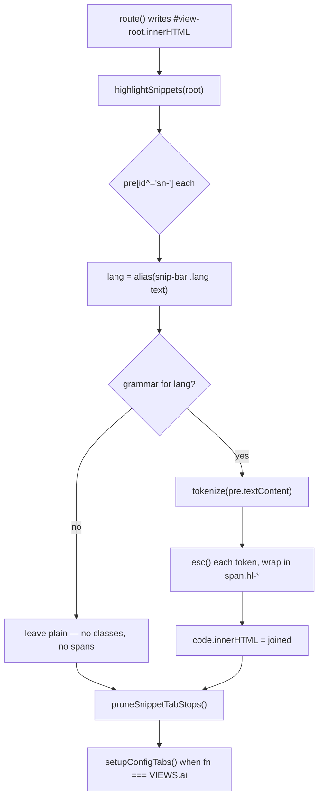

# feat: Syntax highlighting in snippets

## Goal capsule

Color the code inside the site's ~317 snippet blocks so a reader can find the
shape of a config, a command or a quoted instruction file at a glance, without
adding a dependency, without spending the site's one saturated hue, and without
claiming to understand a language the tokenizer does not.

Highlighting runs **client-side only**. The prerendered HTML keeps its plain,
escaped `<code>`; the browser colors it on load.

---

## Problem frame

`snippetHTML()` (`dashboard/template.html:1541`) is the site's only `<pre>`
emitter. It renders every snippet as one undifferentiated monospace block:

```
<pre id="sn-…" tabindex="0" role="group" aria-label="… snippet"><code>…</code></pre>
```

317 blocks across the corpus — 279 from `data/design-systems.json`, 38 from
`data/platforms.json`, plus six install configs and one command block
synthesized on `/ai`. A reader scanning a `mcp.json` for the transport field, or
a `SKILL.md` for its frontmatter boundary, gets no structural help from the
page. The language is named in the snippet bar and then not honored anywhere
else.

### What this is not

It is not a re-typesetting of the block. Type, size, measure, scroll behavior,
copy affordance and focus treatment stay exactly as they are. The only thing
that changes is the color of runs of characters inside the `<code>`.

---

## Prior decision this reverses

`docs/design-audit.md:392` holds a decision against this work:

> **C2 — Syntax highlighting in snippets.** No. Multi-language honesty, zero
> dependencies.

The audit's header says *"Read it before undoing any of it."* This plan
overturns C2, and the two objections are the plan's two hardest constraints
rather than obstacles routed around:

- **Zero dependencies** — answered by KTD1. No package is added. The tokenizer
  is written into `dashboard/template.html`, the way every other behavior on
  the site is.
- **Multi-language honesty** — answered by KTD4. A language is highlighted only
  where the grammar is honest about it. `text` and unrecognized labels stay
  plain, and the plain path is the default rather than the fallback.

U6 rewrites the C2 entry to record the reversal and the reasoning, so the audit
stays the truthful record it claims to be.

---

## Requirements

- **R1.** Snippet code blocks render with per-token color in the browser.
- **R2.** Highlighting is presentation only. `data/*.json`, the markdown
  mirrors, the JSON twins, the SQLite export and both MCP servers carry exactly
  the bytes they carry today.
- **R3.** Every color is a token in `:root`, authored in `oklch()` through
  `light-dark()`, and ships in both themes.
- **R4.** Every syntax color clears WCAG AA 4.5:1 against `--bg-sunk` in both
  themes, verified by `scripts/check_contrast.js` rather than by eye.
- **R5.** No syntax color is `--accent`, `--accent-ink`, or any hue a reader
  could mistake for the site's interaction blue.
- **R6.** The copy button keeps copying the snippet byte-for-byte.
- **R7.** Data still reaches the DOM escaped. The tokenizer never emits an
  unescaped run of record content.
- **R8.** Highlighting adds no layout shift: the classes it introduces carry
  color and font-style only, never box-model properties.
- **R9.** Languages the tokenizer does not model honestly render plain, and the
  set of modeled languages is stated somewhere a reader can find.
- **R10.** The snippet's accessibility contract is unchanged: `<pre>` keeps its
  id, its conditional `tabindex`/`role`, and its label.
- **R11.** The feature degrades to today's rendering with JS off, and survives
  Windows High Contrast and print without becoming meaningless.
- **R12.** A guard fails the build if highlighting silently stops working.

---

## Key technical decisions

### KTD1 — Hand-written tokenizer inside `dashboard/template.html`

No npm package, no separate asset file.

The site has no bundler; `template.html` is one hand-written file whose `<style>`
and `<script id="app">` are inlined into every generated page.
`docs/architecture.md:8-14` states the standing position: *"Rebuilding on Astro
or Eleventy would re-host a working renderer inside a dependency treadmill and
put finished CSS at risk."* A highlighter package is the same trade in
miniature.

**Rejected: a separate cached `/highlight.js` asset.** Attractive on page-weight
grounds — it would load once instead of multiplying across ~30 route files. It
breaks `artifact.html`, which `scripts/build_dashboard.py:736-740` builds as a
single self-contained file with the payload inlined; a second fetched asset
would make the artifact variant no longer self-contained, or would need
variant-specific inlining machinery for a few KB. Inlining is both simpler and
correct for both variants.

**Rejected: Shiki, highlight.js, Prism, Starry Night.** All are build-time or
bundled-runtime tools that assume a bundler. Their smallest useful language
subsets are an order of magnitude larger than what this corpus needs, and every
one of them ships a theme this site would immediately have to override token by
token — Shiki disclaims theme ownership outright, and neither highlight.js
(`PR #3390`, closed unmerged) nor Prism (`#3180`, open since 2021) treats
contrast as a test failure. The color work would have to be done here
regardless; the grammars are the only thing being bought, and the corpus needs
seven of them.

### KTD2 — Client-side DOM pass, hooked into `route()`

*(session-settled: user-directed — chosen over build-time highlighting baked
into the prerendered HTML: the user accepted the flash-of-unhighlighted-code and
crawler-sees-plain-code tradeoff.)*

`scripts/prerender.mjs` renders every route through a `node:vm` shim whose
`querySelectorAll()` returns `[]` (`scripts/prerender.mjs:74-76`). A DOM pass
therefore does not run at prerender: static HTML ships plain `<code>`, and the
browser colors it after `route()` writes the view.

Accepted consequences, stated plainly because they are real:

- A brief flash of unhighlighted code on first paint. Bounded by R8 — color
  only, no reflow — so it is a color change, not a jump.
- Agent and crawler traffic, which `docs/architecture.md:21-24` notes runs no
  JS, sees the plain block. This is the correct outcome anyway: highlighting is
  decoration, and the markdown twins are the surface built for those readers.

The hook is `route()` (`dashboard/template.html:2150`), which reassigns
`#view-root.innerHTML` wholesale on every navigation. Highlighting runs there,
**before** `pruneSnippetTabStops()` (`:2180`), for the same reason
`setupConfigTabs()` runs after it (`:2183`, and the note at `:1957-1963`): the
pass that measures overflow must see final content.

### KTD3 — The site's own tokens, ink-ramp first, two low-chroma hues

`--accent` is spent. AGENTS.md: *"Blue is for interaction. […] Nothing else gets
blue."* And the data-viz rule — *"intensity carries importance, not hue"* — is
the site's stated instinct for exactly this problem.

So the theme leads with the existing ink ramp and adds hue only where the ink
ramp cannot carry the distinction:

- `--ink-3` for comments — the muted-text role it already plays.
- `--ink` for identifiers and plain runs — unchanged from today.
- Two new low-chroma tokens for the two categories a reader genuinely scans
  for: **string/value** and **keyword/key**. Hue chosen off the blue axis and
  low enough in chroma to sit inside the near-monochrome page.
- Punctuation dimmed to `--ink-2`.

Five roles, not fifteen. `github-light-default` / `github-dark-default` are the
reference pair for hue relationships — verified during research to clear 4.5:1
on every code-painting scope category in both directions — but the values are
re-authored in `oklch()` against this site's own `--bg-sunk`, not ported.

**Rejected: a monochrome theme (ink ramp and weight only).** Elegantly in
keeping, and it needs no new tokens or contrast entries. It also cannot
distinguish a string from a key, which is most of what a reader is scanning a
`mcp.json` for — the feature would be nearly invisible on exactly the blocks it
most needs to help with.

**Rejected: bold weight as a signal.** Monospace advance width is identical
across normal/bold/italic, so it is metrically free — but the block is 12px, and
bolding at that size muddies more than it separates. Italic is used for comments
only.

### KTD4 — Seven grammars, everything else plain

Modelled: `json`, `yaml`, `shell`, `ts`/`js`/`tsx`, `html`, `css`, `markdown`.

Left plain: `text` (28 snippets), `http` (1), and any label the alias map does
not resolve. Plain is the default branch, not an error path.

`markdown` is 205 of 317 snippets and carries the decision. These are
`SKILL.md`, `AGENTS.md` and `llms.txt` files quoted verbatim from other people's
repos. Leaving them plain would make the feature invisible on two thirds of the
corpus; coloring them like prose would be the dishonesty C2 warned about. The
resolution is a deliberately thin markdown grammar — heading lines, fence
delimiters, inline code, link targets, list markers, and frontmatter
boundaries — which surfaces the *structure* of a quoted instruction file without
pretending to parse its prose. Nested fenced content is not recursively
highlighted.

### KTD5 — Tokenize raw text, escape per token

AGENTS.md: *"Data strings reach the DOM through `esc()` or `fmt()`. […] A record
string interpolated raw into a template is a page that breaks on the first `<` in
somebody's docs."*

The pass reads `pre.textContent` — the raw, already-unescaped code — tokenizes
it, and rebuilds `innerHTML` by escaping each token's text through the existing
`esc()` and wrapping it in a span. No branch emits unescaped content.

**Rejected: tokenizing the already-escaped string.** It would make the tokenizer
see `&lt;`, `&gt;`, `&amp;`, `&quot;`, `&#39;`, where a grammar can split an
entity across a span boundary or read `&`/`;` as operators. That is where an
injection regression hides, and 205 of 317 snippets are verbatim third-party
instruction files — precisely the hostile-input case `scripts/build_md.py:328-330`
already defends against in the markdown layer.

### KTD6 — Inline line handling, no line numbers

If the implementation wraps lines at all, wrappers are inline `<span>`, never
block `<div>`. Measured during research: a block element per line silently drops
newlines from `.textContent` — which is exactly what the copy button reads
(`dashboard/template.html:2274-2279`) — and breaks multi-line find-in-page,
because a match terminates at a block boundary.

No line numbers. Were they ever added, they would have to be CSS counters rather
than real elements, for the same reason.

---

## High-level technical design



The tokenizer itself is one shape reused per language — an ordered list of
`[className, RegExp]` rules scanned left to right, first match wins, unmatched
characters accumulate into a plain run:

```
tokenize(src, rules) -> [{cls, text}, …]     // cls null = plain run
```

This is deliberately a lexer and not a parser. It gets a JSON key/string
distinction and a shell comment right; it will not track scope. That limitation
is the honest boundary of KTD4, not a defect to fix later.

---

## Implementation units

### U1. Syntax color tokens and their contrast entries

**Goal:** The five color roles exist as tokens and are provably AA in both
themes before any of them is used.

**Requirements:** R3, R4, R5

**Dependencies:** none

**Files:**
- `dashboard/template.html` (the `:root` block, lines 69-108)
- `scripts/check_contrast.js`

**Approach:**

1. Add a syntax group to `:root`, after the data tokens and before the type
   tokens, matching the block's existing conventions: one declaration per line,
   two-space indent, `--name: light-dark(<light>, <dark>);`, paired tokens two
   per line where they read as a couple, and a `/* … */` prose comment above the
   group defending the choice and naming `scripts/check_contrast.js` — the way
   the `--control-line` group does at line 88.
2. Author the two new hue tokens in `oklch()` with lightness first, so the group
   reads as a ramp in source. Reuse `--ink`, `--ink-2`, `--ink-3` for the other
   three roles rather than minting near-duplicates.
3. Extend `scripts/check_contrast.js`. Its pairs are hardcoded literals in
   `PAIRS` and `GROUNDS`; add a syntax group asserting each new ink against
   `--bg-sunk` (light `oklch(97% 0 0)`, dark `oklch(14.5% 0 0)`) at ≥ 4.5:1,
   following the existing structure and log format.
4. Mirror the `--control-line` drift guard at `scripts/check_contrast.js:111-118`:
   grep `dashboard/template.html` for each new token's exact declaration string
   and fail if it is not found byte-for-byte, so the literals in the check and
   the tokens in the stylesheet cannot drift apart.
5. Fold the new failures into the existing `process.exitCode = 1` condition.

**Patterns to follow:** the `--mat-*` PAIRS block and the `--control-line`
GROUNDS block in `scripts/check_contrast.js`; the `:root` group comments in
`dashboard/template.html:69-108`.

**Execution note:** Land the check before the colors are used anywhere. Pick
candidate values, run `node scripts/check_contrast.js`, and adjust until it
passes — the script is the design tool here, not a rubber stamp.

**Test scenarios:**
- `node scripts/check_contrast.js` exits 0 and prints a PASS line for every new
  syntax pair in both light and dark.
- Perturbing one new token's lightness in `template.html` by a few points makes
  the drift guard report `NO` and the script exit 1.
- Deliberately setting one syntax ink to a value below 4.5:1 against
  `--bg-sunk` makes the script report FAIL and exit 1.
- The existing `--mat-*` and `--control-line` assertions still pass unchanged.

**Verification:** `npm run check` reaches the build step; the contrast section
of the output lists the new pairs alongside the existing ones.

---

### U2. The tokenizer and the language alias map

**Goal:** A pure `(source, language) -> HTML` function that is correct about
seven grammars, honest about everything else, and cannot emit unescaped content.

**Requirements:** R1, R7, R9, R2

**Dependencies:** U1 (class names must match the tokens)

**Files:**
- `dashboard/template.html` (new functions in the `<script id="app">` block,
  near `esc()`/`fmt()` at lines 1207 and 1297-1304)
- `tests/highlight.test.mjs` (new)

**Approach:**

1. Write an alias map normalizing the corpus's 13 labels onto the seven
   grammars. The two datasets disagree and both must resolve: systems say
   `typescript` (21) and `bash` (5); platforms say `ts` (5) and `shell` (1).
   Also present: `javascript` (14), `tsx` (3), `yaml` (11), `json` (23),
   `markdown` (205), `text` (28), `http` (1), plus `sh` and `sql` on
   template-authored blocks. Normalize the data at read time — do **not** edit
   `data/*.json`, which would change 21 markdown fences, the SQLite export and
   `build/md-map.json`, and would need a schema enum change plus `npm run types`.
2. Write the rule-list tokenizer described in the technical design. One ordered
   `[className, RegExp]` list per grammar, sticky-flagged and scanned from an
   index, first match wins, unmatched characters accumulating into a plain run.
3. Write the seven rule lists. Keep each one small and legible; a rule that
   cannot be defended in one line does not belong.
4. `highlightCode(src, lang)`: resolve the alias, return `esc(src)` untouched
   when there is no grammar, otherwise tokenize and join `esc()`-wrapped spans.
   Class names are `hl-` prefixed.
5. Add `tests/highlight.test.mjs`, loading `dashboard/template.html`, slicing the
   `<script id="app">` block and running it in a `node:vm` sandbox to pull
   `highlightCode` and `esc` off the context — the same technique
   `scripts/prerender.mjs:30-132` already uses.

**Patterns to follow:** `scripts/prerender.mjs:30-132` for the vm extraction;
`esc()` at `dashboard/template.html:1207`; `fmt()` at `:1297-1304` for how the
file already thinks about data-to-markup.

**Execution note:** Write the escaping tests first and watch them fail. R7 is
the requirement with a security consequence, and the corpus is full of verbatim
third-party instruction files.

**Test scenarios:**
- `highlightCode('<script>alert(1)</script>', 'html')` returns HTML whose
  concatenated token text is the input, with `<` and `>` escaped in every
  token — no raw `<script>` survives in the output.
- A JSON snippet containing `"a < b & c"` round-trips: stripping all tags from
  the output and unescaping entities yields the exact input string.
- Round-trip invariant holds for a representative snippet in each of the seven
  grammars: tags stripped + entities unescaped == input, byte for byte.
- `highlightCode(src, 'text')` and `highlightCode(src, 'http')` return exactly
  `esc(src)` with no spans.
- An unknown label (`'brainfuck'`) returns exactly `esc(src)`.
- `typescript` and `ts` produce identical output; so do `bash`, `sh` and `shell`.
- JSON: a key is classed differently from a string value; `true`, `false`,
  `null` and numbers are classed as literals; braces and commas are punctuation.
- YAML: a `#` comment is classed as comment; a key before `:` is classed as key;
  a `#` inside a quoted string is **not** classed as a comment.
- Shell: `#` comment, quoted strings, and a `$VAR` are distinguished; a `#`
  inside single quotes is not a comment.
- TS: line and block comments, template literals, and a string containing `//`
  are handled without the `//` starting a comment.
- Markdown: an ATX heading line, a fence delimiter, inline code, a link target
  and a `---` frontmatter boundary are each classed; ordinary prose is a plain
  run; content inside a nested fence is not recursively highlighted.
- CSS and HTML each class comments and strings without a comment delimiter
  inside a string opening one.
- Empty string and a single newline both return without throwing.
- A pathological input (a 100KB line, an unterminated string, an unterminated
  block comment) returns in bounded time rather than hanging.

**Verification:** `npm test` passes with the new suite; every round-trip
assertion is byte-exact.

---

### U3. Wire the pass into `route()`

**Goal:** Snippets are colored in the browser without disturbing the copy
button, the tab-stop pruning, or the `<pre>` accessibility contract.

**Requirements:** R1, R6, R10, R2

**Dependencies:** U2

**Files:**
- `dashboard/template.html` (new `highlightSnippets()`, and its call inside
  `route()` near line 2180)

**Approach:**

1. `highlightSnippets(root)` selects `pre[id^="sn-"]` under the given root,
   reads the language from the sibling `.snip-bar .lang` text, and rewrites the
   inner `<code>`'s `innerHTML` from `highlightCode(pre.textContent, lang)`.
2. Guard it the way `setupConfigTabs()` is guarded (see the note at
   `dashboard/template.html:1954-1963`): under `prerender.mjs` the shim's
   `querySelectorAll()` returns `[]`, so the function must no-op cleanly rather
   than throw — `prerender.mjs:133-138` dies on any exception.
3. Call it from `route()` **before** `pruneSnippetTabStops()` at
   `dashboard/template.html:2180`, so overflow is measured against final
   content.
4. Leave the `<pre>`'s `id`, `tabindex`, `role` and `aria-label` untouched, and
   leave `snippetHTML()` unchanged apart from nothing — this unit does not edit
   the emitter.
5. Do not re-run on `<details>` open. Snippet content is already in the DOM when
   the view renders; the `toggle` listener at `:1923-1926` exists for
   measurement, which highlighting does not change.

**Patterns to follow:** `setupConfigTabs()` at `dashboard/template.html:1975`
and its guard note at `:1954-1963`; `pruneSnippetTabStops()` at `:1910-1921`.

**Test scenarios:**

Added to `tests/highlight.test.mjs`, using the same `node:vm` extraction as U2
with a minimal DOM stub — cheap, and it covers the one failure that would break
the build rather than just the page:

- `highlightSnippets()` called with a root whose `querySelectorAll()` returns
  `[]` returns without throwing — the prerender case, where
  `scripts/prerender.mjs:133-138` dies on any exception.
- `highlightSnippets()` called with no argument, and with a root that is
  `null`, both return without throwing.
- Given a stub `pre` whose `textContent` is a JSON snippet and whose sibling
  `.snip-bar .lang` reads `json`, the stub `code`'s `innerHTML` is set to
  `highlightCode(text, 'json')`.
- Given a stub `pre` whose language reads `text`, the `code`'s `innerHTML` is
  the escaped source with no spans.
- Given a `pre` with no resolvable `.snip-bar .lang` sibling, the function
  leaves it plain rather than throwing.
- The stub `pre`'s `id`, `tabindex`, `role` and `aria-label` are unchanged after
  the pass.

Full-DOM behavior — copy fidelity, tab-stop measurement, the `/ai` tab strip —
is covered by U7's browser pass; `tests/` reads `build/` and has no browser
surface.

**Verification:** `./scripts/build.sh` succeeds; `netlify serve` shows colored
snippets on `/systems/<id>`, `/techniques`, `/platforms` and `/ai`; the copy
button on a highlighted block pastes the original snippet byte-for-byte;
tabbing reaches only the snippets that actually scroll.

---

### U4. Snippet CSS, and the modes where color is not available

**Goal:** The classes paint, they never move anything, and the block stays
readable in forced-colors and in print.

**Requirements:** R8, R11, R3

**Dependencies:** U1, U2

**Files:**
- `dashboard/template.html` (the `.snip` rules at lines 806-828, the print block
  at 1131-1159, and a new `@media (forced-colors: active)` block)

**Approach:**

1. Add `.snip pre .hl-*` rules carrying `color` and, for comments only,
   `font-style: italic`. **No padding, margin, display, border or background on
   any `hl-` class** — this is R8, and it is the measured cause of the CLS that
   client-side highlighters normally introduce (highlight.js and Prism default
   themes gate `padding: 1em` on the class they add at runtime).
2. Scope every selector under `.snip pre` so `fmt()`'s bare inline `<code>`
   (`dashboard/template.html:1301`, used on descriptions, notes, ledes and essay
   text) is untouched.
3. Add a `@media (forced-colors: active)` block restating the grammar the way
   the site's three existing forced-colors blocks do (lines 507, 750, 978) —
   `forced-color-adjust` behavior means a color-only theme collapses to one
   color with nothing carrying the meaning. Comments keep their italic; the
   rest revert to system text color.
4. Check the print block. Print already forces a light color scheme (line 1134)
   and `white-space: pre-wrap` on `.snip pre` (line 1152). Confirm the light
   values print legibly on white; if a syntax ink is too light on paper, restate
   it in the print block rather than compromising the screen value.

**Patterns to follow:** the `@media (forced-colors: active)` blocks at
`dashboard/template.html:507`, `:750`, `:978`; the print block at `:1131-1159`.

**Test scenarios:**
- Test expectation: none for automated coverage — this is pure styling, and the
  repo has no CSS test surface. U1's contrast script covers the color values;
  U7's browser pass covers rendering, forced-colors and print.

**Verification:** With `route()` re-rendering a view, no layout-shift entries
are recorded for the snippet region. Forced-colors emulation keeps the block
readable. Print preview shows legible snippets in light colors. The rule count
added to the inlined `<style>` is small enough not to matter against the ~74KB
it already carries.

---

### U5. A guard that can fail

**Goal:** If highlighting stops reaching the page, the build says so.

**Requirements:** R12

**Dependencies:** U2, U3

**Files:**
- `scripts/prerender.mjs`

**Approach:**

The site's convention is that guards must be able to fail — `prerender.mjs`
already asserts the overview h1 (`:507-508`), the agentic-layer callout
(`:518-526`), the matrix row counts (`:531-544`) and `/ai`'s config panels with
a deliberately exact regex (`:634-638`, whose comment reads *"A new attribute
here should fail and be re-approved, not pass"*).

Client-side rendering means the prerendered HTML has no spans to assert on, so
the guard has to run the tokenizer rather than grep the output. `prerender.mjs`
already pulls named globals off the vm context (`:121-132`) and already executes
WebMCP tools at build time to check them (`:662-701`) — the same move applies:
pull `highlightCode`, run it over a snippet drawn from the real payload for each
of the seven grammars, and `die()` if any of them comes back with no spans, or
if the round-trip does not reproduce the input.

This catches the failure client-side highlighting is otherwise blind to: a
grammar or the alias map silently regressing to the plain path, which looks
exactly like normal output on every static surface.

**Patterns to follow:** the WebMCP registration check at
`scripts/prerender.mjs:662-701`; the `die()` calls throughout.

**Test scenarios:**
- Removing a grammar from the alias map fails the build with a message naming
  the language.
- Making `highlightCode` return `esc(src)` unconditionally fails the build.
- Breaking the round-trip (dropping a character from a token) fails the build.
- A normal build passes and prints a line stating how many grammars were
  exercised.

**Verification:** `./scripts/build.sh` prints the new assertion line; each
sabotage above produces a non-zero exit and a message that names the cause.

---

### U6. Record the reversal and the vocabulary

**Goal:** The audit stays a truthful record, and the modeled-language set is
written down where the next person will look.

**Requirements:** R9, and the prior-decision obligation above

**Dependencies:** U2

**Files:**
- `docs/design-audit.md` (the C2 entry at line 392)
- `AGENTS.md` (the "Design tokens" section)

**Approach:**

1. Rewrite C2. It currently reads as a held decision; it is now a reversed one.
   Say what it was, what changed — a tokenizer with no dependency, a language set
   chosen for honesty rather than coverage, and a contrast check that makes the
   colors provable — and keep the original objection visible so the reasoning
   survives. Match the audit's voice: it argues, it does not announce.
2. Add a short paragraph to the AGENTS.md design-tokens section naming the
   syntax tokens, the seven modeled grammars, the fact that everything else
   renders plain, and the fact that `scripts/check_contrast.js` holds the
   colors to AA against `--bg-sunk`.
3. US spelling throughout, per the standing rule — this is our prose.

**Test scenarios:**
- Test expectation: none — documentation. `npm run check`'s prettier pass covers
  formatting.

**Verification:** `npm run check` passes; the C2 entry states the reversal and
its reasoning; a reader can find the modeled-language list without opening
`template.html`.

---

### U7. Browser pass across routes, themes and modes

**Goal:** Confirm the thing actually looks right, in both themes, on the four
routes that carry snippets.

**Requirements:** R1, R6, R8, R10, R11

**Dependencies:** U1–U5

**Files:** none — verification only

**Approach:**

Serve locally and walk `/systems/<id>` (affordance and technique snippets),
`/techniques`, `/platforms` and `/ai` (the config tab strip), in light and dark,
at 1440 and 375 — the widths `docs/design-audit.md` establishes as the review
frame.

Check specifically: markdown snippets read as structured without reading as
prose-with-decoration; JSON keys separate from values at a glance; the copy
button round-trips; keyboard focus reaches only scrolling snippets; nothing
shifts when the pass runs; the `/ai` config panels still switch (the tab strip
is built after highlighting).

**Test scenarios:**
- Test expectation: none automated — this is the manual design review the repo
  runs on rendered output, and its findings feed back into U4.

**Verification:** All four routes render correctly in both themes at both
widths, with the specific checks above confirmed rather than assumed.

---

## Verification contract

| Gate | Command | Covers |
| --- | --- | --- |
| Contrast | `node scripts/check_contrast.js` | R4, R5 |
| Tokenizer | `npm test` (`tests/highlight.test.mjs`) | R1, R7, R9 |
| Build guard | `./scripts/build.sh` | R12, R2 |
| Full gate | `npm run check` | everything CI runs |
| Browser | `netlify serve` + U7 walk | R6, R8, R10, R11 |

`npm run check` is the gate that matters; it is what CI runs, and its order is
fixed (static checks, contrast, build, tests, markdown-layer self-check).

---

## Scope boundaries

**In scope:** snippet code blocks rendered by `snippetHTML()` on `/systems/<id>`,
`/techniques`, `/platforms` and `/ai`; the color tokens and their contrast
entries; the seven grammars; the docs reversal.

**Out of scope:**

- Inline `<code>` from `fmt()`. It has no language and appears inside prose;
  coloring it would be noise.
- The markdown mirrors, JSON twins, SQLite export and both MCP servers. R2 —
  they carry data, and a fenced block already names its language for whatever
  renderer consumes it.
- `data/*.json` normalization. Reconciling `typescript`/`ts` and `bash`/`shell`
  in the data would change markdown fences, the SQLite export and
  `build/md-map.json`, and would need a schema enum change and `npm run types`.
  The alias map solves the rendering problem without touching the record set.

### Deferred to follow-up work

- Normalizing the language vocabulary across both schemas, and extending
  `schema/design-system.schema.json` to carry an enum the way
  `schema/platform.schema.json` already does — worth doing, unrelated to
  coloring blocks.
- Line numbers. If ever wanted, CSS counters only (KTD6).
- Additional grammars. Adding one is a rule list plus an alias entry plus tests;
  the shape is built for it.

---

## Assumptions

Recorded rather than asked, per headless planning:

- **A1.** Two new hue tokens is the right amount of color for this page. The
  near-monochrome palette and the data-viz rule both point at restraint; five
  roles is the floor at which JSON keys and string values separate.
- **A2.** A thin markdown grammar is wanted rather than markdown left plain.
  205 of 317 snippets are markdown, so plain-markdown would make the feature
  invisible on most of the corpus.
- **A3.** The flash of unhighlighted code is acceptable at the scale it
  occurs — a color change on already-laid-out text, bounded by R8.
- **A4.** Reversing C2 is wanted rather than the audit being left to contradict
  the site. U6 rewrites it in place.

---

## Risks

| Risk | Mitigation |
| --- | --- |
| Escaping regression turns a quoted instruction file into markup | KTD5 tokenizes raw text and escapes per token; U2's first tests are the round-trip and injection cases |
| Copy button starts copying token text or dropping newlines | KTD6 forbids block line wrappers; U2 asserts round-trip; U7 checks by hand |
| A syntax color fails AA and nobody notices | U1 lands the contrast entries and the drift guard before the colors are used |
| Highlighting silently stops working, invisibly on every static surface | U5's build guard runs the tokenizer at build time rather than grepping output |
| Layout shift on first paint | R8 forbids box-model properties on `hl-` classes; U4 states it as a rule and U7 confirms |
| `pruneSnippetTabStops()` measures the wrong content | U3 orders highlighting before it, matching the existing `setupConfigTabs()` precedent |
| Theme collapses to one color in Windows High Contrast | U4 adds a forced-colors block, following the site's three existing ones |

---

## Definition of done

- Snippets on all four routes render with per-token color in both themes.
- `npm run check` exits 0.
- `node scripts/check_contrast.js` reports PASS for every syntax pair in both
  themes, and the drift guard confirms the tokens match the stylesheet.
- `tests/highlight.test.mjs` passes, including the round-trip and injection
  cases for all seven grammars.
- The build guard exercises every grammar and can be made to fail.
- Copy round-trips byte-for-byte on a highlighted block.
- `text`, `http` and unknown labels render plain.
- `docs/design-audit.md` C2 records the reversal and its reasoning; AGENTS.md
  names the tokens and the modeled languages.
- No file under `data/`, and no generated markdown, JSON or SQLite surface, has
  changed.

---

## Sources and research

- `docs/design-audit.md:392` — the C2 decision this plan reverses.
- `docs/architecture.md:8-14, 21-24, 33-36` — the no-dependency position, the
  no-JS agent traffic note, and the page-weight arithmetic.
- `AGENTS.md` — design tokens, the blue-is-for-interaction rule, the `esc()`
  invariant, US spelling.
- `scripts/prerender.mjs:30-138, 662-701` — the `node:vm` shim, its `[]`-returning
  `querySelectorAll()`, and the build-time execution precedent U5 follows.
- `scripts/check_contrast.js:3-16, 77-90, 111-118` — the hardcoded pair
  structure and the drift guard U1 extends.
- External research, 2026: `github-light-default` / `github-dark-default` clear
  4.5:1 on all nine code-painting scope categories in both directions — the hue
  reference for KTD3. Block-level line wrappers drop newlines from `.textContent`
  and break multi-line find-in-page, while token spans are free — the measurement
  behind KTD6 and R6. Client-side highlighters introduce CLS through box-model
  properties gated on runtime-added classes (highlight.js 0.0069, Prism 0.0053) —
  the measurement behind R8. No highlighting ecosystem gates theme contrast in
  CI (highlight.js PR #3390 closed unmerged; Prism #3180 open since 2021), which
  is why U1 exists. APCA was removed from the WCAG 3 draft; WCAG 2.x 4.5:1 is the
  conformance basis.
