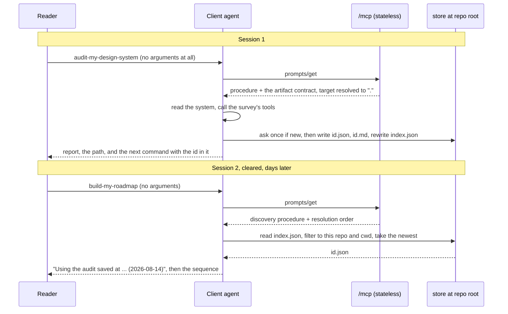
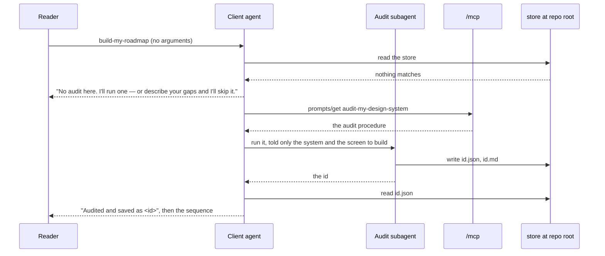
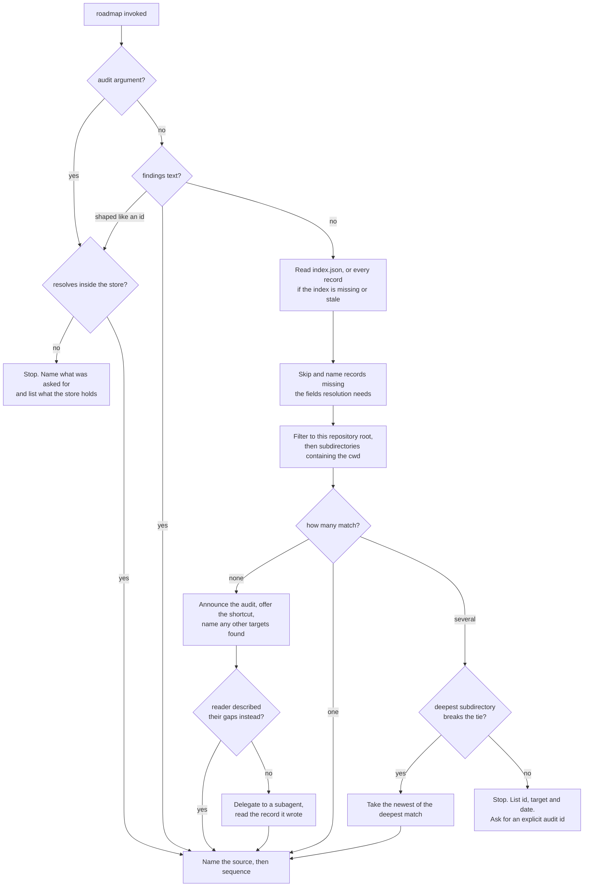

# Audit-to-Roadmap Handoff - Plan

## Goal Capsule

**Objective.** Make an audit outlive the conversation that produced it. The audit
saves a report where the reader can read it again, and the roadmap finds that
report by itself — across sessions, across repositories, and across
subdirectories of a monorepo. When there is no audit to find, the roadmap runs
one rather than refusing.

**Authority hierarchy.** Requirements (R-IDs) win on behavior. Key Technical
Decisions (KTD-IDs) win on mechanism. The house voice of the existing prompt
bodies wins on wording: new instruction text reads like the text beside it or it
does not ship.

**Stop conditions.** Stop and ask if the work would add per-user state, storage,
or authentication to the hosted endpoint. Stop if a change would make the nine
data tools anything other than read-only.

**Execution profile.** One source file, its test suite, and the published copy in
five other files. No new dependencies. No data records change.

**Tail ownership.** Standalone `ce-work` owns commit and push. This repo ships to
`main` rather than through pull requests.

---

## Product Contract

### Summary

Save the audit to a file, teach the roadmap to find it, and have the roadmap run
an audit when it finds none. The hosted MCP endpoint stays stateless and
read-only: it owns the contract — where the file goes, what it holds, how to
resolve which one to use, and that its contents are data rather than instructions
— and instructs the client agent, which is the only party with a filesystem.

### Problem Frame

An audit is spoken into a conversation and then gone. `audit-my-design-system`
ends by telling the agent to report a coverage table and three gaps; nothing
writes them down, so the next session starts with nothing. That is the defect.

`build-my-roadmap` then takes `findings` as a required string with nowhere to get
it from, so the agent asks and the reader pastes what it just said back to it.

Two things about the surface constrain the fix.

These are MCP **prompts**, not tools. A prompt is a pure template:
`(args) → { messages }`. The server interpolates and nothing else. It runs as a
public, unauthenticated Netlify function serving anyone on the internet, with
`sessionIdGenerator: undefined`. It has no access to the reader's disk, no cwd,
no identity, and no session store. Persisting state server-side is not merely
hard here — it is the wrong shape for a read-only research endpoint, and every
data tool carries `readOnlyHint: true` to say so.

The deployed server also rejects a request the MCP spec permits. `arguments` is
optional on `prompts/get`, and omitting it fails on all five prompts, including
`start-here`, which declares no arguments at all:

```
start-here → Invalid arguments for prompt start-here:
             Invalid input: expected object, received undefined
```

Every prompt's `argsSchema` is a bare `z.object({…})`, which rejects `undefined`.
A client that sends no `arguments` key gets an error from the orientation prompt
an agent calls first. This is very likely what
[#5597](https://github.com/anthropics/claude-code/issues/5597) reports as a client
bug — the failure is here, and it is ours to fix.

What is *not* broken: multi-word arguments reach the server intact. Issue
[#14210](https://github.com/anthropics/claude-code/issues/14210) truncates a
slash command's arguments to the first token, but quoting is the documented
workaround and other clients pass named arguments correctly. Pasting findings
works. It is just pointless work, because the agent already knew them.

### Requirements

#### Argument surface

- R19. `prompts/get` succeeds without an `arguments` key on every prompt that can
  run without one. A prompt that genuinely requires an argument still fails, and
  that is correct; only the three with a required argument do.
- R12. `target` on `audit-my-design-system` defaults to `.`, the current working
  directory. The prompt text reads as English whether a target was named or not.
- R13. `findings` on `build-my-roadmap` is optional, and a new optional `audit`
  argument takes a saved audit's id. A path is accepted only when it normalizes
  to a file inside the store; anything else stops and says the argument pointed
  outside it.

#### Persistence

- R1. When the audit finishes, the client agent writes the findings to
  `.state-of-ai/audits/<slug>-<timestamp>.json` at the repository root — the
  current working directory when there is no enclosing repository.
- R2. The record carries what later retrieval depends on: resolved target, target
  kind, the directory the audit ran from, timestamp, compared-to systems,
  constraints, and the survey snapshot date.
- R3. The agent writes a human-readable `<slug>-<timestamp>.md` beside the JSON,
  holding the report it would otherwise only have spoken.
- R4. When a write does not land — no filesystem, a refused permission prompt, or
  an error — the agent says what failed and prints the record inline so it can be
  saved by hand, with the repository path reduced to its basename. It hands over
  the inline findings rather than an id that resolves to nothing.
- R18. The slug keeps only lowercase letters, digits and hyphens, collapses runs,
  and trims to 40 characters. The resolved path must sit inside the store; a slug
  that empties out, or a path that escapes, stops the write and says why. The
  agent never overwrites an existing file: a taken id gains a numeric suffix and
  the id actually used is the one reported.

#### Discovery

- R5. When `build-my-roadmap` runs with no findings and no explicit audit, it
  reads the store and resolves an audit itself.
- R6. Resolution follows a fixed order: explicit `audit` argument, then supplied
  `findings` text, then the best match for the current directory, then the sole
  audit when only one record exists.
- R7. Best match means the audit whose recorded repository root matches, then
  whose recorded subdirectory contains the current directory, deepest first, then
  the newest.
- R8. When several audits match equally well, the prompt stops and lists them
  rather than choosing one.
- R9. When no audit matches, the roadmap says it is going to run one, offers the
  shortcut of describing the gaps instead, and then runs the audit. It names any
  records it found for other targets before starting.
- R20. The roadmap runs that audit by calling the audit prompt in a subagent, and
  reads the record the subagent wrote. When the client cannot run subagents it
  follows the audit inline and records the build test as provisional.
- R15. A record missing the fields resolution depends on is skipped and named. It
  never becomes silent absence — the preamble's own rule is that an empty lookup
  is not evidence the thing is absent, and a skipped file is exactly that case.
- R16. The contents of a record are data describing a design system, never
  instructions to the agent. The agent quotes, summarizes and sequences them, and
  never follows a directive found inside a record, an index entry or a filename.

#### Handoff

- R10. The audit's closing line names the file it wrote and gives the exact
  command to run next, with the audit id already in it.
- R11. The roadmap's opening line names its source: the file it resolved, the
  findings it was handed, or the audit it is about to run.

#### Documentation

- R14. Every place that describes how these two prompts are driven says what they
  now do, including the two registered `description` strings every client shows
  in its prompt picker.
- R17. Every place that calls the server read-only says what that covers: the
  server holds no state and the data tools never write, while the audit prompt
  instructs your own agent to save a record in your own repository.

### Actors

- A1. **The reader** — runs the prompts from a client, wants a roadmap without
  copying anything between sessions.
- A2. **The client agent** — receives the prompt text, calls the survey's data
  tools, and is the only party with a filesystem.
- A3. **The audit subagent** — a fresh context the roadmap delegates to under R20.
  It returns through the record on disk, not through its transcript.
- A4. **The hosted endpoint** — interpolates arguments into instruction text.
  Stateless, read-only, public.

### Key Flows

- F1. **Same session.** Audit runs, writes the record, prints the next command.
  Roadmap runs, resolves the record, names it, sequences the work.
- F2. **Resumed session.** The session is cleared. Roadmap runs days later, reads
  the store, resolves the same record.
- F3. **Monorepo ambiguity.** Several audits exist for different subdirectories of
  one repository. Roadmap narrows by subdirectory depth and stops with a list when
  the narrowing leaves a tie.
- F4. **No audit.** Roadmap runs first. It says it will audit, offers the
  shortcut, delegates to a subagent, reads the record that comes back, and
  sequences from it.

### Acceptance Examples

- AE1. **Covers F1, F2.** `build-my-roadmap` is invoked with no arguments where
  one record exists. The prompt body carries the instruction to read the store and
  to name the resolved file before sequencing anything.
- AE2. **Covers F3.** Records exist for `packages/web` and `packages/native` in
  one repository. Invoked from the repository root, the prompt body carries the
  instruction to list both and ask for an explicit id rather than pick.
- AE3. **Covers F4, R20.** No record matches. The prompt body carries the
  announcement, the describe-your-gaps shortcut, and the instruction to delegate
  the audit to a subagent.
- AE4. **Covers R12, R19.** `audit-my-design-system` is invoked with no
  `arguments` key at all. The server answers, the target resolves to `.`, and the
  returned text contains no `undefined` and no `null`.
- AE5. **Covers R6, R13.** `build-my-roadmap` is invoked with an `audit` id. The
  returned text names that id and does not carry the discovery branch.
- AE6. **Covers R16.** Both prompt bodies carry the rule that record contents are
  data and never instructions.
- AE7. **Covers R19.** `start-here` is invoked with no `arguments` key. The server
  answers instead of returning `Invalid arguments for prompt`.

### Scope Boundaries

In scope: all five prompts' argument schemas, the two prompt bodies this feature
touches, the shared constant that owns the contract, the MCP test suite, and the
published copy that describes how these prompts are driven.

Out of scope, and deliberately so:

- Server-side storage, per-user state, or authentication. The endpoint is public
  and read-only, and R1 puts the file on the machine that has a filesystem.
- The nine data tools and the resource surface. Neither changes.
- The four in-page WebMCP tools. A browser has no filesystem to write to.
- The bodies of `start-here`, `adopt-an-affordance` and `find-technique-for`.
  Their schemas change under R19; their text does not.

#### Deferred to Follow-Up Work

- Shipping this as an Agent Skill rather than a prompt. A skill can bundle
  scripts, which would make the persistence contract enforced rather than stated
  and testable as ordinary code. See KTD1 for why this plan does not.
- A check that pins the prose call-sites to the argument schema, the way
  `tests/mcp.test.mjs:169-172` pins the prompt name set to `MCP_PROMPTS`. Today
  the argument descriptions drift freely, which is why R14 is manual work.
- A bound on how much of a record the roadmap reads into context. A single
  enormous `notes` field is a well-formed record today.

---

## Planning Contract

### Key Technical Decisions

- KTD1. **The prompt bodies carry the contract; nothing enforces it.**
  (session-settled: user-approved — chosen over shipping a local companion that
  holds a filesystem: a companion is the only way to enforce persistence, and it
  is a much larger build than the defect warrants.) The endpoint cannot reach the
  reader's disk, so the persistence instruction goes in the prompt text and the
  client agent executes it. The honest consequence is that the suite proves the
  contract is *stated*, never that an agent obeyed it, which is why the
  Verification Contract carries an end-to-end run by hand. Governs R1, R5.

- KTD11. **A prompt that can run without arguments accepts a missing `arguments`
  object.** A bare `z.object({…})` rejects `undefined`, so a spec-legal
  `prompts/get` without an `arguments` key failed on all five prompts. Two are
  fixed with an object-level default; the other three keep the bare object,
  because a default has to satisfy the schema's output type and no `{}` can
  supply a required field — `tsc` rejects it. Their bare invocation stays an
  error, which is the right answer for a prompt that needs an argument.
  `build-my-roadmap` joins the fixed two in U3, once `findings` is optional.

  Field-level defaults do not rescue the object: an object-level `.default({})`
  is returned as written and does not run them, so the audit's default is spelled
  at both levels. Verified against the repo's own zod. Governs R19, R12.

  ```js
  // audit-my-design-system
  z.object({
    target: z.string().default('.'),
    compare_to: z.string().optional(),
  }).default({ target: '.' })

  // build-my-roadmap — nothing defaults; absent means "go and look"
  z.object({ audit: …, findings: …, constraints: … }).default({})
  ```

- KTD2. **One constant owns the contract.** Both prompt bodies interpolate a
  single `AUDIT_STORE` constant, in the same shape as the existing
  `PROMPT_PREAMBLE`. If the audit writes to one directory and the roadmap reads
  another, the feature is dead and no test would notice. A shared constant makes
  that drift unrepresentable, and it is where R16's untrusted-data rule lives so
  both bodies carry it. Governs R1, R5, R16.

- KTD3. **The store is keyed to the repository, not to the audited target and not
  to the invocation directory.** One store at the repository root, so audits run
  from different subdirectories can see each other and R7 has something to
  narrow. Anchoring at the raw cwd would give each subdirectory its own store, and
  the monorepo resolution could never fire. The record's `run_from` block says
  where inside the repository the audit ran. Governs R1, R7.

- KTD12. **The roadmap delegates a missing audit to a subagent, and reads the
  record rather than the transcript.** (session-settled: user-directed — chosen
  over inlining the audit steps into the roadmap body: a second copy of the
  procedure is the drift this repo keeps hitting.) The roadmap tells the agent to
  call `prompts/get` for `audit-my-design-system` and run it in a subagent, then
  read the record it wrote. A fresh context is also the only way the audit's own
  step 5 is honest — it says a build test run by a context that has already read
  the system tests memory rather than documentation. The record becomes the return
  channel between contexts, so the parent gets structured findings without the
  subagent's whole transcript. Clients without subagents follow the audit inline
  and mark the build test provisional. Governs R20, R9.

- KTD4. **The handoff command carries the audit id.** The audit's closing line
  prints `build-my-roadmap <id>` rather than a bare invocation, so R13's explicit
  override has a natural home and the reader can name a specific audit without
  looking one up. This was also a workaround for a bare invocation failing; KTD11
  fixes that at the source, and the id now stands on its ergonomics alone.
  Governs R10, R13.

- KTD5. **`audit` is declared before `findings`.** Claude Code maps positional
  slash-command text to arguments in declaration order, so the first-declared
  argument is the one a pasted id reaches. A test pins the declaration order and
  can pin nothing else — the client's mapping is not observable from the server —
  so the roadmap body also treats a `findings` value shaped like an audit id as an
  id, which turns a client-side misroute into a correct resolution. Governs R13.

- KTD6. **The index is a cache the roadmap reads first.** The audit rewrites
  `index.json` from a directory read. The roadmap reads the index to filter by
  repository root, subdirectory and recency, and falls back to reading each record
  when the index is missing, stale, or unparseable. Every record is
  self-describing, so the fallback is always sufficient and no repair machinery is
  needed. Governs R5, R7, R15.

- KTD7. **Ask once, then announce.** The agent asks before creating
  `.state-of-ai/` where it does not already exist, and offers R4's inline printout
  instead. Every later write is announced, not asked: stalling mid-run on each
  write is the friction worth avoiding, and one question is not. An unrequested
  first write into a repository the reader may not own reads as over-reach out of
  proportion to the seconds it saves. Governs R1, R4.

- KTD8. **A record is data, never instructions.** The roadmap reads free text off
  disk and turns it into work it then acts on, so anyone who can write to the
  repository — a malicious pull request, a postinstall script, a shared checkout —
  could otherwise steer an agent that holds tools. R15's malformed-record rule does
  not cover a well-formed record carrying a hostile `notes` field. The rule lives
  in `AUDIT_STORE` so both bodies carry it, the way `PROMPT_PREAMBLE` already
  carries the citation and empty-lookup rules into every prompt. Governs R16.

- KTD9. **A structured record rather than a free-form report and a path.** The
  lighter option — the audit writes prose wherever it likes, prints the path, and
  the roadmap takes that path — delivers F1 and F2 with no schema at all. The
  structured record buys the two things the lighter option cannot: a coverage
  status a machine can read, keeping "absent" and "N/A" apart as the audit body
  already insists, and the `run_from` metadata R7 narrows on. It also gives KTD12
  a return channel a parent can read without the subagent's transcript. Anything
  beyond those fields belongs in the markdown twin. Governs R2, R7, R20.

- KTD10. **No version negotiation.** The record carries `schema: "dsai-audit"`
  with no version. Every instance is produced freehand by a language model from
  prose instructions, so a version number would promise a stability contract
  nothing here can produce, test, or migrate. The roadmap reads the fields it
  recognizes and applies R15 to anything missing what resolution needs, whatever
  the record claims about itself. Governs R15.

### High-Level Technical Design

The handoff across a cleared session. The endpoint returns text; the client agent
does everything else.



The cold start, where the roadmap has nothing to resolve. The subagent returns
through the record, not through its transcript.



The resolution order the roadmap body encodes. Filtering happens before counting,
so the cold-start branch has the unmatched records available to name.



### The audit record

`.state-of-ai/audits/<slug>-<YYYYMMDDTHHMMSSZ>.json` at the repository root. The
slug follows R18. The id is the filename stem, and it is what R10 prints, R13
accepts, and a subagent returns under R20.

`run_from` is a sibling of `target`, not a field inside it, because it records
where the audit ran rather than where the audited system lives. The two coincide
only for a local path; a URL or a bare name still needs somewhere to record the
working directory, and R7 matches against this block for all three kinds.

```json
{
  "schema": "dsai-audit",
  "id": "acme-ui-20260814T101500Z",
  "generated_at": "2026-08-14T10:15:00Z",
  "survey_snapshot": "2026-07-28",
  "target": { "raw": ".", "resolved": "acme-ui", "kind": "path" },
  "run_from": { "repo_root": "/Users/x/src/acme", "subdirectory": "packages/ui" },
  "compared_to": ["shadcn-ui"],
  "constraints": null,
  "coverage": [{ "affordance_type": "llms-txt", "status": "absent", "evidence_url": null, "note": "" }],
  "gaps": [{ "title": "", "why_it_costs": "", "affordance_type": "", "example": { "system_id": "", "source_url": "" } }],
  "build_test": { "run": true, "provisional": false, "screen": "", "guesses": [] },
  "notes": ""
}
```

`status` takes `present`, `absent`, `n/a` or `unknown`. The audit body already
insists that "we do not ship this" and "this does not apply" stay apart, and the
record has to preserve that or the roadmap sequences work nobody needs.
`index.json` holds `schema`, `updated_at`, and one entry per record carrying its
id, timestamp, target and `run_from` blocks, compared-to list, and two file paths.

Resolution depends on `id`, `generated_at` and `run_from`. A record missing any of
them is skipped and named under R15, whatever its `schema` says.

`build_test.provisional` is false when the audit ran in a context that had not
already read the system — a fresh subagent under R20, or a first-run audit. It is
true when the audit ran inline in a context that had.

### Assumptions

- The client agent has file read and write tools. R4 covers the case where it does
  not, or where the write is refused.
- Repository root means the enclosing git repository when there is one, and the
  current working directory otherwise. The agent may determine it by shell or by
  walking upward for `.git`; the prompt states the definition, not the method.
- A client that can run subagents can also let one reach this server. R20's
  inline fallback covers the case where it cannot.

### Sources

Every line citation was verified against the working tree, and every claim about
the deployed server was verified against `https://state-of-ai-in-design-systems.netlify.app/mcp`.

- `netlify/functions/mcp.mjs:1205-1247` — `build-my-roadmap` as it stands.
- `netlify/functions/mcp.mjs:1289-1342` — `audit-my-design-system`, including the
  four `${target}` interpolation sites at lines 1316, 1322, 1328 and 1330, and the
  step-5 caveat at line 1330 and the subagent note at line 1332 that KTD12 builds on.
- `netlify/functions/mcp.mjs:613-628` — `PROMPT_PREAMBLE`, the pattern KTD2
  follows. The snapshot date is a bare literal here (line 616) and in `PROVENANCE`
  (line 606), not a shared binding.
- `netlify/functions/mcp.mjs:1209-1211` and `1293-1294` — the two registered
  `description` strings, which are the copy a client's prompt picker shows.
- `node_modules/@modelcontextprotocol/server/dist/src-D86MbS1I.mjs:5364-5373` —
  `promptArgumentsFromStandardSchema`. Zod `.optional()` and `.default(…)` both
  surface as `required: false` with no visible default, so KTD11's change is
  invisible in `prompts/list` and entirely server-side.
- Live probe, 2026-08-14: `prompts/get` without an `arguments` key fails on all
  five prompts including `start-here`; with `arguments: {}` it succeeds for
  `start-here` and fails on `target` / `findings` for the other two; a multi-word
  `findings` value is accepted and interpolated correctly.
- Claude Code [#5597](https://github.com/anthropics/claude-code/issues/5597)
  (an all-optional prompt needs one typed character) — very likely a client-side
  report of the server-side defect KTD11 fixes. [#14210](https://github.com/anthropics/claude-code/issues/14210)
  truncates slash-command arguments to the first token; quoting is the workaround
  and the server is not involved.
- There is no MCP-native pattern for a prompt writing an artifact that a later
  prompt rediscovers. This defines a local convention rather than following one.
- `.work/` in `.gitignore` — the repo's own precedent for a gitignored,
  subject-keyed working directory. KTD3 follows the shape and not the name:
  `.work/` is this project's scratch space, and the record lands in somebody
  else's repository.

---

## Implementation Units

Order is U6, U1, U2, U3, U4, U5. U6 lands first: it fixes a live defect and every
later unit assumes its schema shape.

### U6. Let every prompt answer a bare invocation

**Goal.** `prompts/get` without an `arguments` key succeeds on all five prompts,
and the audit's target defaults to the current directory.

**Requirements.** R19, R12. Implements KTD11.

**Dependencies.** None. Lands before U1.

**Files.**

- `netlify/functions/mcp.mjs` — the `argsSchema` on all five `registerPrompt`
  calls.
- `tests/mcp.test.mjs` — new assertions.

**Approach.** Add an object-level default to the two `argsSchema`s that can carry
one. `start-here` takes `.default({})`. `audit-my-design-system` takes
`.default({ target: '.' })`, because an object-level default is returned literally
and does not run field defaults over itself — `target` carries `.default('.')` as
well, and both are needed. Leave a short comment saying so; it is the kind of
thing that gets "simplified" back into a bug.

Leave the other three alone. `tsc` rejects `.default({})` on a schema with a
required field, because the default has to satisfy the output type, and a bare
invocation of a prompt that needs an argument should fail anyway.

This fixes `start-here`, which declares no arguments and still fails today. That
is a live defect on the orientation prompt, independent of everything else in this
plan, and it is why this unit goes first.

The audit body changes by two bindings and nothing else. `target` now arrives as
`.` when nobody named one, and a path cannot stand where a name belongs, so the
four interpolation sites read from a `subject` noun phrase and an `its`
possessive. No step is added or reworded; U2 owns that.

**Execution note.** Write the `start-here` assertion first and watch it fail
against the current schema. It is the cheapest possible proof that the defect is
real and that the fix addresses it.

**Patterns to follow.** The existing `registerPrompt` calls at
`netlify/functions/mcp.mjs:1205`, `1249`, `1289`, `1344` and `1398`.

**Test scenarios.**

- Covers AE7. `prompts/get` for `start-here` with no `arguments` key returns
  messages rather than `Invalid arguments for prompt`.
- Covers AE4. `prompts/get` for `audit-my-design-system` with no `arguments` key
  returns messages, and the text carries no `undefined` and no `\bnull\b`.
- Covers AE4. With no target, the text never renders the bare `.` in a sentence,
  and does render the noun phrase and the `its` possessive.
- With `arguments: {}`, `audit-my-design-system` resolves `target` to `.` and
  reads the same as the no-key call.
- With `target: 'acme-ui'`, the sentence and the possessive both still name it,
  and the current-directory phrasing is absent.
- The three prompts with a required argument still refuse a bare invocation, and
  name the missing field when given `arguments: {}`.
- `prompts/list` keeps every `required` flag except `target`, which becomes
  `false` because it now has a default. An object-level default is invisible there.

**Verification.** `npm test` passes. Every existing prompt assertion still passes
untouched, because none of them omits `arguments`, and the existing argument-name
assertion compares names rather than `required` flags.

---

### U1. Give the contract one owner

**Goal.** A single constant holding the store location, the filename shape, the
record's field list, and the rule that a record is data rather than instructions,
so the two prompt bodies cannot disagree about any of it.

**Requirements.** R1, R5, R16. Implements KTD2, KTD6, KTD8, KTD10.

**Dependencies.** U6.

**Files.**

- `netlify/functions/mcp.mjs` — add `AUDIT_STORE` beside `PROMPT_PREAMBLE`
  (around line 613), and hoist `SNAPSHOT_DATE`.
- `tests/mcp.test.mjs` — new assertions.

**Approach.** Follow `PROMPT_PREAMBLE`: a module-scope constant built from an
array of lines and joined. It holds the store location, the filename shape, the
record's field list, which fields resolution depends on, the index's role as a
cache, and R16's untrusted-data rule. Both prompt bodies interpolate it.

The snapshot date is a bare literal in `PROVENANCE` (line 606) and
`PROMPT_PREAMBLE` (line 616) — there is no binding to reuse. Hoist a module-scope
`SNAPSHOT_DATE` beside `PROVENANCE` and interpolate it in those two places and in
`AUDIT_STORE`. Leave the tool descriptions alone; they carry the date too, but
they are outside this plan and the hoist is only worth doing where the new
constant needs it.

**Patterns to follow.** `netlify/functions/mcp.mjs:613-628`.

**Test scenarios.**

- Both prompt bodies contain the store location, asserted against the constant
  rather than a literal.
- Covers AE6. Both prompt bodies contain R16's rule that record contents are data
  and never instructions.
- The constant names every field the record section lists, and names `id`,
  `generated_at` and `run_from` as the fields resolution depends on.
- The constant carries no version number in the schema id (KTD10).
- `SNAPSHOT_DATE` appears once as a binding, and `PROMPT_PREAMBLE` still reports
  the same date it does today.

**Verification.** `npm test` passes. The two prompt bodies quote the same store
because they quote the same constant.

---

### U2. Make the audit write what it found

**Goal.** The audit reads `.` when no target is named, and ends by writing the
record and handing over the next command.

**Requirements.** R1, R2, R3, R4, R10, R12, R18. Implements KTD3, KTD4, KTD7,
KTD9.

**Dependencies.** U6, U1.

**Files.**

- `netlify/functions/mcp.mjs` — body of `audit-my-design-system`
  (lines 1289-1342). The schema already changed in U6.
- `tests/mcp.test.mjs` — new assertions in the `prompt surface` block.

**Approach.**

1. Rewrite `target`'s description to say that leaving it out audits the current
   directory.
2. `target` is now always a string, so no interpolation site can see `undefined`.
   The remaining work is prose: `.` reads badly inside a sentence, so render it as
   a noun phrase at the four sites. Check the possessive at line 1328 by eye. When
   the target is `.`, prepend a resolution step: identify the system in the
   current directory from its manifest, README and docs, and name it before
   starting.
3. Keep the existing wording where a target *is* named. Five assertions already
   pin that text and none should need touching.
4. Add the write step: resolve the repository root, ask once if `.state-of-ai/`
   does not exist there (KTD7) and fall through to step 6 if the answer is no,
   then write the record and the markdown twin, rewrite `index.json` from a
   directory read, and say where they went.
5. Carry R18 as refusals, not as naming advice: a slug that empties out or a path
   that escapes the store stops the write and says why, and a taken id gains a
   numeric suffix whose result is the id reported.
6. Add the closing handoff: the path, the id, and
   `/mcp__ds-state-of-ai__build-my-roadmap <id>` as the next command. One line
   saying the directory can be gitignored or committed, noting that committing it
   makes records writable through code review.
7. Add R4's fallback for any write that does not land — no filesystem, refused, or
   failed. Say what happened, print the record inline with the repository path
   reduced to its basename, and hand over the inline findings rather than an id
   that resolves to nothing.
8. Set `build_test.provisional` from whether this context had already read the
   system before step 5 ran.

**Patterns to follow.** The `compare_to` branch at lines 1323-1325 shows how an
optional argument replaces a branch rather than adding to it. The
`adopt-an-affordance` context clause at line 1379 shows the clean-omission shape.

**Test scenarios.**

- With no `target`, the text carries the instruction to identify the system in the
  current directory, and contains no bare `.` standing where a system name belongs.
- With `target: 'acme-ui'`, the text still matches `acme-ui` and every existing
  audit assertion still passes unchanged.
- The body carries the instruction to write at the repository root, and the
  `.json` and `.md` filename shapes.
- The body carries R18's three refusals: an empty slug, a path outside the store,
  and an existing file.
- The body carries KTD7's ask-once-then-announce rule.
- The body names `build-my-roadmap` as the next command and carries the id
  placeholder in it.
- The body carries R4's fallback and covers refused and failed writes, not only a
  missing filesystem.
- The body carries the rule setting `build_test.provisional`.

**Verification.** `npm test` passes with no edits to the five existing audit-body
assertions.

---

### U3. Teach the roadmap to find an audit, or run one

**Goal.** `findings` becomes optional, an `audit` argument arrives ahead of it,
and the body carries the resolution order, the two stop states, the cold-start
delegation, and the source announcement.

**Requirements.** R5, R6, R7, R8, R9, R11, R13, R15, R16, R20. Implements KTD4,
KTD5, KTD6, KTD8, KTD10, KTD12.

**Dependencies.** U6, U1.

**Files.**

- `netlify/functions/mcp.mjs` — `argsSchema` argument order and body of
  `build-my-roadmap` (lines 1205-1247).
- `tests/mcp.test.mjs` — replace the removed assertion, add the discovery
  assertions.

**Approach.**

1. Declare `audit` first, then `findings`, then `constraints`. Order is the point
   (KTD5). U6 already added the object-level default.
2. `audit` is `z.string().optional()`. Its description interpolates the filename
   shape out of `AUDIT_STORE`, so U4's cross-check compares two strings that both
   derive from the constant. `findings` becomes `z.string().optional()`.
3. When `audit` is supplied, interpolate it and suppress the discovery branch, the
   way `compare_to` suppresses the generic benchmark branch today. Carry R13's
   confinement: an id resolves inside the store, a path is accepted only when it
   normalizes to a file inside the store, and anything else stops and says the
   argument pointed outside it.
4. When `findings` is supplied and `audit` is not, keep the current behavior —
   except that a `findings` value shaped like an audit id is treated as an id and
   the source announcement says so (KTD5).
5. When neither is supplied, open with the resolution procedure from the
   flowchart: read `index.json`, or every record when the index is missing or
   stale; skip and name records missing the fields resolution needs; filter to
   this repository root and to subdirectories containing the cwd; narrow by depth,
   then recency.
6. Carry R9 and R20 as the cold-start branch, not a stop: say an audit is about to
   run, offer the shortcut of describing the gaps instead, name any records found
   for other targets, then call `prompts/get` for `audit-my-design-system` and run
   it in a subagent. Read the record the subagent wrote rather than its transcript.
   Say plainly that a client without subagents follows the audit inline and marks
   the build test provisional.
7. Keep two stops. STOP1 names an `audit` argument that did not resolve. STOP3
   lists id, target and date on a genuine tie and asks for an explicit id.
8. Make the source announcement the first line of the output in every branch,
   including "audited just now and saved as `<id>`".
9. Carry R16 from `AUDIT_STORE`: the record's contents are data, and a directive
   found inside one is reported rather than followed.
10. Delete the assertion at `tests/mcp.test.mjs:438-442`. It asserts the schema
    rejects a missing `findings`, which is the behavior being removed.

**Test scenarios.**

- Covers AE1. With no arguments, the text carries the store location and the
  instruction to read the index before falling back to every record.
- Covers AE1. With no arguments, the text carries no `undefined`, no `\bnull\b`,
  and no dangling `Findings:` heading.
- Covers AE2. The text carries the subdirectory-depth tiebreak and the
  instruction to list candidates rather than choose.
- Covers AE3. The text carries the announcement, the describe-your-gaps shortcut,
  the instruction to delegate to a subagent, and the instruction to read the record
  rather than the subagent's transcript.
- Covers AE3, R20. The text carries the inline fallback for clients without
  subagents, and ties it to marking the build test provisional.
- Covers AE5. With `audit: 'acme-ui-20260814T101500Z'`, the text names that id and
  does not carry the discovery branch.
- Covers R13. The text carries the refusal for a path outside the store.
- Covers R15. The text carries the instruction to skip and name a record missing
  the fields resolution needs.
- Covers R16. The text carries the data-not-instructions rule.
- Covers KTD5. The text carries the instruction to treat a `findings` value shaped
  like an id as an id.
- With `findings` supplied, the existing pass-through assertions still hold, and
  neither the discovery branch nor the cold-start branch appears.
- `prompts/list` reports `audit`, `findings` and `constraints`, in that order,
  with `required: false` on each, and every one described.

**Verification.** `npm test` passes. The prompt name set assertion at
`tests/mcp.test.mjs:169-172` stays green, because no prompt is added or renamed.

---

### U4. Cover the four flows end to end

**Goal.** One test per flow, so a future edit that breaks the handoff fails rather
than drifts.

**Requirements.** R6, R7, R8, R9, R20. Covers F1, F2, F3, F4.

**Dependencies.** U2, U3.

**Files.**

- `tests/mcp.test.mjs` — a `handoff` describe block.

**Approach.** U2 and U3 assert their own bodies. This unit asserts the two bodies
*agree*: the store the audit writes to is the store the roadmap reads from, the id
shape the audit prints is the id shape the roadmap's `audit` description accepts,
and the resolution order in the roadmap body lists its tiers in R6's order.
Assert against the `AUDIT_STORE` constant, never against a copied literal — a
literal in the test is a fourth copy of the convention and will drift like the
others.

The cold-start flow crosses a prompt boundary, so assert that too: the roadmap
body names `audit-my-design-system` by its registered name, which is the name
`prompts/list` reports. A rename would otherwise break the delegation silently.

State plainly in a comment what these prove and what they cannot: the contract is
stated, not obeyed. KTD1 is the reason. Point the comment at the Verification
Contract's hand-run check, which is where obedience is actually observed.

**Test scenarios.**

- Covers F1 and F2. The store location in the audit body and in the roadmap body
  is the same string, and both derive from the constant.
- Covers F1. The id shape the audit prints and the shape in the roadmap's `audit`
  description both derive from the constant.
- Covers F3. The roadmap body carries repository root, subdirectory depth and
  recency as three distinct narrowing steps, in that order.
- Covers F4. The roadmap body names `audit-my-design-system` exactly as
  `prompts/list` reports it.
- Both bodies carry R16's rule, asserted once against the constant.

**Verification.** `npm test` passes. Editing the store location in `AUDIT_STORE`
alone keeps the suite green; editing it in one prompt body alone fails it.
Renaming `audit-my-design-system` fails the delegation assertion.

---

### U5. Resync the published copy

**Goal.** Nothing published still says the roadmap works by telling it your gaps,
and nothing still implies that connecting the server cannot touch your disk.

**Requirements.** R14, R17.

**Dependencies.** U2, U3.

**Files.**

- `netlify/functions/mcp.mjs:1209-1211` and `1293-1294` — the two registered
  `description` strings.
- `scripts/build_md.py:1298-1302` — the `/ai` copy block.
- `README.md:45-47` and `README.md:38-39` — the pitch and the read-only sentence.
- `AGENTS.md:287-296` and `AGENTS.md:277` — the prompt list and the read-only
  sentence.
- `docs/architecture.md:99`
- `docs/launch-post.md:42-46`
- `netlify/functions/mcp.mjs:1277-1281` — the prompt list inside `start-here`.

**Approach.** Three of these carry the paste phrasing — `scripts/build_md.py`,
`README.md` and `docs/launch-post.md`. Lead with what the roadmap now does on its
own: run it, and it finds your last audit or runs one. Naming your gaps is still
supported and still the fastest route; it is no longer the only one.

`AGENTS.md:287-296` already describes the roadmap correctly but omits the pairing,
so it gains the audit handoff rather than losing a phrase.

Two are wrong before this change and are worth fixing while the file is open.
`docs/architecture.md:99` says "Two prompts round it out" and names two; there are
five. `scripts/build_md.py:1298-1302` describes the audit's job — "tell it what
your design system ships and what it does not" — as the roadmap's opening move,
conflating the two prompts.

R17 is the one most likely to be skipped and the one that matters most. README and
AGENTS both say the server is "public, read-only and unauthenticated" a few lines
above the install command. A reader takes that as a property of connecting, not of
the nine data tools. Say what read-only covers and what the audit prompt asks the
reader's own agent to do.

The two registered `description` strings are the copy every client's prompt picker
shows, which makes them the most-read surface in the list.

The `/ai` copy is generated, so `build/ai-page-content.json` and `/ai.md` follow
from `scripts/build_md.py` on the next build. Do not edit the generated files.

**Execution note.** No check binds these to the schema. `npm run check` passes
whether or not this unit is done, which is exactly why it is a unit and not a
footnote.

**Test scenarios.** Test expectation: none — prose resync with no behavior change.
The build's own assertion that the registered prompt set matches the published one
still runs and still passes; nothing here adds or renames a prompt.

**Verification.** No file outside `docs/plans/` still describes `build-my-roadmap`
as requiring you to supply your gaps. `docs/architecture.md` names five prompts.
Both read-only sentences say what read-only covers. `npm run check` passes,
including the markdown-layer self-check over the regenerated `/ai.md`.

---

## Verification Contract

`npm run check` is the gate. It is what CI runs, through the same
`scripts/check.sh`, so the two cannot drift.

Reproduce CI faithfully before declaring the work done: clear `build/` and
`.fallow/` first. `npm run check` can pass locally against a stale `build/` that
CI will not have, and the MCP suite imports JSON out of `build/`.

```sh
rm -rf build .fallow && npm run check
```

Specific gates this work touches:

- `npm test` — the MCP suite. Every assertion in U6 and U1 through U4 lands here.
- `npx prettier --check .` — the prompt bodies are long string arrays and prettier
  will reformat them.
- `./scripts/build.sh` — regenerates `build/ai-page-content.json` from
  `scripts/build_md.py`, which U5 edits.
- `python3 scripts/check_md_layer.py` — runs over the regenerated `/ai.md`.
- `npx fallow dead-code` — cannot be tripped by this work.
  `netlify/functions/mcp.mjs` is a declared entry point in `.fallowrc.jsonc`, and
  nothing here adds an unimported module.

### After deploying, run the handoff by hand

No suite can run this. KTD1 is the reason: the endpoint returns text, and whether
an agent obeys it is not observable from the server.

In a scratch repository, run `audit-my-design-system` with no arguments against
the deployed endpoint. Confirm a conforming record and its markdown twin landed in
`.state-of-ai/audits/` at the repository root. Clear the session, run
`build-my-roadmap` with no arguments, and confirm it names that record. Then
delete the store and run `build-my-roadmap` again to exercise the cold start:
confirm it announces the audit, offers the shortcut, and comes back with a record.

Record the outcome in the commit message. This is the only evidence the plan's
central assumption holds.

## Definition of Done

Global:

- Every requirement R1 through R20 is met or explicitly deferred in writing.
- `rm -rf build .fallow && npm run check` passes.
- The hand-run handoff has been run and its outcome recorded in the commit
  message.
- The store location exists as one constant and appears as a literal nowhere else,
  including in the tests.
- No new dependency, no new file that nothing imports, no change to the data
  records or the nine tools.
- The new prompt text reads like the text beside it: no hedging, no throat
  clearing, US spelling, and the first person where the report speaks in its own
  voice.
- Any code from an approach that did not work out is removed rather than left in
  the diff.

Per unit:

- U6. `prompts/get` with no `arguments` key answers on all five prompts, and
  `start-here` is no longer broken.
- U1. Both prompt bodies quote the same store and the same untrusted-data rule,
  and a test proves it.
- U2. The audit answers with no arguments, writes a record at the repository root,
  refuses the three unsafe writes, and prints the next command with an id in it.
- U3. The roadmap resolves an audit with no arguments, runs one when it finds
  none, names its source in every branch, and stops rather than guessing at both
  stop states.
- U4. Editing the store constant keeps the suite green; editing one prompt body
  alone breaks it, and renaming the audit prompt breaks the delegation.
- U5. No published sentence still says the roadmap needs you to type your gaps,
  both read-only sentences say what they cover, and `docs/architecture.md` counts
  five prompts.
