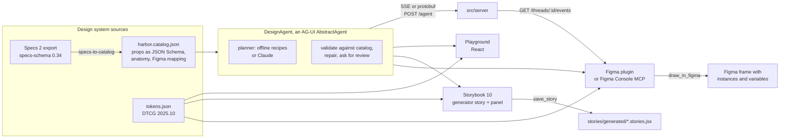

# AG-UI for design systems: a lab

Can a design system's own components become the only vocabulary an AI agent
can use, streamed live to React, Storybook and Figma over one protocol? This
lab tests that with [AG-UI](https://docs.ag-ui.com/spec/1.0/architecture) 1.0
(`@ag-ui/core`, `@ag-ui/client` and `@ag-ui/encoder` 1.0.1) and a small
sample system called Harbor.

The research behind it is in
[`reports/AG UI protocol for design systems.md`](reports/AG%20UI%20protocol%20for%20design%20systems.md),
built from the sourced notes in [`research_notes/`](research_notes/).

## The short answer

AG-UI carries the conversation between an agent and whatever is drawing the
screen. It does not define components, a catalog or validation; the design
system has to bring those. Once it does, one AG-UI stream can drive the
browser, Storybook and Figma at the same time, because all three receive the
same events and render the same UI tree with their own implementation of the
same components.

What the lab shows working:

- The catalog is the contract. `harbor.catalog.json` generates the agent's
  prompt context, the JSON Schema of its `render_ui` tool, the validator, the
  Storybook controls, the Figma property mapping and an A2UI catalog. Nothing
  about a component is written twice.
- Four ways to deliver UI over AG-UI, each tested end to end against the
  1.0 client's own event verifier: shared state, a frontend tool call, an
  activity message, and an A2UI surface.
- A validate-and-repair loop. Contract errors (a prop outside its enum, an
  invented component) go back to the agent as data and get fixed before
  anyone sees them. Guideline warnings (two primary buttons, a skipped
  heading level) stay for the human reviewer.
- Design review as a protocol step. Every screen ends its run with an
  AG-UI interrupt. Approving it resumes the thread, and the agent calls
  whichever export tools the surface offered: `save_story` in Storybook,
  `draw_in_figma` in Figma, `export_code` in the playground. The agent never
  needs to know which surface it is talking to.
- A second surface can follow a run it did not start. The Figma plugin can
  mirror a thread someone is driving from Storybook.

## How it fits together



## The four delivery modes

Set with `forwardedProps.mode` on `RunAgentInput`. All four end with the same
review interrupt.

| Mode       | AG-UI events                                                              | Where the tree lives                  | Best for                                                                  |
| ---------- | ------------------------------------------------------------------------- | ------------------------------------- | ------------------------------------------------------------------------- |
| `state`    | `STATE_SNAPSHOT`, then one `STATE_DELTA` (JSON Patch) per node            | shared state at `/ui`                 | several surfaces rendering one document; the Figma<>code loop             |
| `tool`     | `TOOL_CALL_START`, `TOOL_CALL_ARGS` (streamed JSON), `TOOL_CALL_END`       | the `render_ui` call's arguments      | clients that hold the components and must validate before drawing          |
| `activity` | `ACTIVITY_SNAPSHOT`, `ACTIVITY_DELTA` with `activityType: "harbor.surface"` | an activity message in the thread     | chat UIs that show generated screens inline                               |
| `a2ui`     | `ACTIVITY_SNAPSHOT` with `activityType: "a2ui-surface"`                    | A2UI v0.9 operations in the message   | interop with A2UI renderers and `@ag-ui/a2ui-middleware`                  |

The UI tree is a flat map, `{ title, root, nodes: { n1: { type, props, children } } }`,
for the same reason A2UI uses an adjacency list: a stream can add one node
with one JSON Patch `add` and never rewrite a subtree it already sent.

## Run it

Everything runs offline. The planner is keyword recipes (sign-up and login
forms, dashboards, pricing, settings, empty states) unless
`ANTHROPIC_API_KEY` is set, in which case the server uses Claude
(`claude-opus-5-5`) and streams the tree into state while the model writes it.

```sh
cd labs/ag-ui
npm install
npm test                 # node --test, no network
npm run agent            # AG-UI server on http://localhost:8787
```

Server routes:

| Route                           | What it does                                                                                 |
| ------------------------------- | -------------------------------------------------------------------------------------------- |
| `POST /agent`                   | `RunAgentInput` in, AG-UI events out. SSE by default, protobuf when `Accept` asks for it.    |
| `GET /agent/capabilities`       | `AgentCapabilities`: modes, interrupts, client-provided tools, the catalog id.                |
| `GET /catalog`                  | The catalog plus the tools and context a client should send, so thin clients need not bundle it. |
| `GET /threads/:threadId/events` | A read-only mirror of every run on a thread, starting from a snapshot of current state.       |

Any stock AG-UI client works against it:

```js
import { HttpAgent } from '@ag-ui/client';

const agent = new HttpAgent({ url: 'http://localhost:8787/agent' });
agent.messages = [{ id: 'u1', role: 'user', content: 'a dashboard with 4 metrics' }];
await agent.runAgent({ forwardedProps: { mode: 'state' } });
console.log(agent.state.ui); // the Harbor tree
```

## What is where

| Path                        | What it is                                                                                                   |
| --------------------------- | ------------------------------------------------------------------------------------------------------------ |
| `src/catalog/`              | Harbor's catalog and DTCG tokens; `catalogToTools`, `catalogToContext`, `treeSchema`, tokens to CSS and Figma variables. |
| `src/tree/`                 | The UI tree: `validateTree` (contract errors and guideline warnings), `treeToOps`, `applyOps`, `treeToJsx`, `treeToCsf`. |
| `src/agent/design-agent.js` | `DesignAgent extends AbstractAgent`: the four modes, validation, repair, review interrupt, export tools.       |
| `src/agent/session.js`      | The client loop every surface shares: run, answer frontend tools, resume interrupts, expose a snapshot.       |
| `src/agent/recipes.js`      | The offline planner.                                                                                         |
| `src/agent/claude-planner.js` | The Claude planner: `render_ui` as a tool, eager input streaming, repair via error tool results.           |
| `src/a2ui/`                 | Harbor as an A2UI catalog; trees to and from A2UI v0.9 operations; findings as `VALIDATION_FAILED` errors.    |
| `src/server/`               | The HTTP server above.                                                                                       |
| `src/react/`                | Harbor's React components, `TreeRenderer`, `useSession`.                                                     |

## Verified, and not

Verified in this container: every test in `tests/` (`npm test`), every
agent mode through `@ag-ui/client`'s own `runAgent` and verifier, SSE and
protobuf over HTTP with a stock `HttpAgent`, the thread mirror, and the
Claude planner against a scripted fake of the SDK stream.

Not verified: a live Claude call (no API key in this environment).
