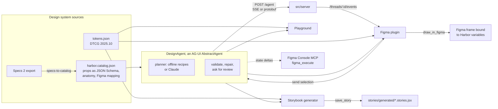

# AG-UI for design systems: a lab

Can a design system's own components become the only vocabulary an AI agent
can use, streamed live to a browser, Storybook and Figma over one protocol?
This lab tests that with [AG-UI](https://docs.ag-ui.com/spec/1.0/architecture)
1.0 (`@ag-ui/core`, `@ag-ui/client` and `@ag-ui/encoder` 1.0.1) and a small
sample system called Harbor.

The research is in
[`reports/AG UI protocol for design systems.md`](reports/AG%20UI%20protocol%20for%20design%20systems.md),
built from the sourced notes in [`research_notes/`](research_notes/). It
answers the questions; this README says what the prototypes showed.

## The short answer

AG-UI carries the conversation between an agent and whatever draws the
screen. It defines no components, catalog or validation, so the design system
has to bring those. Once it does, one AG-UI stream drives the browser,
Storybook and Figma, because each receives the same events and renders the
same UI tree with its own implementation of the same components. The catalog
is the asset worth building first. The transport is replaceable.

## What was built

| Prototype | What it does | Where |
| --- | --- | --- |
| Catalog as contract | One JSON file declares 13 components with props as JSON Schema, children rules, anatomy and a Figma mapping. The agent's prompt context, its `render_ui` tool schema, the validator, Storybook's controls, the Figma property mapping and an A2UI catalog are all derived from it. | `src/catalog/` |
| Design agent | An AG-UI `AbstractAgent` that builds screens only from the catalog, in four delivery modes, validates and repairs its output, stops for design review, then calls the export tools the surface offered. | `src/agent/` |
| Agent server | `POST /agent` over SSE or protobuf, plus a thread mirror so a second surface can follow a run it did not start. | `src/server/` |
| Playground | A single-file page for designers and developers: prompt, watch every event arrive, review, and read the contract, JSX, CSF and Figma payload for the current screen. | `playground/` |
| Storybook generator | Storybook 10.6 with catalog-driven controls, an AG-UI/Generate story, an AG-UI panel, and `save_story`, which writes a real story file during `storybook dev`. | `.storybook/`, `stories/`, `src/storybook/` |
| Figma plugin | A development plugin that is an AG-UI client: it generates, follows a thread, draws into the canvas as patches arrive, handles review, and sends a selected frame back to the agent. | `figma-plugin/`, `src/figma/` |
| Figma Console MCP adapter | Turns a tree, or a live run's state deltas, into `figma_execute` calls for Southleft's Figma Console MCP. | `src/figma/figma-console-mcp.js` |
| Specs adapter | Turns a Specs 2 export (`@directededges/specs-schema` 0.34.0) into catalog entries, including slot rules and invalid prop combinations, and diffs two catalogs. | `src/specs/` |
| A2UI projection | Harbor as an A2UI catalog, and trees as A2UI v0.9 operations in the shape `@ag-ui/a2ui-middleware` 0.0.11 puts on the wire. | `src/a2ui/` |
| Claude planner | Replaces the offline recipes when `ANTHROPIC_API_KEY` is set; streams the tree into state while the model writes it. | `src/agent/claude-planner.js` |

## How it fits together



## The four delivery modes

Chosen with `forwardedProps.mode` on `RunAgentInput`. All four end with the
same review interrupt, and every one is tested through `@ag-ui/client`'s own
`runAgent` and 1.0 event verifier.

| Mode | AG-UI events | Where the screen lives | Good for |
| --- | --- | --- | --- |
| `state` | `STATE_SNAPSHOT`, then one `STATE_DELTA` (JSON Patch) per node | shared state at `/ui` | several surfaces rendering one document; the Figma and code loop |
| `tool` | `TOOL_CALL_START`, `TOOL_CALL_ARGS` (streamed JSON), `TOOL_CALL_END` | the `render_ui` call's arguments | clients that hold the components and validate before drawing |
| `activity` | `ACTIVITY_SNAPSHOT`, `ACTIVITY_DELTA`, `activityType: "harbor.surface"` | an activity message in the thread | chat UIs that show generated screens inline |
| `a2ui` | `ACTIVITY_SNAPSHOT`, `activityType: "a2ui-surface"` | A2UI v0.9 operations | interop with A2UI renderers and `@ag-ui/a2ui-middleware` |

The tree is a flat map, `{ title, root, nodes: { n1: { type, props, children } } }`,
for the reason A2UI uses an adjacency list: a stream adds one node with one
JSON Patch `add` and never rewrites a subtree it already sent.

## What held

The report ends with six hypotheses only a prototype could settle. Here is
what the lab found for each.

| Hypothesis | Result |
| --- | --- |
| Catalog as tool schema | Held. The `render_ui` schema is a discriminated union built from the catalog; an invented component or an out-of-enum prop fails it. The agent's prompt context, the validator and Storybook's controls come from the same file, so they cannot disagree. |
| Shared-state streaming of a UI tree | Held. One snapshot and one patch per node render progressively in all three surfaces. A late observer gets a snapshot of current state and catches up. Edits flow back only on the next run, as the spec says: a frame sent from Figma arrives in `state.ui` and the agent builds from it. |
| Validate-and-repair loop | Held for contract errors. A planted bad prop is caught and fixed before review in every mode; in tool mode the rejection travels as a tool result and the agent sends a corrected call. Guideline breaches (two primary buttons, skipped heading levels) are reported as warnings for the reviewer, not repaired. |
| Interrupts for design review | Held. Every screen ends its run with a `design_review` interrupt; approve, reject with notes, and cancel all resume the thread correctly. Approve-with-edits is not built. |
| Export tools per surface | Held. The agent calls whichever of `save_story`, `draw_in_figma` and `export_code` the surface offered in `RunAgentInput.tools`, and never needs to know which surface it is talking to. |
| Figma and Storybook as AG-UI clients | Held in Storybook, where `save_story` writes a real file during `storybook dev`. Built but unverified in Figma: the plugin ran against a strict mock of the Plugin API, not the Figma desktop app. |

Other findings from building it:

- A validator is not optional. AG-UI validates nothing, and the SDK's
  tolerant parser will hand a renderer half a component name mid-stream. The
  agent filters partial trees to whole catalog types before they reach a
  renderer.
- Bundlers can break Figma code. The Figma runtime shipped as function source
  text, and a minifier rewrote `catch (e) {}` to `catch {}`, which the plugin
  sandbox rejects. The runtime now travels as string literals, with a test
  that guards the syntax the sandbox cannot parse.
- A strict content policy blocks Ajv, which compiles validators with
  `new Function`. The playground ships validators compiled ahead of time.
- The report advises keeping `figma_execute`, which runs arbitrary
  JavaScript, away from the agent. The lab's adapter follows that: the agent
  never writes JavaScript. The script is generated from a validated tree by
  code in this repository.

## Run it

Everything runs offline. The planner is keyword recipes (sign-up and login
forms, dashboards, pricing, settings, empty states) unless `ANTHROPIC_API_KEY`
is set, when the server uses Claude (`claude-opus-5-5`).

```sh
cd labs/ag-ui
npm install
npm test                         # 101 tests, no network
npm run agent                    # AG-UI server on http://localhost:8787
npm run storybook                # Storybook on http://localhost:6006, AG-UI/Generate
npx vite playground              # the playground, served locally
npx vite build playground        # playground/dist/index.html, one self-contained file
node figma-plugin/build.mjs      # then import figma-plugin/manifest.json in Figma desktop
node src/figma/figma-console-mcp.js --prompt "sign up form" --dry-run
```

`playground/README.md`, `figma-plugin/README.md` and
`stories/generated/README.md` cover each surface in detail.

Any stock AG-UI client can drive the server:

```js
import { HttpAgent } from '@ag-ui/client';

const agent = new HttpAgent({ url: 'http://localhost:8787/agent' });
agent.messages = [{ id: 'u1', role: 'user', content: 'a dashboard with 4 metrics' }];
await agent.runAgent({ forwardedProps: { mode: 'state' } });
console.log(agent.state.ui); // the Harbor tree
```

| Route | What it does |
| --- | --- |
| `POST /agent` | `RunAgentInput` in, AG-UI events out. SSE by default, protobuf when `Accept` asks for it. |
| `GET /agent/capabilities` | `AgentCapabilities`: modes, interrupts, client-provided tools, catalog id. |
| `GET /catalog` | The catalog plus the tools and context a client should send. |
| `GET /threads/:threadId/events` | A read-only mirror of a thread's runs, starting from a snapshot of its current state. |

## Verified, and not

Verified in this container:

- `npm test`: 101 tests covering the catalog, tree, validation, exporters,
  tokens and contrast in both themes, all four modes through the 1.0 client
  verifier, interrupts and resume, SSE and protobuf over HTTP, the thread
  mirror, the A2UI projection, the Claude planner against a scripted fake of
  the SDK stream, the Figma script against a Plugin API mock, the Specs
  adapter against the published schema, and Storybook's save path.
- `storybook build` and `storybook dev` with Playwright: generate, review,
  approve, and a story file written and indexed.
- The playground build in Chromium at 1440 and 390 pixels wide, light and
  dark, with no console errors.
- The Figma plugin's protocol replayed against the real server.

Not verified:

- Anything inside the Figma desktop app: real library imports, fonts, auto
  layout resolution, and streaming from the plugin's iframe.
- A live `figma_execute` call through Figma Console MCP.
- A live Claude call. There is no API key in this environment.

## Known limits

- Stack, Grid and Card draw as auto-layout frames in Figma, not component
  instances, and INSTANCE_SWAP props are not set.
- Each Figma patch call carries the runtime and variable definitions, about
  45 KB.
- Reading a Figma frame without the lab's plugin data is heuristic.
- The thread mirror is in memory. The protocol defines no shared thread store,
  so two people on one thread each send their own copy of history.
- Storybook's `experimental_serverChannel` is undocumented and dev-only.

## What is where

| Path | What it is |
| --- | --- |
| `src/catalog/` | Harbor's catalog and DTCG tokens; tools, context, tree schema, CSS variables and Figma variables. |
| `src/tree/` | The UI tree: `validateTree`, `treeToOps`, `applyOps`, `treeToJsx`, `treeToCsf`. |
| `src/agent/` | `DesignAgent`, the shared client loop (`session.js`), the offline recipes and the Claude planner. |
| `src/a2ui/` | Harbor as an A2UI catalog; trees to and from A2UI operations; findings as `VALIDATION_FAILED` errors. |
| `src/server/` | The HTTP server. |
| `src/react/` | Harbor's React components, `TreeRenderer`, `useSession`. |
| `src/storybook/` | argTypes from the catalog, the generator UI, the save-story preset, the AG-UI panel, manifest drift check. |
| `src/figma/` | Tree to Figma script, Figma node to tree, the Figma Console MCP adapter, the sandbox runtime. |
| `src/specs/` | Specs 2 export to catalog entries, and `catalogDiff`. |
| `playground/`, `figma-plugin/`, `stories/`, `.storybook/` | The three surfaces. |
| `tests/` | `node --test`. |
